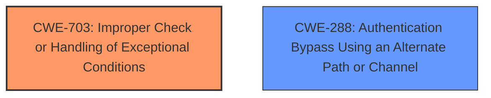

# Raw Analyzer Response for CVE-2024-20894

# Summary
| CWE ID  | CWE Name                                                     | Confidence | CWE Abstraction Level | CWE Vulnerability Mapping Label | CWE-Vulnerability Mapping Notes |
| :-------- | :----------------------------------------------------------- | :--------- | :-------------------- | :------------------------------ | :------------------------------ |
| CWE-703 | Improper Check or Handling of Exceptional Conditions         | 0.80       | Pillar                | Primary                         | Discouraged                     |
| CWE-288 | Authentication Bypass Using an Alternate Path or Channel      | 0.60       | Base                  | Secondary                       | Allowed                         |

## Evidence and Confidence

*   **Confidence Score:** 0.70
*   **Evidence Strength:** MEDIUM

## Relationship Analysis
The primary CWE selected is CWE-703 which is a Pillar and is a very broad category. It's connected to many other CWEs but doesn't have direct parent-child or chain relationships strongly influencing the mapping here. The secondary CWE, CWE-288, is a Base level CWE. The guidance is to prefer more specific CWEs, but the evidence only supports the high level CWE-703.

## Vulnerability Chain
The vulnerability chain starts with the **improper handling of exceptional conditions** (CWE-703), which leads to a bypass of authentication (CWE-288). The initial flaw is the root cause, and the authentication bypass is the direct consequence.

## Summary of Analysis
The initial assessment focused on identifying the root cause of the vulnerability based on the provided evidence. The vulnerability description and CVE summary both point to **"Improper handling of exceptional conditions"** as the primary issue. This directly influenced the selection of CWE-703, despite its high-level abstraction. The description also mentions that this leads to an authentication bypass which influenced the selection of CWE-288 as a secondary weakness.

The relationship analysis didn't significantly alter the initial assessment, as the primary weakness is a high-level Pillar with few direct relationships that strongly apply. The selection is primarily based on the explicit mention of "improper handling of exceptional conditions" in the vulnerability description.

The selected CWEs are at the appropriate level of specificity given the available evidence. While more specific CWEs might exist, the current evidence doesn't provide sufficient detail to warrant a more granular classification for the root cause. More analysis would be required to find a more appropriate CWE.

Relevant CWE Information:

# Enhanced Context (25 CWEs)
The following CWEs were identified as potentially relevant to this vulnerability:

## CWE-703: Improper Check or Handling of Exceptional Conditions
**Abstraction Level**: Pillar
**Similarity Score**: 0.77
**Source**: dense

**Description**:
The product does not properly anticipate or handle exceptional conditions that rarely occur during normal operation of the product.

**Mapping Guidance**:
- Usage: Discouraged
- Rationale: This CWE entry is extremely high-level, a Pillar.

## CWE-288: Authentication Bypass Using an Alternate Path or Channel
**Abstraction Level**: Base
**Similarity Score**: 0.565
**Source**: dense

**Description**:
The product allows the attacker to bypass authentication to perform privileged actions by using an alternate path or channel that is not properly authenticated.

**Mapping Guidance**:
- Usage: Allowed
- Rationale: This CWE entry is at the Base level of abstraction, which is a preferred level of abstraction for mapping to the root causes of vulnerabilities.

**Relationships**:
- PARENTOF -> CWE-322
- PARENTOF -> CWE-288
- CHILDOF -> CWE-287
- CHILDOF -> CWE-287
- CHILDOF -> CWE-306

---

# Complete CWE Specifications

CWE-703: Improper Check or Handling of Exceptional Conditions

CWE-288: Authentication Bypass Using an Alternate Path or Channel

CWE-703 is selected because the **rootcause** is **Improper handling of exceptional conditions**. While it is a Pillar (very high level) it is the primary **rootcause**. The CWE description matches the vulnerability description.
CWE-288 is selected because the vulnerability leads to bypass authentication. The CWE description matches the vulnerability description.