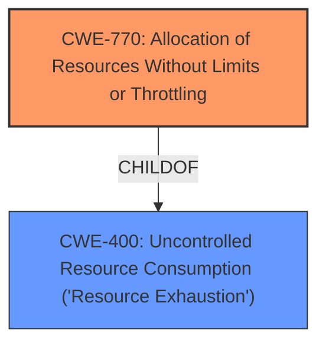

# Analysis Report for CVE-2024-20996

# Vulnerability Analysis Report: CVE-2024-20996

## Description

Vulnerability in the MySQL Server product of Oracle MySQL (component InnoDB). Supported versions that are affected are 8.0.37 and prior and 8.4.0 and prior. Easily exploitable vulnerability allows high privileged attacker with network access via multiple protocols to compromise MySQL Server. Successful attacks of this vulnerability can result in unauthorized ability to cause a hang or frequently repeatable crash (complete DOS) of MySQL Server. CVSS 3.1 Base Score 4.9 (Availability impacts). CVSS Vector (CVSS3.1/AVN/ACL/PRH/UIN/SU/CN/IN/AH).

## Vulnerability Description Key Phrases

- **Impact:** ['cause a hang or frequently repeatable crash', 'hang or frequently repeatable crash (complete DOS) of MySQL Server']
- **Vector:** multiple protocols
- **Attacker:** high privileged attacker with network access
- **Product:** MySQL Server
- **Version:** 8.0.37 and prior and 8.4.0 and prior
- **Component:** InnoDB

## Analysis (with Relationship Data)

# Summary
| CWE ID        | CWE Name                                                                  | Confidence | CWE Abstraction Level | CWE Vulnerability Mapping Label | CWE-Vulnerability Mapping Notes |
| ------------- | ------------------------------------------------------------------------- | ---------- | --------------------- | ------------------------------- | ----------------------------- |
| CWE-770       | Allocation of Resources Without Limits or Throttling                      | 0.7        | Base                  | Primary                         | Allowed                       |
| CWE-400       | Uncontrolled Resource Consumption ('Resource Exhaustion')                 | 0.6        | Class                 | Secondary                       | Allowed-with-Review           |

## Evidence and Confidence

*   **Confidence Score:** 0.7
*   **Evidence Strength:** MEDIUM

## Relationship Analysis
The primary CWE selected is CWE-770, which is a base-level CWE and a child of CWE-400. The vulnerability description indicates that an attacker can cause a denial of service by causing a hang or crash of the MySQL server, suggesting resource exhaustion. CWE-770 directly addresses the **allocation of resources without limits**, which can lead to the server being overwhelmed. While CWE-400 is a broader category, CWE-770 provides a more specific root cause.



## Vulnerability Chain
The vulnerability chain starts with the **uncontrolled allocation of resources** (CWE-770), leading to **resource exhaustion** (CWE-400), and ultimately resulting in a denial-of-service condition where the MySQL server hangs or crashes.

## Summary of Analysis
The vulnerability description indicates that a high-privileged attacker with network access can cause a hang or crash of the MySQL Server via multiple protocols. The CVE Reference Links Content Summary notes that an unspecified vulnerability exists in the InnoDB component and an attacker must be able to send specially crafted network packets to a vulnerable MySQL Server instance. The successful exploitation of this vulnerability may result in a high impact on availability.

The primary CWE, CWE-770, is selected due to its direct relation to the **allocation of resources without limits**, which can result in a denial-of-service condition. The evidence provided is sufficient to suggest this weakness. While the provided information is not very detailed, the ability to cause a repeatable crash indicates that resource allocation is likely a factor. The relationship analysis highlights that CWE-770 is a specific type of resource exhaustion, making it a more appropriate choice than the broader CWE-400.

CWE-NVD-noinfo was rejected because it is not an actual CWE, but a placeholder indicating lack of information, while we can make inferences based on the details of the vulnerability.

The retriever results also listed several CWEs like CWE-89 (SQL Injection), CWE-129 (Improper Validation of Array Index), and CWE-789 (Memory Allocation with Excessive Size Value). These were not chosen as they are not supported by the evidence, which is centered around resource exhaustion leading to a crash.

Relevant CWE Information:

# Enhanced Context (25 CWEs)
The following CWEs were identified as potentially relevant to this vulnerability:

## CWE-89: Improper Neutralization of Special Elements used in an SQL Command ('SQL Injection')
**Abstraction Level**: Base
**Similarity Score**: 0.68
**Source**: dense

**Description**:
The product constructs all or part of an SQL command using externally-influenced input from an upstream component, but it does not neutralize or incorrectly neutralizes special elements that could modify the intended SQL command when it is sent to a downstream component. Without sufficient removal or quoting of SQL syntax in user-controllable inputs, the generated SQL query can cause those inputs to be interpreted as SQL instead of ordinary user data.

**Mapping Guidance**:
- Usage: Allowed
- Rationale: This CWE entry is at the Base level of abstraction, which is a preferred level of abstraction for mapping to the root causes of vulnerabilities.


## CWE-129: Improper Validation of Array Index
**Abstraction Level**: Variant
**Similarity Score**: 0.68
**Source**: dense

**Description**:
The product uses untrusted input when calculating or using an array index, but the product does not validate or incorrectly validates the index to ensure the index references a valid position within the array.

**Mapping Guidance**:
- Usage: Allowed
- Rationale: This CWE entry is at the Variant level of abstraction, which is a preferred level of abstraction for mapping to the root causes of vulnerabilities.


## CWE-209: Generation of Error Message Containing Sensitive Information
**Abstraction Level**: Base
**Similarity Score**: 0.67
**Source**: dense

**Description**:
The product generates an error message that includes sensitive information about its environment, users, or associated data.

**Mapping Guidance**:
- Usage: Allowed
- Rationale: This CWE entry is at the Base level of abstraction, which is a preferred level of abstraction for mapping to the root causes of vulnerabilities.


## CWE-833: Deadlock
**Abstraction Level**: Base
**Similarity Score**: 0.67
**Source**: dense

**Description**:
The product contains multiple threads or executable segments that are waiting for each other to release a necessary lock, resulting in deadlock.

**Mapping Guidance**:
- Usage: Allowed
- Rationale: This CWE entry is at the Base level of abstraction, which is a preferred level of abstraction for mapping to the root causes of vulnerabilities.


## CWE-1391: Use of Weak Credentials
**Abstraction Level**: Class
**Similarity Score**: 0.66
**Source**: dense

**Description**:
The product uses weak credentials (such as a default key or hard-coded password) that can be calculated, derived, reused, or guessed by an attacker.

**Mapping Guidance**:
- Usage: Allowed-with-Review
- Rationale: This CWE entry is a Class and might have Base-level children that would be more appropriate


## CWE-755: Improper Handling of Exceptional Conditions
**Abstraction Level**: Class
**Similarity Score**: 0.66
**Source**: dense

**Description**:
The product does not handle or incorrectly handles an exceptional condition.

**Mapping Guidance**:
- Usage: Discouraged
- Rationale: This CWE entry is a level-1 Class (i.e., a child of a Pillar). It might have lower-level children that would be more appropriate


## CWE-303: Incorrect Implementation of Authentication Algorithm
**Abstraction Level**: Base
**Similarity Score**: 0.66
**Source**: dense

**Description**:
The requirements for the product dictate the use of an established authentication algorithm, but the implementation of the algorithm is incorrect.

**Mapping Guidance**:
- Usage: Allowed
- Rationale: This CWE entry is at the Base level of abstraction, which is a preferred level of abstraction for mapping to the root causes of vulnerabilities.


## CWE-330: Use of Insufficiently Random Values
**Abstraction Level**: Class
**Similarity Score**: 0.66
**Source**: dense

**Description**:
The product uses insufficiently random numbers or values in a security context that depends on unpredictable numbers.

**Mapping Guidance**:
- Usage: Discouraged
- Rationale: This CWE entry is a level-1 Class (i.e., a child of a Pillar). It might have lower-level children that would be more appropriate


## CWE-665: Improper Initialization
**Abstraction Level**: Class
**Similarity Score**: 0.66
**Source**: dense

**Description**:
The product does not initialize or incorrectly initializes a resource, which might leave the resource in an unexpected state when it is accessed or used.

**Mapping Guidance**:
- Usage: Discouraged
- Rationale: This CWE entry is a level-1 Class (i.e., a child of a Pillar). It might have lower-level children that would be more appropriate


## CWE-941: Incorrectly Specified Destination in a Communication Channel
**Abstraction Level**: Base
**Similarity Score**: 0.66
**Source**: dense

**Description**:
The product creates a communication channel to initiate an outgoing request to an actor, but it does not correctly specify the intended destination for that actor.

**Mapping Guidance**:
- Usage: Allowed
- Rationale: This CWE entry is at the Base level of abstraction, which is a preferred level of abstraction for mapping to the root causes of vulnerabilities.


## CWE-770: Allocation of Resources Without Limits or Throttling
**Abstraction Level**: Base
**Similarity Score**: 662.22
**Source**: sparse

**Description**:
The product allocates a reusable resource or group of resources on behalf of an actor without imposing any restrictions on the size or number of resources that can be allocated, in violation of the intended security policy for that actor.

**Mapping Guidance**:
- Usage: Allowed
- Rationale: This CWE entry is at the Base level of abstraction, which is a preferred


## CWE Relationship Analysis

Current CWEs represent these abstraction levels: .


### Vulnerability Chain Analysis

**Chain starting from CWE-89:**
- 89 (Improper Neutralization of Special Elements used in an SQL Command ('SQL Injection')) - ROOT


**Chain starting from CWE-400:**
- 400 (Uncontrolled Resource Consumption) - ROOT


### CWE Relationship Diagram

```mermaid
graph TD
    classDef primary fill:#f96,stroke:#333,stroke-width:2px
    classDef secondary fill:#69f,stroke:#333
    classDef tertiary fill:#9e9,stroke:#333
```


*Report generated on 2025-07-13 05:15:27*
