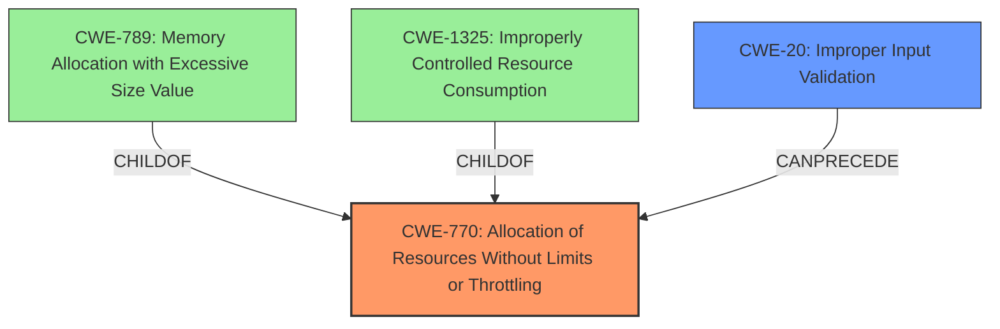

# Raw Analyzer Response for CVE-2024-21130

# Summary
| CWE ID    | CWE Name                                                                   | Confidence | CWE Abstraction Level | CWE Vulnerability Mapping Label | CWE-Vulnerability Mapping Notes |
| :--------- | :------------------------------------------------------------------------- | :--------- | :---------------------- | :------------------------------ | :---------------------------- |
| **CWE-770** | **Allocation of Resources Without Limits or Throttling**                 | 0.7        | Base                    | Primary CWE                     | Allowed                       |
| CWE-20     | Improper Input Validation                                                  | 0.5        | Class                   | Secondary Candidate             | Discouraged                   |

## Evidence and Confidence

*   **Confidence Score:** 0.7
*   **Evidence Strength:** MEDIUM

## Relationship Analysis

The primary CWE selected is CWE-770, "Allocation of Resources Without Limits or Throttling". This CWE is a base-level weakness describing a resource management issue. CWE-770 has child relationships to CWE-789 (Memory Allocation with Excessive Size Value) and CWE-1325 (Improperly Controlled Resource Consumption). While there is no specific mention of memory allocation, the DOS impact suggests excessive resource consumption, making CWE-770 a reasonable fit. It can also be preceded by CWE-20 (Improper Input Validation) which is present in the Retriever Results.

## Vulnerability Chain

The vulnerability chain starts with a high-privileged attacker with network access. The **weakness** lies in the "Server Optimizer" component, allowing unspecified manipulation that leads to a hang or crash (complete DOS) of the MySQL Server.

1.  Attacker with network access.
2.  **Unspecified manipulation** in the Server Optimizer (**ROOT CAUSE**).
3.  **Allocation of resources without limits or throttling** (CWE-770).
4.  Hang or repeatable crash (complete DOS) of MySQL Server.

## Summary of Analysis

The primary focus is on the root cause that leads to the DOS.

The vulnerability description indicates that a high-privileged attacker can cause a hang or crash of the MySQL server. The **root cause** and **weakness** is in the "Server Optimizer" component, allowing unspecified manipulation that leads to a hang or crash (complete DOS) of the MySQL Server.
The description mentions "unauthorized ability to cause a hang or frequently repeatable crash (complete DOS) of MySQL Server," which aligns well with CWE-770, "Allocation of Resources Without Limits or Throttling".

The "CVE Reference Links Content Summary" states: "The vulnerability allows for unspecified manipulation" and "Successful exploitation could lead to a high impact on data availability." This supports the DOS impact and hints at a resource-related issue.

CWE-20 "Improper Input Validation" was considered as a secondary weakness. While input validation issues often precede resource exhaustion vulnerabilities, there's no direct evidence in the description to confirm this. Thus, it's included as a secondary candidate.

I am basing this assessment primarily on the provided evidence.

# Relevant CWE Information:

# Enhanced Context (25 CWEs)

## CWE-89: Improper Neutralization of Special Elements used in an SQL Command ('SQL Injection')
**Abstraction Level**: Base
**Similarity Score**: 0.68
**Source**: dense

**Description**:
The product constructs all or part of an SQL command using externally-influenced input from an upstream component, but it does not neutralize or incorrectly neutralizes special elements that could modify the intended SQL command when it is sent to a downstream component. Without sufficient removal or quoting of SQL syntax in user-controllable inputs, the generated SQL query can cause those inputs to be interpreted as SQL instead of ordinary user data.

**Mapping Guidance**:
- Usage: Allowed
- Rationale: This CWE entry is at the Base level of abstraction, which is a preferred level of abstraction for mapping to the root causes of vulnerabilities.

## CWE-129: Improper Validation of Array Index
**Abstraction Level**: Variant
**Similarity Score**: 0.68
**Source**: dense

**Description**:
The product uses untrusted input when calculating or using an array index, but the product does not validate or incorrectly validates the index to ensure the index references a valid position within the array.

**Mapping Guidance**:
- Usage: Allowed
- Rationale: This CWE entry is at the Variant level of abstraction, which is a preferred level of abstraction for mapping to the root causes of vulnerabilities.

## CWE-303: Incorrect Implementation of Authentication Algorithm
**Abstraction Level**: Base
**Similarity Score**: 0.68
**Source**: dense

**Description**:
The requirements for the product dictate the use of an established authentication algorithm, but the implementation of the algorithm is incorrect.

**Mapping Guidance**:
- Usage: Allowed
- Rationale: This CWE entry is at the Base level of abstraction, which is a preferred level of abstraction for mapping to the root causes of vulnerabilities.

## CWE-209: Generation of Error Message Containing Sensitive Information
**Abstraction Level**: Base
**Similarity Score**: 0.67
**Source**: dense

**Description**:
The product generates an error message that includes sensitive information about its environment, users, or associated data.

**Mapping Guidance**:
- Usage: Allowed
- Rationale: This CWE entry is at the Base level of abstraction, which is a preferred level of abstraction for mapping to the root causes of vulnerabilities.

## CWE-472: External Control of Assumed-Immutable Web Parameter
**Abstraction Level**: Base
**Similarity Score**: 0.67
**Source**: dense

**Description**:
The web application does not sufficiently verify inputs that are assumed to be immutable but are actually externally controllable, such as hidden form fields.

**Mapping Guidance**:
- Usage: Allowed
- Rationale: This CWE entry is at the Base level of abstraction, which is a preferred level of abstraction for mapping to the root causes of vulnerabilities.

## CWE-1391: Use of Weak Credentials
**Abstraction Level**: Class
**Similarity Score**: 0.67
**Source**: dense

**Description**:
The product uses weak credentials (such as a default key or hard-coded password) that can be calculated, derived, reused, or guessed by an attacker.

**Mapping Guidance**:
- Usage: Allowed-with-Review
- Rationale: This CWE entry is a Class and might have Base-level children that would be more appropriate

## CWE-943: Improper Neutralization of Special Elements in Data Query Logic
**Abstraction Level**: Class
**Similarity Score**: 0.67
**Source**: dense

**Description**:
The product generates a query intended to access or manipulate data in a data store such as a database, but it does not neutralize or incorrectly neutralizes special elements that can modify the intended logic of the query.

**Mapping Guidance**:
- Usage: Allowed-with-Review
- Rationale: This CWE entry is a Class and might have Base-level children that would be more appropriate

## CWE-755: Improper Handling of Exceptional Conditions
**Abstraction Level**: Class
**Similarity Score**: 0.67
**Source**: dense

**Description**:
The product does not handle or incorrectly handles an exceptional condition.

**Mapping Guidance**:
- Usage: Discouraged
- Rationale: This CWE entry is a level-1 Class (i.e., a child of a Pillar). It might have lower-level children that would be more appropriate

## CWE-941: Incorrectly Specified Destination in a Communication Channel
**Abstraction Level**: Base
**Similarity Score**: 0.67
**Source**: dense

**Description**:
The product creates a communication channel to initiate an outgoing request to an actor, but it does not correctly specify the intended destination for that actor.

**Mapping Guidance**:
- Usage: Allowed
- Rationale: This CWE entry is at the Base level of abstraction, which is a preferred level of abstraction for mapping to the root causes of vulnerabilities.

## CWE-294: Authentication Bypass by Capture-replay
**Abstraction Level**: Base
**Similarity Score**: 0.66
**Source**: dense

**Description**:
A capture-replay flaw exists when the design of the product makes it possible for a malicious user to sniff network traffic and bypass authentication by replaying it to the server in question to the same effect as the original message (or with minor changes).

**Mapping Guidance**:
- Usage: Allowed