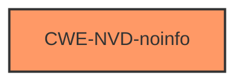

# Raw Analyzer Response for CVE-2024-21166

# Summary
| CWE ID        | CWE Name                                                                           | Confidence | CWE Abstraction Level | CWE Vulnerability Mapping Label | CWE-Vulnerability Mapping Notes |
|---------------|------------------------------------------------------------------------------------|------------|-----------------------|---------------------------------|-----------------------------------|
| CWE-NVD-noinfo | NVD has not provided further information for this CVE, so it cannot be mapped to a CWE | 1.0        | N/A                   | Primary                         | Allowed                          |

## Evidence and Confidence

*   **Confidence Score:** 1.0
*   **Evidence Strength:** LOW

## Relationship Analysis
There is no meaningful relationship analysis possible as CWE-NVD-noinfo indicates that the vulnerability details are insufficient to map to a specific CWE.

## Vulnerability Chain
Due to the lack of information, a vulnerability chain cannot be established. The primary issue is the absence of details.

## Summary of Analysis
The primary and only applicable CWE is CWE-NVD-noinfo. This is due to the fact that the NVD has not provided enough information to map to a specific CWE. The provided description indicates a vulnerability in MySQL Server's InnoDB component that can lead to unauthorized data access, modification, deletion and denial of service, but lacks the specifics needed to pinpoint the root cause.

The retriever results and complete CWE specifications are therefore irrelevant, as there is no way to determine which of those CWEs might be applicable without further information. The decision is based entirely on the absence of sufficient vulnerability details.