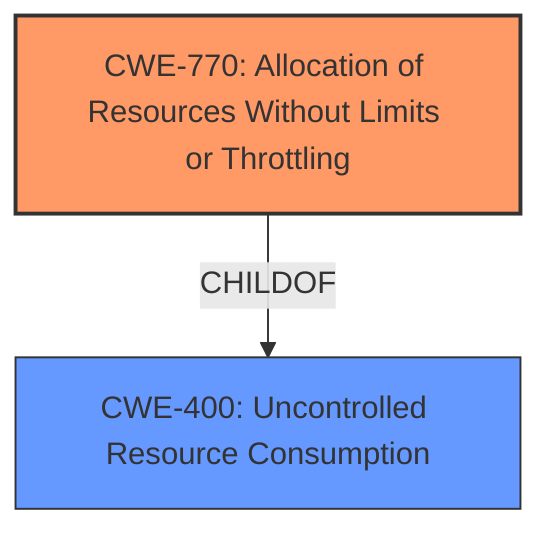

# Analysis Report for CVE-2024-21177

# Vulnerability Analysis Report: CVE-2024-21177

## Description

Vulnerability in the MySQL Server product of Oracle MySQL (component Server Optimizer). Supported versions that are affected are 8.0.37 and prior and 8.4.0 and prior. Easily exploitable vulnerability allows low privileged attacker with network access via multiple protocols to compromise MySQL Server. Successful attacks of this vulnerability can result in unauthorized ability to cause a hang or frequently repeatable crash (complete DOS) of MySQL Server. CVSS 3.1 Base Score 6.5 (Availability impacts). CVSS Vector (CVSS3.1/AVN/ACL/PRL/UIN/SU/CN/IN/AH).

## Vulnerability Description Key Phrases

- **Impact:** ['cause a hang or frequently repeatable crash', 'hang or frequently repeatable crash (complete DOS) of MySQL Server']
- **Vector:** multiple protocols
- **Attacker:** low privileged attacker with network access
- **Product:** Oracle MySQL
- **Version:** 8.0.37 and prior and 8.4.0 and prior
- **Component:** Server Optimizer

## Analysis (with Relationship Data)

# Summary
| CWE ID | CWE Name | Confidence | CWE Abstraction Level | CWE Vulnerability Mapping Label | CWE-Vulnerability Mapping Notes |
|---|---|---|---|---|---|
| CWE-770 | Allocation of Resources Without Limits or Throttling | 0.7 | Base | Allowed | Primary CWE |
| CWE-400 | Uncontrolled Resource Consumption | 0.6 | Class | Allowed-with-Review | Secondary Candidate |

## Evidence and Confidence

*   **Confidence Score:** 0.7
*   **Evidence Strength:** MEDIUM

## Relationship Analysis
The primary CWE selected is CWE-770, which is a Base level CWE. CWE-770 has a parent of CWE-400, which indicates a broader category of resource consumption issues. The vulnerability description indicates a "hang or frequently repeatable crash (complete DOS) of MySQL Server" due to a logical issue in the optimizer, which directly relates to uncontrolled resource allocation.



## Vulnerability Chain
The vulnerability chain starts with a logical issue in the Server Optimizer component, leading to uncontrolled allocation of resources, and ultimately resulting in a denial-of-service (DOS) condition.

Logical Issue in Optimizer -> **CWE-770**: Allocation of Resources Without Limits or Throttling -> Denial of Service

## Summary of Analysis
Initially, CWE-NVD-noinfo was listed as the primary CWE. However, analyzing the CVE Reference Links Content Summary, the root cause is a logical issue within the optimizer component, which can lead to a hang or crash due to resource exhaustion. This points towards CWE-770, Allocation of Resources Without Limits or Throttling, as the more appropriate primary CWE.

The vulnerability description and CVE reference summary provide evidence for a resource allocation issue that leads to a denial-of-service. The Retriever Results listed CWE-770 with a good score. CWE-400 is a parent of CWE-770 and covers the broader case of uncontrolled resource consumption, but CWE-770 is more specific to the allocation aspect, making it a better fit.

The evidence supporting this decision is:
- **Vulnerability Description Key Phrases:** "cause a hang or frequently repeatable crash (complete DOS) of MySQL Server"
- **CVE Reference Links Content Summary:** "The vulnerability is located in the optimizer component of MySQL server."
- **CVE Reference Links Content Summary:** "The vulnerability is a logical issue within the optimizer component, potentially leading to privilege escalation."
- **CVE Reference Links Content Summary:** "Impact of exploitation: An attacker could potentially gain elevated privileges within the system."

I considered CWE-400 (Uncontrolled Resource Consumption) as a broader category, but CWE-770 is more specific to the allocation of resources without limits. I also considered CWE-129 (Improper Validation of Array Index), CWE-89 (Improper Neutralization of Special Elements used in an SQL Command ('SQL Injection')), and CWE-611 (Improper Restriction of XML External Entity Reference), but these did not align as closely with the root cause described in the summary.

Relevant CWE Information:

# Enhanced Context (25 CWEs)

## CWE-129: Improper Validation of Array Index
**Abstraction Level**: Variant
**Similarity Score**: 0.68
**Source**: dense

**Description**:
The product uses untrusted input when calculating or using an array index, but the product does not validate or incorrectly validates the index to ensure the index references a valid position within the array.

**Mapping Guidance**:
- Usage: Allowed
- Rationale: This CWE entry is at the Variant level of abstraction, which is a preferred level of abstraction for mapping to the root causes of vulnerabilities.

*This CWE is not chosen because the description indicates a logical issue in the optimizer, rather than a problem related to array indexing.*

## CWE-89: Improper Neutralization of Special Elements used in an SQL Command ('SQL Injection')
**Abstraction Level**: Base
**Similarity Score**: 0.68
**Source**: dense

**Description**:
The product constructs all or part of an SQL command using externally-influenced input from an upstream component, but it does not neutralize or incorrectly neutralizes special elements that could modify the intended SQL command when it is sent to a downstream component. Without sufficient removal or quoting of SQL syntax in user-controllable inputs, the generated SQL query can cause those inputs to be interpreted as SQL instead of ordinary user data.

**Mapping Guidance**:
- Usage: Allowed
- Rationale: This CWE entry is at the Base level of abstraction, which is a preferred level of abstraction for mapping to the root causes of vulnerabilities.

*This CWE is not chosen because the description indicates a logical issue in the optimizer, rather than a problem related to SQL injection.*

## CWE-611: Improper Restriction of XML External Entity Reference
**Abstraction Level**: Base
**Similarity Score**: 0.63
**Source**: sparse

**Description**:
The product processes an XML document that can contain XML entities with URIs that resolve to documents outside of the intended sphere of control, causing the product to embed incorrect documents into its output.

**Mapping Guidance**:
- Usage: Allowed
- Rationale: This CWE entry is at the Base level of abstraction, which is a preferred level of abstraction for mapping to the root causes of vulnerabilities.

*This CWE is not chosen because the description indicates a logical issue in the optimizer, rather than a problem related to XML processing.*

## CWE-770: Allocation of Resources Without Limits or Throttling
**Abstraction Level**: Base
**Similarity Score**: 626.10
**Source**: sparse

**Description**:
The product allocates a reusable resource or group of resources on behalf of an actor without imposing any restrictions on the size or number of resources that can be allocated, in violation of the intended security policy for that actor.

**Mapping Guidance**:
- Usage: Allowed
- Rationale: This CWE entry is at the Base level of abstraction, which is a preferred level of abstraction for mapping to the root causes of vulnerabilities.

*This CWE is chosen because the description indicates a logical issue in the optimizer leading to a DOS condition, suggesting uncontrolled resource allocation.*

## CWE-400: Uncontrolled Resource Consumption
**Abstraction Level**: Class
**Similarity Score**: N/A
**Source**: N/A

**Description**:
The product does not properly control the consumption of resources, which can lead to a denial of service or reduced performance.

*This CWE is considered as a secondary candidate since it is the parent of CWE-770. While CWE-770 more accurately represents the weakness, CWE-400 is a broader category that is related.*


## CWE Relationship Analysis

Current CWEs represent these abstraction levels: .


### Vulnerability Chain Analysis

**Chain starting from CWE-89:**
- 89 (Improper Neutralization of Special Elements used in an SQL Command ('SQL Injection')) - ROOT


**Chain starting from CWE-400:**
- 400 (Uncontrolled Resource Consumption) - ROOT


### CWE Relationship Diagram

```mermaid
graph TD
    classDef primary fill:#f96,stroke:#333,stroke-width:2px
    classDef secondary fill:#69f,stroke:#333
    classDef tertiary fill:#9e9,stroke:#333
```


*Report generated on 2025-07-13 05:22:21*
