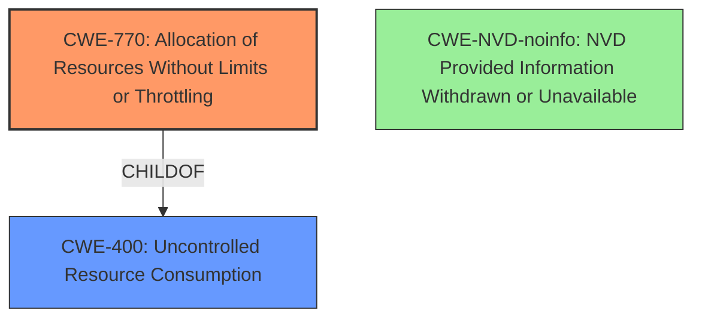

# Enhanced Analysis for CVE-2024-21203

# Summary
| CWE ID        | CWE Name                                                                  | Confidence | CWE Abstraction Level | CWE Vulnerability Mapping Label | CWE-Vulnerability Mapping Notes |
|---------------|---------------------------------------------------------------------------|------------|-----------------------|-----------------------------------|-----------------------------------|
| CWE-770       | Allocation of Resources Without Limits or Throttling                      | 0.6        | Base                  | Primary                           | Allowed                           |
| CWE-400       | Uncontrolled Resource Consumption                                         | 0.4        | Class                  | Secondary                         | Allowed                           |
| CWE-NVD-noinfo| NVD Provided Information Withdrawn or Unavailable                         | 0.3        | N/A                   | Alternative                       | N/A                               |

## Evidence and Confidence

*   **Confidence Score:** 0.6
*   **Evidence Strength:** LOW

## Relationship Analysis
The primary relationship that influenced the decision was the parent-child relationship between CWE-770 (Base) and CWE-400 (Class). While CWE-400 is a broader category, the description specifies a denial-of-service (DoS) condition, which is a direct consequence of uncontrolled resource consumption. CWE-770 offers a more specific description by focusing on the **allocation of resources** without limits or throttling, suggesting this is the root cause of the vulnerability. CWE-NVD-noinfo was also considered, but it provides no actionable information for classification.



## Vulnerability Chain
The vulnerability chain starts with **uncontrolled allocation of resources** (CWE-770), leading to **resource exhaustion** (CWE-400), and ultimately resulting in a **denial-of-service** (DoS) condition where the MySQL Server hangs or crashes.

CWE-770 (Root Cause) -> CWE-400 (Impact) -> Denial of Service

## Summary of Analysis
The initial analysis focused on the reported impact: a denial-of-service (DoS) condition. The primary evidence supporting this is the phrase "cause a hang or frequently repeatable crash (complete DOS) of MySQL Server." The "CWE for similar CVE Descriptions" section suggests CWE-NVD-noinfo as the primary match, however, this provides no actionable information, and per mapping guidelines, should not be used if more information is available.

The Retriever results suggested several CWEs, but CWE-770 stood out due to its focus on **uncontrolled allocation of resources**, which aligns with potential causes of DoS. This is further supported by the "Complete CWE Specifications" for CWE-770, indicating it's a base-level weakness related to resource management. The relationship to CWE-400, a broader class encompassing resource consumption issues, further solidifies the choice of CWE-770 as the primary root cause, with CWE-400 representing the resulting impact.

The final selection reflects the available evidence, emphasizing the root cause (CWE-770) and the resulting impact (CWE-400). CWE-770 is at the optimal level of specificity (Base) as it directly addresses the **allocation of resources** without proper limits, leading to the observed DoS.

Relevant CWE Information:

# Enhanced Context (25 CWEs)
The following CWEs were identified as potentially relevant to this vulnerability:

## CWE-129: Improper Validation of Array Index
**Abstraction Level**: Variant
**Similarity Score**: 0.71
**Source**: dense

**Description**:
The product uses untrusted input when calculating or using an array index, but the product does not validate or incorrectly validates the index to ensure the index references a valid position within the array.

**Mapping Guidance**:
- Usage: Allowed
- Rationale: This CWE entry is at the Variant level of abstraction, which is a preferred level of abstraction for mapping to the root causes of vulnerabilities.

*This CWE was not selected, as there is no mention of array indexing.*

## CWE-303: Incorrect Implementation of Authentication Algorithm
**Abstraction Level**: Base
**Similarity Score**: 0.71
**Source**: dense

**Description**:
The requirements for the product dictate the use of an established authentication algorithm, but the implementation of the algorithm is incorrect.

**Mapping Guidance**:
- Usage: Allowed
- Rationale: This CWE entry is at the Base level of abstraction, which is a preferred level of abstraction for mapping to the root causes of vulnerabilities.

*This CWE was not selected, as there is no mention of authentication algorithms.*

## CWE-89: Improper Neutralization of Special Elements used in an SQL Command ('SQL Injection')
**Abstraction Level**: Base
**Similarity Score**: 0.70
**Source**: dense

**Description**:
The product constructs all or part of an SQL command using externally-influenced input from an upstream component, but it does not neutralize or incorrectly neutralizes special elements that could modify the intended SQL command when it is sent to a downstream component. Without sufficient removal or quoting of SQL syntax in user-controllable inputs, the generated SQL query can cause those inputs to be interpreted as SQL instead of ordinary user data.

**Mapping Guidance**:
- Usage: Allowed
- Rationale: This CWE entry is at the Base level of abstraction, which is a preferred level of abstraction for mapping to the root causes of vulnerabilities.

*This CWE was not selected, as there is no mention of SQL injection.*

## CWE-209: Generation of Error Message Containing Sensitive Information
**Abstraction Level**: Base
**Similarity Score**: 0.70
**Source**: dense

**Description**:
The product generates an error message that includes sensitive information about its environment, users, or associated data.

**Mapping Guidance**:
- Usage: Allowed
- Rationale: This CWE entry is at the Base level of abstraction, which is a preferred level of abstraction for mapping to the root causes of vulnerabilities.

*This CWE was not selected, as there is no mention of error messages.*

## CWE-755: Improper Handling of Exceptional Conditions
**Abstraction Level**: Class
**Similarity Score**: 0.69
**Source**: dense

**Description**:
The product does not handle or incorrectly handles an exceptional condition.

**Mapping Guidance**:
- Usage: Discouraged
- Rationale: This CWE entry is a level-1 Class (i.e., a child of a Pillar). It might have lower-level children that would be more appropriate

*This CWE was not selected, as it is too general and does not provide specific information related to the root cause of the vulnerability.*

## CWE-1391: Use of Weak Credentials
**Abstraction Level**: Class
**Similarity Score**: 0.69
**Source**: dense

**Description**:
The product uses weak credentials (such as a default key or hard-coded password) that can be calculated, derived, reused, or guessed by an attacker.

**Mapping Guidance**:
- Usage: Allowed-with-Review
- Rationale: This CWE entry is a Class and might have Base-level children that would be more appropriate

*This CWE was not selected, as there is no mention of weak credentials.*

## CWE-330: Use of Insufficiently Random Values
**Abstraction Level**: Class
**Similarity Score**: 0.69
**Source**: dense

**Description**:
The product uses insufficiently random numbers or values in a security context that depends on unpredictable numbers.

**Mapping Guidance**:
- Usage: Discouraged
- Rationale: This CWE entry is a level-1 Class (i.e., a child of a Pillar). It might have lower-level children that would be more appropriate

*This CWE was not selected, as there is no mention of random number generation.*

## CWE-497: Exposure of Sensitive System Information to an Unauthorized Control Sphere
**Abstraction Level**: Base
**Similarity Score**: 0.69
**Source**: dense

**Description**:
The product does not properly prevent sensitive system-level information from being accessed by unauthorized actors who do not have the same level of access to the underlying system as the product does.

**Mapping Guidance**:
- Usage: Allowed
- Rationale: This CWE entry is at the Base level of abstraction, which is a preferred level of abstraction for mapping to the root causes of vulnerabilities.

*This CWE was not selected, as there is no mention of information disclosure.*

## CWE-294: Authentication Bypass by Capture-replay
**Abstraction Level**: Base
**Similarity Score**: 0.69
**Source**: dense

**Description**:
A capture-replay flaw exists when the design of the product makes it possible for a malicious user to sniff network traffic and bypass authentication by replaying it to the server in question to the same effect as


## CWE Relationship Analysis

Current CWEs represent these abstraction levels: .


### Vulnerability Chain Analysis

**Chain starting from CWE-89:**
- 89 (Improper Neutralization of Special Elements used in an SQL Command ('SQL Injection')) - ROOT


**Chain starting from CWE-400:**
- 400 (Uncontrolled Resource Consumption) - ROOT


### CWE Relationship Diagram

```mermaid
graph TD
    classDef primary fill:#f96,stroke:#333,stroke-width:2px
    classDef secondary fill:#69f,stroke:#333
    classDef tertiary fill:#9e9,stroke:#333
```