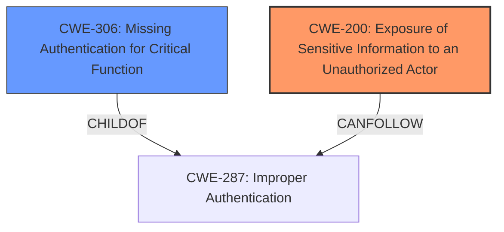

# Enhanced Analysis for CVE-2024-21205

# Summary
| CWE ID          | CWE Name                                                                 | Confidence | CWE Abstraction Level | CWE Vulnerability Mapping Label | CWE-Vulnerability Mapping Notes |
|-----------------|--------------------------------------------------------------------------|------------|-----------------------|---------------------------------|-----------------------------------|
| **CWE-200**     | Exposure of Sensitive Information to an Unauthorized Actor              | 0.7        | Class                 | Primary CWE                    | Discouraged                      |
| CWE-NVD-noinfo  | NVD noinfo                                                             | 0.5        | N/A                   | Secondary Candidate             | N/A                              |
| CWE-306         | Missing Authentication for Critical Function                             | 0.4        | Base                  | Secondary Candidate             | Allowed                      |

## Evidence and Confidence

*   **Confidence Score:** 0.7
*   **Evidence Strength:** MEDIUM

## Relationship Analysis
The primary relationship considered was the parent-child. CWE-200 is a Class-level CWE, and several more specific Base or Variant CWEs could potentially fit. However, given the limited information about the root cause, the broader CWE-200 is selected. CWE-306 was considered due to the possibility of missing authentication leading to the exposure, but there isn't explicit evidence. CWE-NVD-noinfo is included as a possible, though unhelpful, catch-all when the root cause cannot be determined.



## Vulnerability Chain
The vulnerability chain starts with an unknown root cause within the OSB Core Functionality. This leads to unauthorized access to critical data or complete access to all Oracle Service Bus accessible data. The identified CWE reflects the impact (exposure of sensitive information) rather than the root cause because the specific flaw is not detailed.

## Summary of Analysis
The initial analysis focused on identifying a specific root cause CWE, but the provided information lacks sufficient detail to pinpoint the exact flaw. The vulnerability description indicates unauthorized access to data, aligning with CWE-200, Exposure of Sensitive Information to an Unauthorized Actor. While CWE-200 is discouraged for being too general, in this case, it's the most appropriate given the limited information. The CVE Reference Links Content Summary also confirms that the **root cause is not specifically mentioned**. The retriever results include several potential CWEs, but without more information about the OSB Core Functionality vulnerability, a more specific selection would be speculative. The assessment is heavily based on the evidence provided, specifically the **impact:** **unauthorized access to critical data or complete access to all Oracle Service Bus accessible data**. While the abstraction level of CWE-200 is not ideal, it is the best fit considering the available evidence.

Relevant CWE Information:

# Enhanced Context (25 CWEs)
The following CWEs were identified as potentially relevant to this vulnerability:

## CWE-497: Exposure of Sensitive System Information to an Unauthorized Control Sphere
**Abstraction Level**: Base
**Similarity Score**: 0.75
**Source**: dense

**Description**:
The product does not properly prevent sensitive system-level information from being accessed by unauthorized actors who do not have the same level of access to the underlying system as the product does.

**Mapping Guidance**:
- Usage: Allowed
- Rationale: This CWE entry is at the Base level of abstraction, which is a preferred level of abstraction for mapping to the root causes of vulnerabilities.


## CWE-668: Exposure of Resource to Wrong Sphere
**Abstraction Level**: Class
**Similarity Score**: 0.74
**Source**: dense

**Description**:
The product exposes a resource to the wrong control sphere, providing unintended actors with inappropriate access to the resource.

**Mapping Guidance**:
- Usage: Discouraged
- Rationale: CWE-668 is high-level and is often misused as a catch-all when lower-level CWE IDs might be applicable. It is sometimes used for low-information vulnerability reports [REF-1287]. It is a level-1 Class (i.e., a child of a Pillar). It is not useful for trend analysis.


## CWE-303: Incorrect Implementation of Authentication Algorithm
**Abstraction Level**: Base
**Similarity Score**: 0.73
**Source**: dense

**Description**:
The requirements for the product dictate the use of an established authentication algorithm, but the implementation of the algorithm is incorrect.

**Mapping Guidance**:
- Usage: Allowed
- Rationale: This CWE entry is at the Base level of abstraction, which is a preferred level of abstraction for mapping to the root causes of vulnerabilities.


## CWE-200: Exposure of Sensitive Information to an Unauthorized Actor
**Abstraction Level**: Class
**Similarity Score**: 0.73
**Source**: dense

**Description**:
The product exposes sensitive information to an actor that is not explicitly authorized to have access to that information.

**Mapping Guidance**:
- Usage: Discouraged
- Rationale: CWE-200 is commonly misused to represent the loss of confidentiality in a vulnerability, but confidentiality loss is a technical impact - not a root cause error. As of CWE 4.9, over 400 CWE entries can lead to a loss of confidentiality. Other options are often available. [REF-1287].

**Technical Explanation:**

CWE-200 (Exposure of Sensitive Information to an Unauthorized Actor): This CWE is selected because the vulnerability results in unauthorized access to critical data. While it's a high-level CWE, the lack of root cause details makes it difficult to choose a more specific one. The **impact** of the vulnerability directly aligns with the description of CWE-200.

**Security Implications:**

The security implication is a breach of confidentiality. Unauthorized actors can access sensitive data, leading to potential data theft, privacy violations, and other security incidents.

**Considered but not used CWEs:**

CWE-306 (Missing Authentication for Critical Function): While possible, there's no direct evidence of missing authentication. It remains a possibility but is not definitively supported by the provided information. Other CWEs like path traversal, XML external entity injection, etc. were considered from the retriever results, but there is no supporting evidence.


## CWE Relationship Analysis

Current CWEs represent these abstraction levels: .


### Vulnerability Chain Analysis

**Chain starting from CWE-306:**
- 306 (Missing Authentication for Critical Function) - ROOT


**Chain starting from CWE-668:**
- 668 (Exposure of Resource to Wrong Sphere) - ROOT


### CWE Relationship Diagram

```mermaid
graph TD
    classDef primary fill:#f96,stroke:#333,stroke-width:2px
    classDef secondary fill:#69f,stroke:#333
    classDef tertiary fill:#9e9,stroke:#333
```