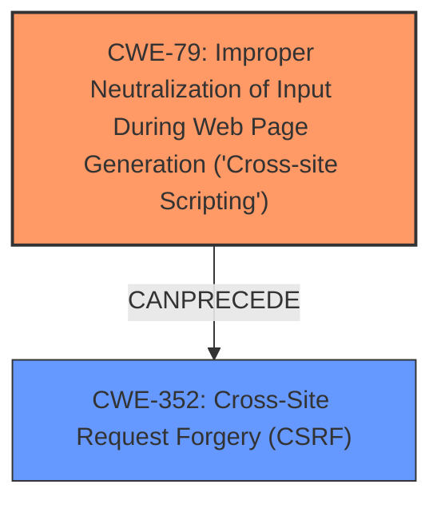

# Analysis Report for CVE-2024-21690

# Vulnerability Analysis Report: CVE-2024-21690

## Description

This High severity Reflected **XSS** and CSRF (Cross-Site Request Forgery) vulnerability was introduced in versions 7.19.0, 7.20.0, 8.0.0, 8.1.0, 8.2.0, 8.3.0, 8.4.0, 8.5.0, 8.6.0, 8.7.1, 8.8.0, and 8.9.0 of Confluence Data Center and Server. This Reflected **XSS** and CSRF (Cross-Site Request Forgery) vulnerability, with a CVSS Score of 7.1, allows an unauthenticated attacker to execute arbitrary HTML or JavaScript code on a victims browser and force a end user to execute unwanted actions on a web application in which theyre currently authenticated which has high impact to confidentiality, low impact to integrity, no impact to availability, and requires user interaction. Atlassian recommends that Confluence Data Center and Server customers upgrade to latest version, if you are unable to do so, upgrade your instance to one of the specified supported fixed versions * Confluence Data Center and Server 7.19 Upgrade to a release greater than or equal to 7.19.26 * Confluence Data Center and Server 8.5 Upgrade to a release greater than or equal to 8.5.14 * Confluence Data Center and Server 9.0 Upgrade to a release greater than or equal to 9.0.1 See the release notes (https//confluence.atlassian.com/doc/confluence-release-notes-327.html). You can download the latest version of Confluence Data Center and Server from the download center (https//www.atlassian.com/software/confluence/download-archives). This vulnerability was reported via our Bug Bounty program.

## Vulnerability Description Key Phrases

- **Weakness:** ['XSS', 'cross-site scripting']
- **Impact:** ['availability', 'execute arbitrary HTML or JavaScript code', 'execute unwanted actions', 'integrity']
- **Attacker:** unauthenticated attacker
- **Product:** Confluence Data Center and Server
- **Version:** ['7.19.0', '7.20.0', '8.0.0', '8.1.0', '8.2.0', '8.3.0', '8.4.0', '8.5.0', '8.6.0', '8.7.1', '8.8.0', 'and 8.9.0']

## Analysis (with Relationship Data)

# Summary
| CWE ID | CWE Name | Confidence | CWE Abstraction Level | CWE Vulnerability Mapping Label | CWE-Vulnerability Mapping Notes |
|---|---|---|---|---|---|
| CWE-79 | Improper Neutralization of Input During Web Page Generation ('Cross-site Scripting') | 1.0 | Base | Primary | Allowed |
| CWE-352 | Cross-Site Request Forgery (CSRF) | 0.9 | Base | Secondary | Allowed |

## Evidence and Confidence

*   **Confidence Score:** 0.95
*   **Evidence Strength:** HIGH

## Relationship Analysis
The primary weakness is CWE-79, which describes the **improper neutralization of input** leading to Cross-Site Scripting (XSS). The secondary weakness is CWE-352, Cross-Site Request Forgery (CSRF), which results from the application allowing actions without proper validation of the request's origin. CWE-79 is a base level CWE, which is the preferred level of abstraction.



## Vulnerability Chain
The vulnerability chain starts with the **improper neutralization of input** (CWE-79) that allows an attacker to inject malicious code into a web page. This injected code can then be used to force a user to perform unwanted actions, leading to Cross-Site Request Forgery (CWE-352).
  - **Root Cause:** CWE-79 (**Improper Neutralization of Input**)
  - **Resulting Impact:** CWE-352 (Cross-Site Request Forgery)

## Summary of Analysis
The analysis is strongly based on the provided evidence, especially the keyphrases "XSS" and "CSRF" in the vulnerability description, and the description of the vulnerability's impact. The primary weakness, CWE-79, directly addresses the **improper neutralization of input**, a classic characteristic of XSS vulnerabilities. The secondary weakness, CWE-352, aligns with the description of an attacker forcing a user to perform unwanted actions. The relationship between these two CWEs is that successful XSS (CWE-79) can enable CSRF (CWE-352) attacks, as malicious JavaScript can be injected to make unauthorized requests.

The selected CWEs are at the optimal level of specificity because they directly reflect the root cause (**improper neutralization**) and the resulting vulnerability (CSRF). Other CWEs were considered but deemed less accurate because they addressed related but distinct weaknesses (e.g., code injection, path traversal).

Relevant CWE Information:

# Enhanced Context (25 CWEs)
The following CWEs were identified as potentially relevant to this vulnerability:

## CWE-668: Exposure of Resource to Wrong Sphere
**Abstraction Level**: Class
**Similarity Score**: 0.74
**Source**: dense

**Description**:
The product exposes a resource to the wrong control sphere, providing unintended actors with inappropriate access to the resource.

**Mapping Guidance**:
- Usage: Discouraged
- Rationale: CWE-668 is high-level and is often misused as a catch-all when lower-level CWE IDs might be applicable. It is sometimes used for low-information vulnerability reports [REF-1287]. It is a level-1 Class (i.e., a child of a Pillar). It is not useful for trend analysis.


## CWE-74: Improper Neutralization of Special Elements in Output Used by a Downstream Component ('Injection')
**Abstraction Level**: Class
**Similarity Score**: 0.74
**Source**: dense

**Description**:
The product constructs all or part of a command, data structure, or record using externally-influenced input from an upstream component, but it does not neutralize or incorrectly neutralizes special elements that could modify how it is parsed or interpreted when it is sent to a downstream component.

**Mapping Guidance**:
- Usage: Discouraged
- Rationale: CWE-74 is high-level and often misused when lower-level weaknesses are more appropriate.


## CWE-41: Improper Resolution of Path Equivalence
**Abstraction Level**: Base
**Similarity Score**: 0.73
**Source**: dense

**Description**:
The product is vulnerable to file system contents disclosure through path equivalence. Path equivalence involves the use of special characters in file and directory names. The associated manipulations are intended to generate multiple names for the same object.

**Mapping Guidance**:
- Usage: Allowed
- Rationale: This CWE entry is at the Base level of abstraction, which is a preferred level of abstraction for mapping to the root causes of vulnerabilities.


## CWE-303: Incorrect Implementation of Authentication Algorithm
**Abstraction Level**: Base
**Similarity Score**: 0.73
**Source**: dense

**Description**:
The requirements for the product dictate the use of an established authentication algorithm, but the implementation of the algorithm is incorrect.

**Mapping Guidance**:
- Usage: Allowed
- Rationale: This CWE entry is at the Base level of abstraction, which is a preferred level of abstraction for mapping to the root causes of vulnerabilities.


## CWE-345: Insufficient Verification of Data Authenticity
**Abstraction Level**: Class
**Similarity Score**: 0.73
**Source**: dense

**Description**:
The product does not sufficiently verify the origin or authenticity of data, in a way that causes it to accept invalid data.

**Mapping Guidance**:
- Usage: Discouraged
- Rationale: This CWE entry is a level-1 Class (i.e., a child of a Pillar). It might have lower-level children that would be more appropriate


## CWE-212: Improper Removal of Sensitive Information Before Storage or Transfer
**Abstraction Level**: Base
**Similarity Score**: 0.73
**Source**: dense

**Description**:
The product stores, transfers, or shares a resource that contains sensitive information, but it does not properly remove that information before the product makes the resource available to unauthorized actors.

**Mapping Guidance**:
- Usage: Allowed
- Rationale: This CWE entry is at the Base level of abstraction, which is a preferred level of abstraction for mapping to the root causes of vulnerabilities.


## CWE-138: Improper Neutralization of Special Elements
**Abstraction Level**: Class
**Similarity Score**: 0.73
**Source**: dense

**Description**:
The product receives input from an upstream component, but it does not neutralize or incorrectly neutralizes special elements that could be interpreted as control elements or syntactic markers when they are sent to a downstream component.

**Mapping Guidance**:
- Usage: Discouraged
- Rationale: This CWE entry is a level-1 Class (i.e., a child of a Pillar). It might have lower-level children that would be more appropriate


## CWE-23: Relative Path Traversal
**Abstraction Level**: Base
**Similarity Score**: 0.72
**Source**: dense

**Description**:
The product uses external input to construct a pathname that should be within a restricted directory, but it does not properly neutralize sequences such as ".." that can resolve to a location that is outside of that directory.

**Mapping Guidance**:
- Usage: Allowed
- Rationale: This CWE entry is at the Base level of abstraction, which is a preferred level of abstraction for mapping to the root causes of vulnerabilities.


## CWE-1391: Use of Weak Credentials
**Abstraction Level**: Class
**Similarity Score**: 0.72
**Source**: dense

**Description**:
The product uses weak credentials (such as a default key or hard-coded password) that can be calculated, derived, reused, or guessed by an attacker.

**Mapping Guidance**:
- Usage: Allowed-with-Review
- Rationale: This CWE entry is a Class and might have Base-level children that would be more appropriate


## CWE-917: Improper Neutralization of Special Elements used in an Expression Language Statement ('Expression Language Injection')
**Abstraction Level**: Base
**Similarity Score**: 0.72
**Source**: dense

**Description**:
The product constructs all or part of an expression language (EL) statement in a framework such as a Java Server Page (JSP) using externally-influenced input from an upstream component, but it does not neutralize or incorrectly neutralizes special elements that could modify the intended EL statement before it is executed.

**Mapping Guidance**:
- Usage: Allowed
- Rationale: This CWE entry is at the Base level of abstraction, which is a preferred level of abstraction for mapping to the root causes of vulnerabilities.


## CWE-917: Improper Neutralization of Special Elements used in an Expression Language Statement ('Expression Language Injection')
**Abstraction Level**: Base
**Similarity Score**: 11021.14
**Source**: sparse

**Description**:
The product constructs all or part of an expression language (EL) statement in a framework such as a Java Server Page (JSP) using externally-influenced input from


## CWE Relationship Analysis

Current CWEs represent these abstraction levels: .


### Vulnerability Chain Analysis

**Chain starting from CWE-1391:**
- 1391 (Use of Weak Credentials) - ROOT


**Chain starting from CWE-345:**
- 345 (Insufficient Verification of Data Authenticity) - ROOT


### CWE Relationship Diagram

```mermaid
graph TD
    classDef primary fill:#f96,stroke:#333,stroke-width:2px
    classDef secondary fill:#69f,stroke:#333
    classDef tertiary fill:#9e9,stroke:#333
```


*Report generated on 2025-07-13 05:34:03*
