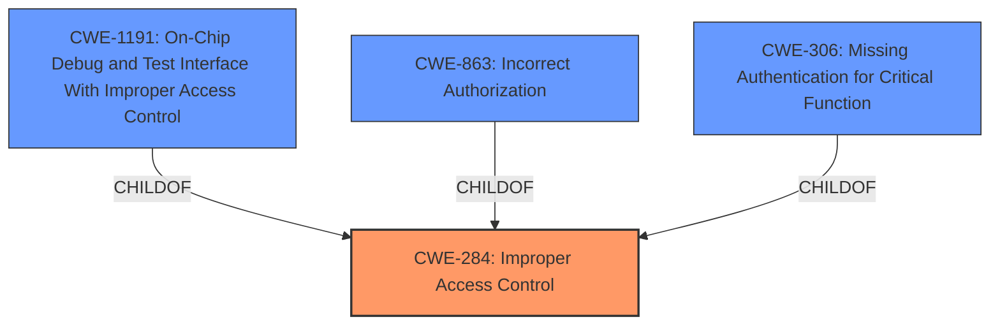

# Analysis Report for CVE-2024-21739

# Vulnerability Analysis Report: CVE-2024-21739

## Description

Geehy APM32F103CCT6, APM32F103RCT6, APM32F103RCT7, and APM32F103VCT6 devices have **Incorrect Access Control**.

## Vulnerability Description Key Phrases

- **Rootcause:** Incorrect Access Control
- **Product:** Geehy APM32F103CCT6, APM32F103RCT6, APM32F103RCT7, and APM32F103VCT6 devices

## Analysis (with Relationship Data)

# Summary
| CWE ID | CWE Name | Confidence | CWE Abstraction Level | CWE Vulnerability Mapping Label | CWE-Vulnerability Mapping Notes |
|---|---|---|---|---|---|
| CWE-284 | Improper Access Control | 0.8 | Pillar | Allowed | Primary CWE |
| CWE-1191 | On-Chip Debug and Test Interface With Improper Access Control | 0.6 | Base | Allowed | Secondary Candidate |
| CWE-863 | Incorrect Authorization | 0.5 | Class | Allowed-with-Review | Secondary Candidate |
| CWE-306 | Missing Authentication for Critical Function | 0.5 | Base | Allowed | Secondary Candidate |

## Evidence and Confidence

*   **Confidence Score:** 0.8
*   **Evidence Strength:** MEDIUM

## Relationship Analysis
The primary relationship influencing the CWE selection is the hierarchical relationship, where CWE-284 (Improper Access Control) serves as a high-level classification. The other CWEs considered, such as CWE-1191 (On-Chip Debug and Test Interface With Improper Access Control), CWE-863 (Incorrect Authorization), and CWE-306 (Missing Authentication for Critical Function), are more specific and fall under the umbrella of access control issues. The abstraction level of CWE-284 being a Pillar influenced the decision to consider more specific Base or Class level CWEs if sufficient evidence supported them.



## Vulnerability Chain
The vulnerability chain starts with **Incorrect Access Control**. Without more information, it is not possible to build a longer chain.

## Summary of Analysis
The initial assessment identified **Incorrect Access Control** as the root cause, based on the "Vulnerability Description Key Phrases". The primary decision was to select CWE-284 because the description directly mentions "**Incorrect Access Control**".

While the Retriever Results suggested more specific CWEs like CWE-1191, CWE-863, and CWE-306, the provided vulnerability description lacks the necessary details to definitively classify the issue beyond a general access control problem. Therefore, while these are considered as secondary candidates, CWE-284 is the most appropriate primary classification given the available evidence.

Relevant CWE Information:

# Enhanced Context (25 CWEs)
The following CWEs were identified as potentially relevant to this vulnerability:

## Vulnerability Description
Geehy APM32F103CCT6, APM32F103RCT6, APM32F103RCT7, and APM32F103VCT6 devices have **Incorrect Access Control**.

### Vulnerability Description Key Phrases
- **rootcause:** **Incorrect Access Control**
- **product:** Geehy APM32F103CCT6, APM32F103RCT6, APM32F103RCT7, and APM32F103VCT6 devices

## CVE Reference Links Content Summary
UNRELATED

## Retriever Results

### Top Combined Results

| Rank | CWE ID | Name | Abstraction | Usage  | Retrievers | Individual Scores |
|------|--------|------|-------------|-------|------------|-------------------|
| 1 | 1263 | Improper Physical Access Control | Class | Allowed-with-Review | sparse | 0.064 |
| 2 | 284 | Improper Access Control | Pillar | Discouraged | sparse | 0.062 |
| 3 | 340 | Generation of Predictable Numbers or Identifiers | Class | Allowed-with-Review | sparse | 0.061 |
| 4 | 425 | Direct Request ('Forced Browsing') | Base | Allowed | sparse | 0.060 |
| 5 | 1296 | Incorrect Chaining or Granularity of Debug Components | Base | Allowed | sparse | 0.059 |
| 6 | 306 | Missing Authentication for Critical Function | Base | Allowed | sparse | 0.059 |
| 7 | 863 | Incorrect Authorization | Class | Allowed-with-Review | sparse | 0.058 |
| 8 | 1394 | Use of Default Cryptographic Key | Base | Allowed | sparse | 0.057 |
| 9 | 1191 | On-Chip Debug and Test Interface With Improper Access Control | Base | Allowed | dense | 0.567 |
| 10 | 471 | Modification of Assumed-Immutable Data (MAID) | Base | Allowed | graph | 0.002 |

Based on the provided information:

*   **CWE-284: Improper Access Control**
    *   **Technical Explanation:** The vulnerability description explicitly states "**Incorrect Access Control**". CWE-284 is a high-level category for access control issues.
    *   **Security Implications:** The implications depend on what resources are not properly protected, but could include unauthorized information disclosure, modification, or denial of service.
    *   **Relationships:** This is a high-level category (Pillar). Child CWEs such as CWE-306, CWE-862, and CWE-863 could be more specific if more details were available.
    *   **Mapping Guidance:** The usage is "Allowed".
    *   **Primary**

*   **CWE-1191: On-Chip Debug and Test Interface With Improper Access Control**
    *   **Technical Explanation:** This is a base level CWE that represents the case where the on-chip debug and test interface has improper access control. Given the type of device this is (Geehy APM32F103CCT6, APM32F103RCT6, APM32F103RCT7, and APM32F103VCT6), it is possible this is the root cause.
    *   **Security Implications:** If access control is not enforced, then the debug interface could be used to extract code, modify memory, or perform other unauthorized actions.
    *   **Relationships:** Child of CWE-284.
    *   **Mapping Guidance:** The usage is "Allowed".

*   **CWE-863: Incorrect Authorization**
    *   **Technical Explanation:** The product performs an authorization check but does it incorrectly. Since the description states "**Incorrect Access Control**", this is a possible cause.
    *   **Security Implications:** An attacker could gain access to resources or perform actions they are not authorized to.
    *   **Relationships:** Child of CWE-284.
    *   **Mapping Guidance:** The usage is "Allowed-with-Review".

*   **CWE-306: Missing Authentication for Critical Function**
    *   **Technical Explanation:** The product does not perform authentication for a critical function. Since the description states "**Incorrect Access Control**", this is a possible cause.
    *   **Security Implications:** An attacker could access critical functionality without proper authentication.
    *   **Relationships:** Child of CWE-287, which is a child of CWE-284.
    *   **Mapping Guidance:** The usage is "Allowed".

CWEs Considered but not Used:

*   CWE-1263: Improper Physical Access Control: While physical access control is a type of access control, there's no evidence provided to suggest this is the case.
*   CWE-340: Generation of Predictable Numbers or Identifiers: This CWE is not directly related to the "**Incorrect Access Control**" issue.
*   CWE-425: Direct Request ('Forced Browsing'): This CWE is not directly related to the "**Incorrect Access Control**" issue, as it focuses on web application URL authorization.
*   CWE-1296: Incorrect Chaining or Granularity of Debug Components: This CWE is too specific without more information about the debug components.
*   CWE-1394: Use of Default Cryptographic Key: This CWE is not related to the "**Incorrect Access Control**" issue.
*   CWE-471: Modification of Assumed-Immutable Data (MAID): This CWE is not related to the "**Incorrect Access Control**" issue.


## CWE Relationship Analysis

Current CWEs represent these abstraction levels: .


### Vulnerability Chain Analysis

**Chain starting from CWE-863:**
- 863 (Incorrect Authorization) - ROOT


**Chain starting from CWE-340:**
- 340 (Generation of Predictable Numbers or Identifiers) - ROOT


### CWE Relationship Diagram

```mermaid
graph TD
    classDef primary fill:#f96,stroke:#333,stroke-width:2px
    classDef secondary fill:#69f,stroke:#333
    classDef tertiary fill:#9e9,stroke:#333
```


*Report generated on 2025-07-13 05:34:23*
