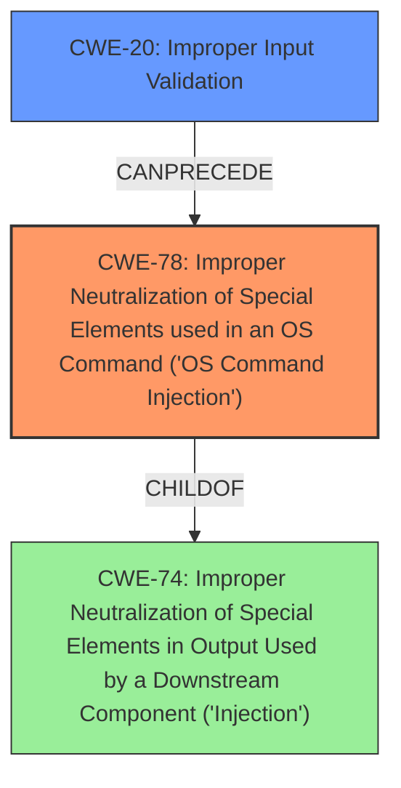

# Raw Analyzer Response for CVE-2024-21797

# Summary
| CWE ID | CWE Name | Confidence | CWE Abstraction Level | CWE Vulnerability Mapping Label | CWE-Vulnerability Mapping Notes |
|---|---|---|---|---|---|
| CWE-78 | Improper Neutralization of Special Elements used in an OS Command ('OS Command Injection') | 1 | Base | Allowed | Primary CWE: The vulnerability is a command injection vulnerability due to a lack of input filtering, leading to arbitrary command execution. |
| CWE-20 | Improper Input Validation | 0.7 | Class | Allowed | Secondary CWE: The root cause is **missing input validation** of the `TR069_local_port` parameter that led to the command injection. |

## Evidence and Confidence

*   **Confidence Score:** 0.9
*   **Evidence Strength:** HIGH

## Relationship Analysis
The primary CWE is CWE-78, which is a base-level CWE representing the specific type of injection vulnerability. CWE-78 is a child of CWE-74 (Improper Neutralization of Special Elements in Output Used by a Downstream Component ('Injection')), which is a class-level CWE. CWE-78 also can follow CWE-20 (Improper Input Validation) if there is **missing input validation**. This relationship correctly describes the vulnerability chain.

## Vulnerability Chain
The vulnerability chain starts with **improper input validation** (CWE-20), which leads to the injection of special elements into an OS command (CWE-78), resulting in arbitrary command execution.

## Summary of Analysis
The analysis is based on the provided vulnerability description and the CVE reference content summary. The evidence clearly points to a **command injection vulnerability** in the `adm.cgi set_TR069()` functionality of Wavlink AC3000. The root cause is the **lack of input filtering** for the `TR069_local_port` parameter, which allows attackers to inject subshell commands. The injected commands are then executed by the system, leading to arbitrary command execution. The selected CWEs are at the optimal level of specificity, with CWE-78 representing the specific type of injection and CWE-20 representing the **lack of input validation** leading to the injection.

Other CWEs Considered:

*   CWE-77: Improper Neutralization of Special Elements used in a Command ('Command Injection') - While similar to CWE-78, CWE-78 is more specific as it explicitly mentions OS commands.
*   CWE-74: Improper Neutralization of Special Elements in Output Used by a Downstream Component ('Injection') - This is a more general class of injection vulnerabilities. CWE-78 is a child of CWE-74 and is more specific to OS command injection.
*   CWE-89: Improper Neutralization of Special Elements used in an SQL Command ('SQL Injection') - This is specific to SQL injection, which is not the case here.
*   CWE-79: Improper Neutralization of Input During Web Page Generation ('Cross-site Scripting') - This is specific to Cross-site Scripting, which is not the case here.
*   CWE-134: Use of Externally-Controlled Format String - This is specific to format string vulnerabilities, which is not the case here.
*   CWE-22: Improper Limitation of a Pathname to a Restricted Directory ('Path Traversal') - This is specific to Path Traversal, which is not the case here.
*   CWE-425: Direct Request ('Forced Browsing') - This is specific to forced browsing, which is not the case here.
*   CWE-120: Buffer Copy without Checking Size of Input ('Classic Buffer Overflow') - This is specific to buffer overflows, which is not the case here.
*   CWE-1287: Improper Validation of Specified Type of Input - This is a general input validation issue. CWE-20 is more appropriate.

The retriever results listed CWE-790 (Improper Filtering of Special Elements) and CWE-138 (Improper Neutralization of Special Elements). However, these are Class-level CWEs, and CWE-78 is a more specific Base-level CWE that better represents the **command injection vulnerability**.