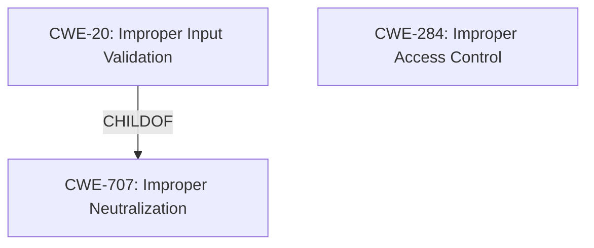

# Enhanced Analysis for CVE-2024-21829

# Summary
| CWE ID | CWE Name | Confidence | CWE Abstraction Level | CWE Vulnerability Mapping Label | CWE-Vulnerability Mapping Notes |
|---|---|---|---|---|---|
| CWE-20 | Improper Input Validation | 0.9 | Class | Allowed-with-Review | Primary CWE |
| CWE-284 | Improper Access Control | 0.6 | Pillar | Discouraged | Secondary Candidate |

## Evidence and Confidence

*   **Confidence Score:** 0.9
*   **Evidence Strength:** HIGH

## Relationship Analysis
The primary CWE selected is CWE-20, which is a class-level CWE. While more specific CWEs might exist, the provided information doesn't specify the exact nature of the **improper input validation**, making a broader classification appropriate. CWE-20 is a child of CWE-707 (Improper Neutralization) and can precede CWE-22 (Improper Limitation of a Pathname to a Restricted Directory ('Path Traversal')), CWE-41 (Improper Resolution of Path Equivalence), and CWE-74 (Improper Neutralization of Special Elements used in an Output Operation ('Injection')).

CWE-284 is a high-level pillar that represents a failure to restrict access to resources. It's related to the impact (escalation of privilege) described in the vulnerability.



## Vulnerability Chain
The vulnerability chain starts with **improper input validation** (CWE-20), which then leads to potential escalation of privilege.

## Summary of Analysis
The initial analysis focused on identifying the **root cause** of the vulnerability, which is described as **improper input validation**. The CVE Reference Links Content Summary explicitly states this, providing strong evidence. The **impact** is escalation of privilege, suggesting a failure in access control.

CWE-20 (Improper Input Validation) aligns directly with the **root cause** described in the vulnerability description and CVE summary. The description states, "**Improper input validation** in UEFI firmware error handler...may allow a privileged user to potentially enable escalation of privilege via local access."

CWE-284 (Improper Access Control) was considered because the **impact** of the vulnerability is escalation of privilege, suggesting a failure to restrict access to resources. However, since the vulnerability description specifically mentions **improper input validation** as the root cause, CWE-20 is the more appropriate primary CWE.

The selection of CWE-20 is at the appropriate level of specificity because the provided information does not offer details on the exact type of input that is not being properly validated. Therefore, a more granular CWE is not supportable at this time.

Relevant CWE Information:
- Vulnerability Description Key Phrases
  - **rootcause:** **Improper input validation**
- CVE Reference Links Content Summary
  - **Root cause of vulnerability:**
    - **Improper input validation** in the UEFI firmware error handler.
  - **Impact of exploitation:**
    - Escalation of privilege.

# Enhanced Context (25 CWEs)

## CWE-274: Improper Handling of Insufficient Privileges
## CWE-280: Improper Handling of Insufficient Permissions or Privileges 
## CWE-266: Incorrect Privilege Assignment
## CWE-267: Privilege Defined With Unsafe Actions
## CWE-807: Reliance on Untrusted Inputs in a Security Decision
## CWE-703: Improper Check or Handling of Exceptional Conditions
## CWE-691: Insufficient Control Flow Management
## CWE-1289: Improper Validation of Unsafe Equivalence in Input
## CWE-668: Exposure of Resource to Wrong Sphere
## CWE-41: Improper Resolution of Path Equivalence
## CWE-863: Incorrect Authorization
## CWE-269: Improper Privilege Management
## CWE-285: Improper Authorization
## CWE-284: Improper Access Control
## CWE-267: Privilege Defined With Unsafe Actions
## CWE-770: Allocation of Resources Without Limits or Throttling
## CWE-20: Improper Input Validation
## CWE-274: Improper Handling of Insufficient Privileges
## CWE-280: Improper Handling of Insufficient Permissions or Privileges 
## CWE-250: Execution with Unnecessary Privileges
## CWE-1256: Improper Restriction of Software Interfaces to Hardware Features
## CWE-1288: Improper Validation of Consistency within Input
## CWE-1285: Improper Validation of Specified Index, Position, or Offset in Input
## CWE-306: Missing Authentication for Critical Function
## CWE-248: Uncaught Exception


## CWE Relationship Analysis

Current CWEs represent these abstraction levels: .


### Vulnerability Chain Analysis

**Chain starting from CWE-274:**
- 274 (Improper Handling of Insufficient Privileges) - ROOT


**Chain starting from CWE-770:**
- 770 (Allocation of Resources Without Limits or Throttling) - ROOT


### CWE Relationship Diagram

```mermaid
graph TD
    classDef primary fill:#f96,stroke:#333,stroke-width:2px
    classDef secondary fill:#69f,stroke:#333
    classDef tertiary fill:#9e9,stroke:#333
```