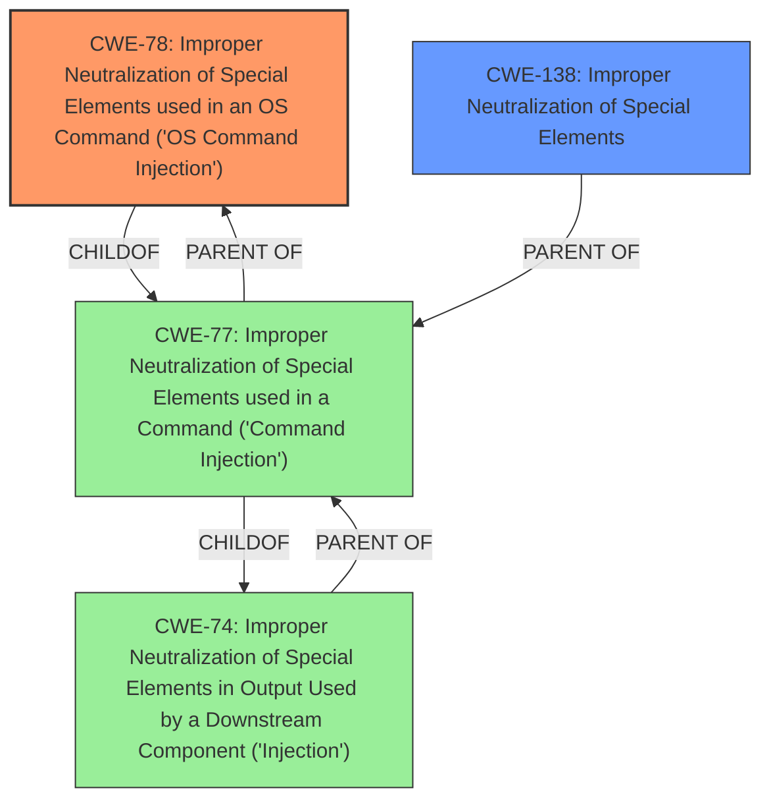

# Analysis Report for CVE-2024-21879

# Vulnerability Analysis Report: CVE-2024-21879

## Description

**Improper Neutralization of Special Elements** used in a Command (Command Injection) vulnerability through an url parameter of an authenticated enpoint in Enphase IQ Gateway (formerly known as Envoy) allows OS Command Injection.This issue affects Envoy from 4.x to 8.x and < 8.2.4225.

## Vulnerability Description Key Phrases

- **Rootcause:** ['Improper Neutralization of Special Elements', 'improper input sanitization']
- **Weakness:** command injection
- **Impact:** execute arbitrary commands
- **Vector:** specially crafted payload
- **Attacker:** authenticated attacker
- **Product:** Enphase IQ Gateway
- **Version:** Envoy 4.x to 8.x and prior to 8.2.4225
- **Component:** unspecified endpoint

## Analysis (with Relationship Data)

# Summary
| CWE ID | CWE Name | Confidence | CWE Abstraction Level | CWE Vulnerability Mapping Label | CWE-Vulnerability Mapping Notes |
|---|---|---|---|---|---|
| CWE-78 | Improper Neutralization of Special Elements used in an OS Command ('OS Command Injection') | 1.0 | Base | Primary | Allowed |
| CWE-138 | Improper Neutralization of Special Elements | 0.7 | Class | Secondary | Discouraged |

## Evidence and Confidence

*   **Confidence Score:** 0.9
*   **Evidence Strength:** HIGH

## Relationship Analysis
The primary relationship that influenced my decision was the parent-child relationship. CWE-78 is a child of CWE-77 (Improper Neutralization of Special Elements used in a Command ('Command Injection')), which itself is a child of CWE-74 (Improper Neutralization of Special Elements in Output Used by a Downstream Component ('Injection')). However, the vulnerability description specifically mentions "OS Command Injection", making CWE-78 the most specific and appropriate choice. CWE-138 is a more general class, and while it applies, it is less specific than CWE-78.



## Vulnerability Chain
The vulnerability chain starts with **improper neutralization of special elements** in the URL parameter, leading to **OS command injection**, which allows an attacker to **execute arbitrary commands**.

## Summary of Analysis
The analysis is based on the provided vulnerability description, which explicitly states "**Improper Neutralization of Special Elements** used in a Command (Command Injection) vulnerability through an url parameter of an authenticated enpoint in Enphase IQ Gateway... allows OS Command Injection." This statement strongly suggests CWE-78 as the primary weakness. The various keyphrase analyses all pointed toward CWE-78 as a top candidate.

CWE-138 was considered because it is a more general case of **improper neutralization**, but CWE-78 provides the necessary specificity regarding the OS command context. Other CWEs like those related to SQL injection, CSV injection, and template injection were deemed irrelevant due to the explicit mention of OS commands.

The selection of CWE-78 is at the optimal level of specificity because it accurately describes the type of injection occurring (OS command injection) due to the **improper neutralization of special elements**.

Relevant CWE Information:

# Enhanced Context (25 CWEs)
The following CWEs were identified as potentially relevant to this vulnerability:

## CWE-74: Improper Neutralization of Special Elements in Output Used by a Downstream Component ('Injection')

## CWE-138: Improper Neutralization of Special Elements

## CWE-345: Insufficient Verification of Data Authenticity

## CWE-917: Improper Neutralization of Special Elements used in an Expression Language Statement ('Expression Language Injection')

## CWE-668: Exposure of Resource to Wrong Sphere

## CWE-184: Incomplete List of Disallowed Inputs

## CWE-212: Improper Removal of Sensitive Information Before Storage or Transfer

## CWE-303: Incorrect Implementation of Authentication Algorithm

## CWE-134: Use of Externally-Controlled Format String

## CWE-696: Incorrect Behavior Order

## CWE-150: Improper Neutralization of Escape, Meta, or Control Sequences

## CWE-1336: Improper Neutralization of Special Elements Used in a Template Engine

## CWE-138: Improper Neutralization of Special Elements

## CWE-90: Improper Neutralization of Special Elements used in an LDAP Query ('LDAP Injection')

## CWE-1236: Improper Neutralization of Formula Elements in a CSV File

## CWE-1336: Improper Neutralization of Special Elements Used in a Template Engine

## CWE-117: Improper Output Neutralization for Logs

## CWE-917: Improper Neutralization of Special Elements used in an Expression Language Statement ('Expression Language Injection')

## CWE-89: Improper Neutralization of Special Elements used in an SQL Command ('SQL Injection')

## CWE-93: Improper Neutralization of CRLF Sequences ('CRLF Injection')

## CWE-78: Improper Neutralization of Special Elements used in an OS Command ('OS Command Injection')

## CWE-1236: Improper Neutralization of Formula Elements in a CSV File

## CWE-79: Improper Neutralization of Input During Web Page Generation ('Cross-site Scripting')

## CWE-22: Improper Limitation of a Pathname to a Restricted Directory ('Path Traversal')

## CWE-90: Improper Neutralization of Special Elements used in an LDAP Query ('LDAP Injection')

# Technical Explanation for Selected CWEs:

*   **CWE-78: Improper Neutralization of Special Elements used in an OS Command ('OS Command Injection')**
    *   **Match:** The vulnerability description explicitly states that the issue is an "OS Command Injection" vulnerability. This aligns directly with the definition of CWE-78, where the product fails to neutralize special elements in externally-influenced input, allowing modification of the intended OS command.
    *   **Security Implications:** This allows an attacker to execute arbitrary OS commands on the affected system, potentially leading to complete system compromise, data theft, or denial of service.
    *   **Relationships:** CWE-78 is a specific type of command injection, making it a child of CWE-77 (Improper Neutralization of Special Elements used in a Command ('Command Injection')).
    *   **Primary/Secondary:** Primary weakness.
    *   **Mapping Guidance:** Allowed.
*   **CWE-138: Improper Neutralization of Special Elements**
    *   **Match:** This is a more general case of **improper neutralization** and could be considered since the root cause involves failing to neutralize special elements.
    *   **Security Implications:** The security implications depend on the context of where the **improper neutralization** occurs.
    *   **Relationships:** This is a parent of more specific injection vulnerabilities.
    *   **Primary/Secondary:** Secondary weakness.
    *   **Mapping Guidance:** Discouraged because more specific CWEs are available.

# CWEs Considered But Not Used:

*   CWE-77: Improper Neutralization of Special Elements used in a Command ('Command Injection') - While related, CWE-78 is more specific as it directly identifies the vulnerability as OS command injection.
*   CWE-89: Improper Neutralization of Special Elements used in an SQL Command ('SQL Injection') - This is specific to SQL injection, which is not the case in this vulnerability.
*   CWE-90: Improper Neutralization of Special Elements used in an LDAP Query ('LDAP Injection') - This is specific to LDAP injection, which is not the case in this vulnerability.
*   CWE-93: Improper Neutralization of CRLF Sequences ('CRLF Injection') - This is specific to CRLF injection, which is not the case in this vulnerability.
*   CWE-1336: Improper Neutralization of Special Elements Used in a Template Engine - This is specific to template engine injection, which is not the case in this vulnerability.
*   CWE-1236: Improper Neutralization of Formula Elements in a CSV File - This is specific to CSV injection, which is not the case in this vulnerability.


## CWE Relationship Analysis

Current CWEs represent these abstraction levels: .


### Vulnerability Chain Analysis

**Chain starting from CWE-345:**
- 345 (Insufficient Verification of Data Authenticity) - ROOT


**Chain starting from CWE-93:**
- 93 (Improper Neutralization of CRLF Sequences ('CRLF Injection')) - ROOT


### CWE Relationship Diagram

```mermaid
graph TD
    classDef primary fill:#f96,stroke:#333,stroke-width:2px
    classDef secondary fill:#69f,stroke:#333
    classDef tertiary fill:#9e9,stroke:#333
```


*Report generated on 2025-07-13 05:38:21*
