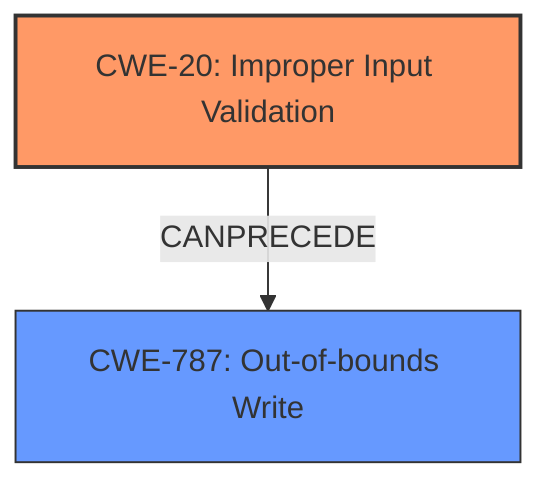

# Raw Analyzer Response for CVE-2024-21976

# Summary
| CWE ID | CWE Name | Confidence | CWE Abstraction Level | CWE Vulnerability Mapping Label | CWE-Vulnerability Mapping Notes |
|---|---|---|---|---|---|
| CWE-20 | Improper Input Validation | 0.9 | Class | Primary | Allowed-with-Review |
| CWE-787 | Out-of-bounds Write | 0.6 | Base | Secondary | Allowed |

## Evidence and Confidence

*   **Confidence Score:** 0.75
*   **Evidence Strength:** MEDIUM

## Relationship Analysis
The primary relationship impacting the decision is that CWE-20 is a class-level CWE, while CWE-787 is a base-level CWE. CWE-20 is chosen because the description explicitly states **"Improper input validation"** as the root cause. It is possible that the improper validation could lead to an out-of-bounds write (CWE-787), thus establishing a potential chain.

## Vulnerability Chain
The vulnerability chain starts with **improper input validation** (CWE-20). This could lead to a specially crafted pointer being supplied to the NPU driver. If this pointer is used without proper bounds checking, it can lead to an out-of-bounds write (CWE-787), which can result in arbitrary code execution.

## Summary of Analysis
The initial assessment focused on identifying the root cause of the vulnerability. The vulnerability description and the CVE Reference Links Content Summary both explicitly state **"Improper input validation"** as the core issue. The Retriever Results also list CWE-20 as the top candidate.

CWE-20 is a Class-level CWE, and while more specific CWEs exist for input validation issues, there isn't enough information to pinpoint the exact type of validation failure. The description mentions a "specially crafted pointer," suggesting the possibility of an out-of-bounds write (CWE-787) or related memory corruption issues. Therefore, CWE-787 is included as a possible consequence of the **improper input validation**, and a secondary CWE.

The selection is primarily based on the provided evidence, specifically the explicit mention of **"Improper input validation"**. The graph relationships support the potential progression from **improper input validation** to an out-of-bounds write.

Relevant CWE Information:

# Enhanced Context (25 CWEs)
The following CWEs were identified as potentially relevant to this vulnerability:

## CWE-1285: Improper Validation of Specified Index, Position, or Offset in Input
**Abstraction Level**: Base
**Similarity Score**: 0.72
**Source**: dense

**Description**:
The product receives input that is expected to specify an index, position, or offset into an indexable resource such as a buffer or file, but it does not validate or incorrectly validates that the specified index/position/offset has the required properties.

**Mapping Guidance**:
- Usage: Allowed
- Rationale: This CWE entry is at the Base level of abstraction, which is a preferred level of abstraction for mapping to the root causes of vulnerabilities.

## CWE-20: Improper Input Validation
**CWE-20** Improper Input Validation
- Technical Explanation: The NPU driver does not properly validate input, which could allow an attacker to supply a specially crafted pointer. This is a case of **Improper Input Validation** because the driver fails to adequately check the input pointer's validity.
- Security Implications: An attacker can supply a **specially crafted pointer** that may lead to out-of-bounds writes or other memory corruption issues, potentially leading to arbitrary code execution.
- Relationship analysis: CWE-20 is a class level weakness and the parent of many specific input validation weaknesses.
- Mapping Guidance Analysis: The retriever results list CWE-20 as the top candidate.
- Why Chosen: The vulnerability description specifically mentions **Improper Input Validation** as the root cause.
- Confidence: 0.9

## CWE-787: Out-of-bounds Write
**CWE-787** Out-of-bounds Write
- Technical Explanation: If the **improperly validated** pointer is subsequently used to write data outside the intended buffer, this would constitute an out-of-bounds write.
- Security Implications: This can lead to arbitrary code execution.
- Relationship analysis: CWE-787 is a base level weakness and is often the result of **Improper Input Validation**.
- Mapping Guidance Analysis: The retriever results list CWE-787 as a possible candidate.
- Why Chosen: The vulnerability description mentions an attacker can supply a **specially crafted pointer**, making an out-of-bounds write likely.
- Confidence: 0.6

### Other CWEs considered but not used.

*   CWE-NVD-noinfo: This is a placeholder and not an actual CWE.
*   CWE-665: Improper Initialization - While initialization issues can lead to vulnerabilities, the primary issue here is the lack of input validation, not necessarily incorrect initialization.
*   CWE-1284, CWE-1285: Improper Validation of Specified Quantity/Index/Position/Offset in Input - These are more specific types of input validation issues. However, without more details about the exact nature of the **improper input validation**, it's difficult to justify these more specific CWEs over the general CWE-20.
*   CWE-476: NULL Pointer Dereference - While a NULL pointer dereference is possible, it's not explicitly stated in the description.
*   CWE-193: Off-by-one Error - This is a specific type of error and is not directly supported by the provided information.
*   CWE-190: Integer Overflow or Wraparound - This is not directly supported by the provided information.
*   CWE-822: Untrusted Pointer Dereference - This is related, but the core issue starts with the **improper input validation** that allows the untrusted pointer to be used in the first place.
*   CWE-770: Allocation of Resources Without Limits or Throttling - This is not directly related to the vulnerability description.