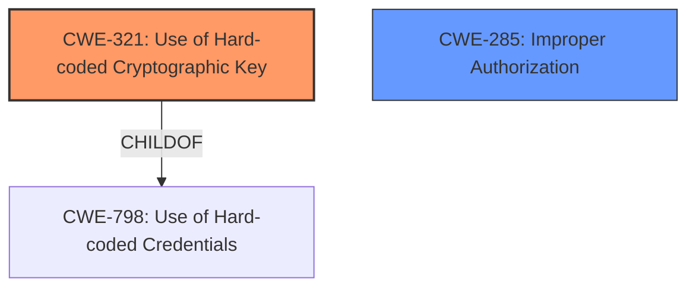

# Enhanced Analysis for CVE-2024-21981

# Summary
| CWE ID | CWE Name | Confidence | CWE Abstraction Level | CWE Vulnerability Mapping Label | CWE-Vulnerability Mapping Notes |
|---|---|---|---|---|---|
| CWE-321 | Use of Hard-coded Cryptographic Key | 0.75 | Variant | Allowed | Primary CWE |
| CWE-285 | Improper Authorization | 0.50 | Class | Discouraged | Secondary Candidate |

## Evidence and Confidence

*   **Confidence Score:** 0.60
*   **Evidence Strength:** MEDIUM

## Relationship Analysis
The primary CWE selected is CWE-321, which is a variant of CWE-798 (Use of Hard-coded Credentials). It relates to using hard-coded cryptographic keys. CWE-285 is a class-level CWE related to improper authorization, but it's a less specific fit than CWE-321. CWE-321 is preferred because the vulnerability description specifically mentions the compromise of cryptographic keys.



## Vulnerability Chain
The vulnerability chain starts with **improper key usage control**, which allows an attacker with arbitrary code execution to extract cryptographic keys, leading to loss of confidentiality and integrity.

Root Cause: **Improper key usage control** leads to CWE-321 (Use of Hard-coded Cryptographic Key) because **improper usage** can result in the key being misused or exposed.
Impact: Extraction of keys leads to loss of confidentiality and integrity.

## Summary of Analysis
The initial assessment identified the **improper key usage control** as the root cause, leading to the selection of CWE-321 (Use of Hard-coded Cryptographic Key) as the primary CWE. The **CVE Reference Links Content Summary** confirms that the vulnerability stems from **improper key usage control** within the AMD Secure Processor (ASP). This can be interpreted as either a hardcoded key or improper use of the key that leads to exposure. The retriever results also list CWE-321 as a candidate.

CWE-285 (Improper Authorization) was considered as a secondary CWE because the vulnerability involves unauthorized access to cryptographic keys. However, it is less specific than CWE-321, and the **improper key usage** is a more direct cause.

The evidence strongly supports CWE-321 as the most appropriate classification, although the exact mechanism of **improper key usage** isn't fully explained. The selection of CWE-321 is at the optimal level of specificity (Variant) based on the provided evidence.

Relevant CWE Information:

# Enhanced Context (25 CWEs)
The following CWEs were identified as potentially relevant to this vulnerability:

## CWE-321: Use of Hard-coded Cryptographic Key
**Abstraction Level**: variant
**Similarity Score**: 2.36
**Source**: graph

**Description**:
CWE-321: Use of Hard-coded Cryptographic Key

**Mapping Guidance**:
- Usage: Allowed
- Rationale: This CWE entry is at the Variant level of abstraction, which is a preferred level of abstraction for mapping to the root causes of vulnerabilities.

**Relationships**:
- CANFOLLOW -> CWE-656
- CHILDOF -> CWE-798
- CHILDOF -> CWE-798
- CHILDOF -> CWE-798
- PARENTOF -> CWE-321

CWE-321 (Use of Hard-coded Cryptographic Key): This CWE is chosen as the primary weakness because the **improper key usage control** ultimately allows the attacker to extract cryptographic keys. While the description doesn't explicitly state the keys are hardcoded, the potential to extract them suggests they are either hardcoded, derived from a predictable algorithm, or otherwise insufficiently protected during usage. The "Variant" level of abstraction is appropriate as it is more specific than the Class or Base levels.

CWE-285 (Improper Authorization): This CWE was considered because the vulnerability involves unauthorized access to cryptographic keys. However, the root cause is more directly related to the key management itself, rather than a general authorization failure. Therefore, CWE-285 is not as precise as CWE-321.


## CWE Relationship Analysis

Current CWEs represent these abstraction levels: .


### Vulnerability Chain Analysis

**Chain starting from CWE-656:**
- 656 (Reliance on Security Through Obscurity) - ROOT


**Chain starting from CWE-321:**
- 321 (Use of Hard-coded Cryptographic Key) - ROOT


### CWE Relationship Diagram

```mermaid
graph TD
    classDef primary fill:#f96,stroke:#333,stroke-width:2px
    classDef secondary fill:#69f,stroke:#333
    classDef tertiary fill:#9e9,stroke:#333
```