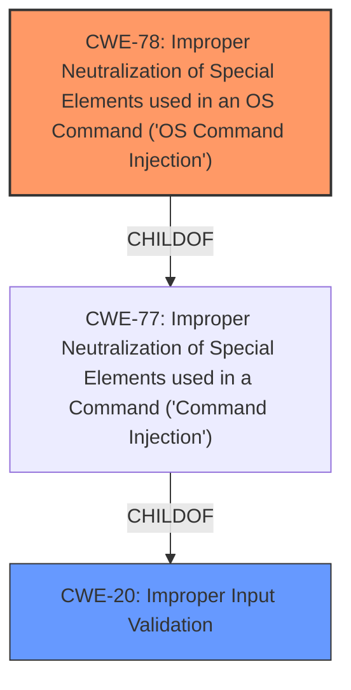

# Raw Analyzer Response for CVE-2024-22065

# Summary
| CWE ID | CWE Name | Confidence | CWE Abstraction Level | CWE Vulnerability Mapping Label | CWE-Vulnerability Mapping Notes |
|---|---|---|---|---|---|
| CWE-78 | Improper Neutralization of Special Elements used in an OS Command ('OS Command Injection') | 1.0 | Base | Primary | Allowed |
| CWE-20 | Improper Input Validation | 0.7 | Class | Secondary | Discouraged |

## Evidence and Confidence

*   **Confidence Score:** 0.9
*   **Evidence Strength:** MEDIUM

## Relationship Analysis
The primary relationship that influenced the CWE selection is the ChildOf relationship between CWE-78 and its parent classes like CWE-77 (Improper Neutralization of Special Elements used in a Command ('Command Injection')) and the broader CWE-20 (Improper Input Validation). While CWE-77 is a Class, CWE-78 is a Base, offering a more specific classification for OS command injection. CWE-20 is considered as a secondary weakness due to the **insufficient input validation** that allowed the **command injection** to occur, but it's a general weakness.

## Vulnerability Chain
The vulnerability chain starts with **insufficient input validation** (CWE-20), which leads to the ability to inject OS commands (CWE-78). The final impact is the execution of arbitrary commands.

## Summary of Analysis
The primary CWE is CWE-78 because the vulnerability description explicitly states a **command injection** vulnerability due to insufficient validation of the Ping Diagnosis interface parameter. The vulnerability allows an authenticated attacker to execute arbitrary commands. CWE-78 (Improper Neutralization of Special Elements used in an OS Command ('OS Command Injection')) directly addresses this scenario. The retriever identified CWE-77 as the top result, but CWE-78 is a more specific base variant, making it the more appropriate choice.

CWE-20 (Improper Input Validation) is included as a secondary weakness because the root cause is explicitly mentioned as **insufficient input validation**. However, CWE-20 is a very broad category, and CWE-78 provides a more precise description of the actual vulnerability. The evidence is based on the vulnerability description key phrases: "**insufficient input validation**" and "**command injection**".

Other considered CWEs and why they were not selected:

*   CWE-77: While highly relevant, CWE-78 is more specific to OS command injection, making it a better fit.
*   CWE-89 (SQL Injection), CWE-93 (CRLF Injection), CWE-1336 (Template Engine Injection): These are all injection vulnerabilities, but they are specific to SQL, CRLF, and template engines, respectively. The vulnerability description does not indicate any of these specific types of injection.
*   CWE-73 (External Control of File Name or Path): This is related to path manipulation, not command injection.
*   CWE-117 (Improper Output Neutralization for Logs): This is related to log injection, not command injection.
*   CWE-112 (Missing XML Validation): This is related to XML validation, not command injection.
*   CWE-434 (Unrestricted Upload of File with Dangerous Type), CWE-22 (Path Traversal), CWE-41 (Improper Resolution of Path Equivalence), CWE-120 (Buffer Copy without Checking Size): These CWEs do not align with the vulnerability description.