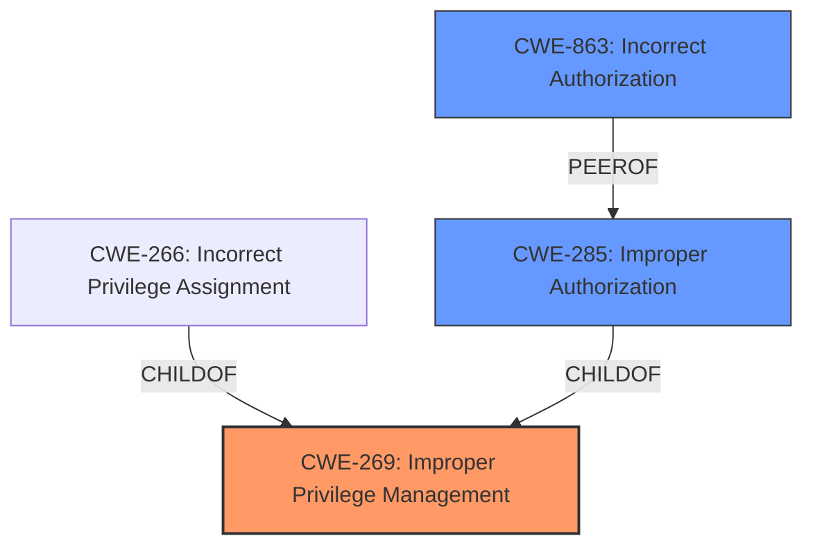

# Enhanced Analysis for CVE-2024-22068

# Summary
| CWE ID | CWE Name | Confidence | CWE Abstraction Level | CWE Vulnerability Mapping Label | CWE-Vulnerability Mapping Notes |
|---|---|---|---|---|---|
| CWE-269 | Improper Privilege Management | 0.8 | Class | Primary | Allowed-with-Review |
| CWE-863 | Incorrect Authorization | 0.6 | Class | Secondary Candidate | Allowed-with-Review |
| CWE-285 | Improper Authorization | 0.5 | Class | Secondary Candidate | Discouraged |

## Evidence and Confidence

*   **Confidence Score:** 0.8
*   **Evidence Strength:** MEDIUM

## Relationship Analysis
The primary CWE is CWE-269, **Improper Privilege Management**, which is a Class-level CWE. While it is often misused, in this case, the vulnerability description explicitly states "**Improper Privilege Management** vulnerability," making it a reasonable starting point.

CWE-269 has child CWEs that could be more specific, such as CWE-266 (**Incorrect Privilege Assignment**) or CWE-285 (**Improper Authorization**). However, the description lacks the specific details to determine if a privilege was incorrectly assigned or if authorization checks were improperly performed.

CWE-863 (**Incorrect Authorization**) is a peer of CWE-285, and the description mentions "Functionality Bypass," suggesting the possibility of incorrect authorization logic, which supports it as a secondary candidate.

CWE-285 is discouraged but still considered a secondary candidate since the authorization itself may have been the issue.



## Vulnerability Chain
The vulnerability chain starts with **Improper Privilege Management** (CWE-269), which leads to Functionality Bypass. The specific mechanism for the bypass is not described, meaning we do not know which authorization or permission issues followed.

## Summary of Analysis
The initial assessment strongly leans towards CWE-269 (**Improper Privilege Management**) due to its direct mention in the vulnerability description as the **rootcause**. However, the lack of detail on the underlying cause makes it challenging to select a more specific CWE.

The secondary candidates, CWE-863 (**Incorrect Authorization**) and CWE-285 (**Improper Authorization**), were considered because the "Functionality Bypass" impact hints at potential authorization issues. However, without more information, it's impossible to confirm whether the authorization was implemented incorrectly or missing altogether.

The decision is based on the provided evidence, which is limited to the phrase "**Improper Privilege Management**" and "Functionality Bypass." The relationship graph highlights that while CWE-269 is a good starting point, more specific child CWEs could be appropriate with additional information.

The selected CWEs are at the Class level because the available information is insufficient to pinpoint a more specific Base or Variant level weakness. A more detailed analysis of the root cause of the **improper privilege management** is needed to refine the CWE classification.

Relevant CWE Information:
- **CWE-269**: **Improper Privilege Management** The product does not properly assign, modify, track, or check privileges for an actor, creating an unintended sphere of control for that actor.
- **CWE-863**: **Incorrect Authorization** The product performs an authorization check when an actor attempts to access a resource or perform an action, but it does not correctly perform the check.
- **CWE-285**: **Improper Authorization** The product does not perform or incorrectly performs an authorization check when an actor attempts to access a resource or perform an action.


## CWE Relationship Analysis

Current CWEs represent these abstraction levels: .


### Vulnerability Chain Analysis

**Chain starting from CWE-863:**
- 863 (Incorrect Authorization) - ROOT


**Chain starting from CWE-269:**
- 269 (Improper Privilege Management) - ROOT


### CWE Relationship Diagram

```mermaid
graph TD
    classDef primary fill:#f96,stroke:#333,stroke-width:2px
    classDef secondary fill:#69f,stroke:#333
    classDef tertiary fill:#9e9,stroke:#333
```