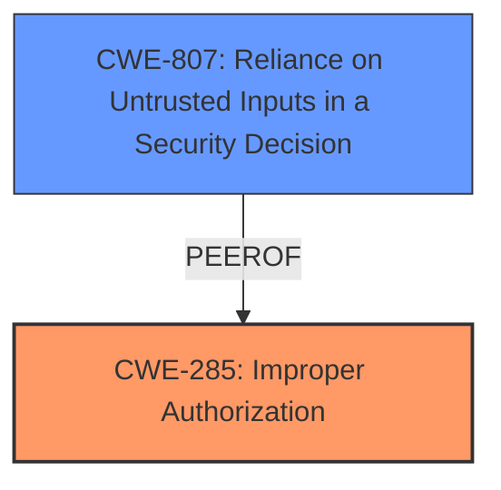

# Analysis for CVE-2024-22069

# Summary
| CWE ID | CWE Name | Confidence | CWE Abstraction Level | CWE Vulnerability Mapping Label | CWE-Vulnerability Mapping Notes |
|---|---|---|---|---|---|
| CWE-285 | Improper Authorization | 0.9 | Class | Primary | Allowed-with-Review |
| CWE-807 | Reliance on Untrusted Inputs in a Security Decision | 0.6 | Base | Secondary Candidate | Allowed |

## Evidence and Confidence

*   **Confidence Score:** 0.8
*   **Evidence Strength:** MEDIUM

## Relationship Analysis
The primary relationship impacting the decision is the hierarchical one between CWE-285 (Improper Authorization) and its potential base-level children. Given the available evidence, CWE-285 is the most accurate, though it is a Class-level CWE.

## Vulnerability Chain
The vulnerability chain starts with **improper authorization**, leading to the ability for an attacker with common permissions to illegally change the password of the administrator by intercepting requests.
  - Root Cause: **Improper Authorization** (CWE-285)
  - Weakness: Intercepting requests to change passwords, which can be seen as reliance on untrusted input (CWE-807).
  - Impact: Change of administrator password leading to full control.

## Summary of Analysis
The initial analysis focused on identifying the root cause of the vulnerability, which is related to **permission and access control**. Based on the provided evidence, the vulnerability involves an **improper authorization** mechanism, allowing attackers with common permissions to change the administrator's password. The analysis considered both the vulnerability description and the CVE reference links content summary.

The selected CWE, CWE-285 (Improper Authorization), aligns with the finding that the product does not correctly perform an authorization check.

The retriever results suggested several CWEs, including CWE-306 (Missing Authentication for Critical Function), CWE-863 (Incorrect Authorization), and CWE-285 (Improper Authorization). However, given the context of the vulnerability, where attackers with common permissions can exploit the flaw, CWE-285 is more appropriate than CWE-306 because authentication is already occurring. CWE-863 (Incorrect Authorization) could be a possible better fit, but the description only indicates that authorization is not happening correctly and not necessarily that it is incorrect.

The choice of CWE-285 is at the optimal level of specificity, given the available evidence. While a more specific child CWE might exist, the provided information doesn't support a more granular classification.

Relevant CWE Information:

# Enhanced Context (25 CWEs)
The following CWEs were identified as potentially relevant to this vulnerability:

## CWE-266: Incorrect Privilege Assignment
**Abstraction Level**: Base
**Similarity Score**: 0.74
**Source**: dense

**Description**:
A product incorrectly assigns a privilege to a particular actor, creating an unintended sphere of control for that actor.

**Mapping Guidance**:
- Usage: Allowed
- Rationale: This CWE entry is at the Base level of abstraction, which is a preferred level of abstraction for mapping to the root causes of vulnerabilities.

*Not Used:* This is not a case of assigning the wrong privileges, but rather of incorrectly authorizing access.

## CWE-267: Privilege Defined With Unsafe Actions
**Abstraction Level**: Base
**Similarity Score**: 0.74
**Source**: dense

**Description**:
A particular privilege, role, capability, or right can be used to perform unsafe actions that were not intended, even when it is assigned to the correct entity.

**Mapping Guidance**:
- Usage: Allowed
- Rationale: This CWE entry is at the Base level of abstraction, which is a preferred level of abstraction for mapping to the root causes of vulnerabilities.

*Not Used:* This CWE isn't applicable because the vulnerability doesn't stem from unsafe actions associated with a correctly assigned privilege, but rather from the incorrect authorization of an action.

## CWE-280: Improper Handling of Insufficient Permissions or Privileges 
**Abstraction Level**: Base
**Similarity Score**: 0.74
**Source**: dense

**Description**:
The product does not handle or incorrectly handles when it has insufficient privileges to access resources or functionality as specified by their permissions. This may cause it to follow unexpected code paths that may leave the product in an invalid state.

**Mapping Guidance**:
- Usage: Allowed
- Rationale: This CWE entry is at the Base level of abstraction, which is a preferred level of abstraction for mapping to the root causes of vulnerabilities.

*Not Used:* This CWE doesn't fit because the vulnerability isn't about improper handling of insufficient privileges, but rather about an authorization flaw that allows attackers with existing, but common, privileges to perform actions they shouldn't.

## CWE-1391: Use of Weak Credentials
**Abstraction Level**: Class
**Similarity Score**: 0.73
**Source**: dense

**Description**:
The product uses weak credentials (such as a default key or hard-coded password) that can be calculated, derived, reused, or guessed by an attacker.

**Mapping Guidance**:
- Usage: Allowed-with-Review
- Rationale: This CWE entry is a Class and might have Base-level children that would be more appropriate

*Not Used:* This CWE doesn't fit because the vulnerability isn't about the use of weak credentials, but about an authorization flaw.

## CWE-807: Reliance on Untrusted Inputs in a Security Decision
**Abstraction Level**: Base
**Similarity Score**: 0.73
**Source**: dense

**Description**:
The product uses a protection mechanism that relies on the existence or values of an input, but the input can be modified by an untrusted actor in a way that bypasses the protection mechanism.

**Mapping Guidance**:
- Usage: Allowed
- Rationale: This CWE entry is at the Base level of abstraction, which is a preferred level of abstraction for mapping to the root causes of vulnerabilities.

*Potentially Used:* The vulnerability involves intercepting requests, so the system relies on inputs that can be modified by the attacker. This is a secondary weakness.

## CWE-668: Exposure of Resource to Wrong Sphere
**Abstraction Level**: Class
**Similarity Score**: 0.73
**Source**: dense

**Description**:
The product exposes a resource to the wrong control sphere, providing unintended actors with inappropriate access to the resource.

**Mapping Guidance**:
- Usage: Discouraged
- Rationale: CWE-668 is high-level and is often misused as a catch-all when lower-level CWE IDs might be applicable. It is sometimes used for low-information vulnerability reports [REF-1287]. It is a level-1 Class (i.e., a child of a Pillar). It is not useful for trend analysis.

*Not Used:* The vulnerability involves an authorization issue, which can be better represented by other CWEs, such as CWE-285.

## CWE-274: Improper Handling of Insufficient Privileges
**Abstraction Level**: Base
**Similarity Score**: 0.73
**Source**: dense

**Description**:
The product does not handle or incorrectly handles when it has insufficient privileges to perform an operation, leading to resultant weaknesses.

**Mapping Guidance**:
- Usage: Discouraged
- Rationale: This CWE entry could be deprecated in a future version of CWE.

*Not Used:* The vulnerability isn't about improper handling of insufficient privileges, but rather about attackers with common privileges being able to perform actions they shouldn't be authorized to do.

## CWE-472: External Control of Assumed-Immutable Web Parameter
**Abstraction Level**: Base
**Similarity Score**: 0.73
**Source**: dense

**Description**:
The web application does not sufficiently verify inputs that are assumed to be immutable but are actually externally controllable, such as hidden form fields.

**Mapping Guidance**:
- Usage: Allowed
- Rationale: This CWE entry is at the Base level of abstraction, which is a preferred level of abstraction for mapping to the root causes of vulnerabilities.

*Not Used:* The vulnerability isn't about the lack of verification of assumed-immutable parameters, but rather about an authorization flaw that allows attackers with common permissions to change the administrator's password.

## CWE-41: Improper Resolution of Path Equivalence
**Abstraction Level**: Base
**Similarity Score**: 0.72
**Source**: dense

**Description**:
The product is vulnerable to file system contents disclosure through path equivalence. Path equivalence involves the use of special characters in file and directory names. The associated manipulations are intended to generate multiple names for the same object.

**Mapping Guidance**:
- Usage: Allowed
- Rationale: This CWE entry is at the Base level of abstraction, which is a preferred level of abstraction for mapping to the root causes of vulnerabilities.

*Not Used:* This CWE is unrelated to the described vulnerability.