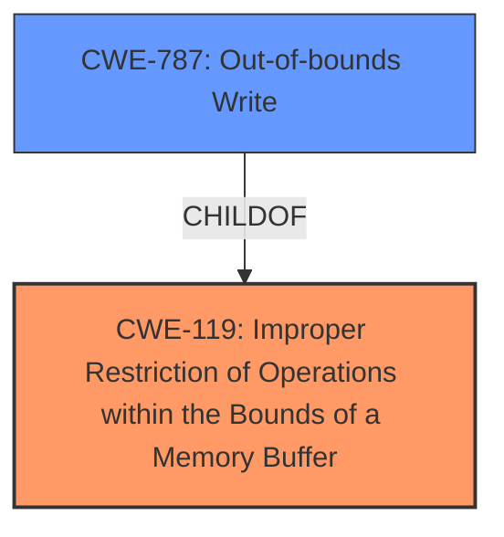

# Analysis Report for CVE-2024-22170

# Vulnerability Analysis Report: CVE-2024-22170

## Description

****Improper Restriction of Operations within the Bounds of a Memory Buffer**** vulnerability in Western Digital My Cloud ddns-start on Linux allows **Overflow** Buffers.This issue affects My Cloud before 5.29.102.

## Vulnerability Description Key Phrases

- **Rootcause:** Improper Restriction of Operations within the Bounds of a Memory Buffer
- **Weakness:** ['Improper Restriction of Operations within the Bounds of a Memory Buffer', 'Overflow']
- **Impact:** overflow buffers
- **Product:** Western Digital My Cloud
- **Version:** before 5.29.102
- **Component:** ddns-start

## Analysis (with Relationship Data)

# Summary

| CWE ID  | CWE Name  | Confidence | CWE Abstraction Level | CWE Vulnerability Mapping Label | CWE-Vulnerability Mapping Notes |
|---|---|---|---|---|---|
| CWE-119 | Improper Restriction of Operations within the Bounds of a Memory Buffer | 1.0 | Class | Allowed | Primary CWE |
| CWE-787 | Out-of-bounds Write | 0.7 | Base | Allowed | Secondary Candidate |

## Evidence and Confidence

*   **Confidence Score:** 0.9
*   **Evidence Strength:** HIGH

## Relationship Analysis

The primary relationship that influenced the decision was the hierarchical relationship, specifically the ChildOf relationship. While the description points to a buffer overflow, the root cause is the **improper restriction of operations** within the bounds of the memory buffer. CWE-119 is a Class-level CWE, and CWE-787 is a Base-level CWE that is often a consequence of CWE-119.



## Vulnerability Chain

The vulnerability chain starts with the **improper restriction of operations** within a memory buffer (CWE-119). This can lead to an out-of-bounds write (CWE-787), which results in a buffer overflow.

## Summary of Analysis

The initial analysis strongly suggests CWE-119 as the primary weakness, supported by the vulnerability description and the keyphrase analysis. The description explicitly mentions "**Improper Restriction of Operations within the Bounds of a Memory Buffer**" as a root cause. The term "**Overflow** Buffers" indicates the impact of the vulnerability, which is often associated with buffer overflows caused by **improper** bounds checking or **improper** memory management. The vulnerability description provided sufficient evidence, and the retriever results confirmed the relevance of CWE-119. Although CWE-787 is strongly considered as a secondary weakness, it is not the primary cause.

The selection of CWE-119 is at the optimal level of specificity because it directly reflects the **improper restriction** that leads to the overflow. More specific CWEs like CWE-120 (Buffer Copy without Checking Size of Input) were considered but deemed less appropriate because the provided information does not specifically mention a buffer copy operation.

Relevant CWE Information:

*   **CWE-119 (Improper Restriction of Operations within the Bounds of a Memory Buffer)**: The product performs operations on a memory buffer, but it reads from or writes to a memory location outside the buffer's intended boundary.
*   **CWE-787 (Out-of-bounds Write)**: The product writes data past the end, or before the beginning, of the intended buffer.

The following CWEs were considered but not used as the primary CWE:

*   **CWE-190 (Integer Overflow or Wraparound)**: Although listed in the retriever results, this CWE is not directly related to the **improper restriction of operations** causing the buffer overflow in this specific case. It is related to arithmetic errors, which are not explicitly mentioned in the description.
*   **CWE-125 (Out-of-bounds Read)**: This CWE describes reading data outside the intended buffer, while the description emphasizes writing (**Overflow**), making CWE-787 a more suitable secondary candidate.
*   **CWE-197 (Numeric Truncation Error)**: Similar to CWE-190, this CWE is not directly relevant to the buffer overflow scenario described.
*   **CWE-122 (Heap-based Buffer Overflow)**: While this could be a possible impact, the root cause is still the **improper restriction of operations**, and the location of the buffer (heap) is not specified.
*   **CWE-770 (Allocation of Resources Without Limits or Throttling)**: This CWE is related to resource management, which is not the primary issue described in the vulnerability.
*   **CWE-124 (Buffer Underwrite ('Buffer Underflow'))**: The description specifies an **overflow**, not an underflow.
*   **CWE-22 (Improper Limitation of a Pathname to a Restricted Directory ('Path Traversal'))**: This CWE is related to path traversal vulnerabilities, which are not relevant to the described buffer overflow.
*   **CWE-522 (Insufficiently Protected Credentials)**: This CWE is related to credential management, which is not relevant to the described buffer overflow.
*   **CWE-116 (Improper Encoding or Escaping of Output)**: This CWE is related to output encoding, which is not relevant to the described buffer overflow.
*   **CWE-194 (Unexpected Sign Extension)**: This CWE is related to sign extension issues, which are not directly relevant to the described buffer overflow.
*   **CWE-131 (Incorrect Calculation of Buffer Size)**: While related to buffer overflows, the description focuses on the **improper restriction of operations**, making CWE-119 a more direct match to the root cause.
*   **CWE-703 (Improper Check or Handling of Exceptional Conditions)**: Too high-level and doesn't specify the nature of the exceptional condition.
*   **CWE-1391 (Use of Weak Credentials)**: Not relevant as it deals with weak credentials.
*   **CWE-668 (Exposure of Resource to Wrong Sphere)**: Too general and doesn't specify the root cause.
*   **CWE-41 (Improper Resolution of Path Equivalence)**: Not relevant as it deals with path equivalence issues.
*   **CWE-697 (Incorrect Comparison)**: Too high-level.
*   **CWE-754 (Improper Check for Unusual or Exceptional Conditions)**: Too high-level and doesn't specify the nature of the exceptional condition.
*   **CWE-345 (Insufficient Verification of Data Authenticity)**: Not relevant as it deals with data authenticity.
*   **CWE-212 (Improper Removal of Sensitive Information Before Storage or Transfer)**: Not relevant as it deals with sensitive information exposure.
*   **CWE-274 (Improper Handling of Insufficient Privileges)**: Not relevant as it deals with privilege handling.
*   **CWE-128 (Wrap-around Error)**: Arithmetic error, not directly related.
*   **CWE-1339 (Insufficient Precision or Accuracy of a Real Number)**: Deals with real number precision, not relevant here.


## CWE Relationship Analysis

Current CWEs represent these abstraction levels: .


### Vulnerability Chain Analysis

**Chain starting from CWE-274:**
- 274 (Improper Handling of Insufficient Privileges) - ROOT


**Chain starting from CWE-345:**
- 345 (Insufficient Verification of Data Authenticity) - ROOT


### CWE Relationship Diagram

```mermaid
graph TD
    classDef primary fill:#f96,stroke:#333,stroke-width:2px
    classDef secondary fill:#69f,stroke:#333
    classDef tertiary fill:#9e9,stroke:#333
```


*Report generated on 2025-07-13 05:47:19*
