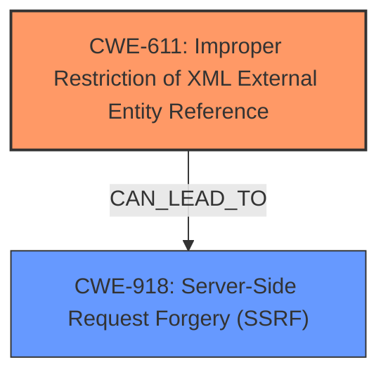

# Analysis Report for CVE-2024-22219

# Vulnerability Analysis Report: CVE-2024-22219

## Description

XML External Entity (XXE) vulnerability in Terminalfour 8.0.0001 through 8.3.18 and XML JDBC versions up to 1.0.4 allows authenticated users to submit malicious XML via unspecified features which could lead to various actions such as accessing the underlying server, remote code execution (RCE), or performing **Server-Side Request Forgery** (SSRF) attacks.

## Vulnerability Description Key Phrases

- **Rootcause:** XML External Entity expansion
- **Weakness:** Server-Side Request Forgery
- **Impact:** remote code execution
- **Vector:** malicious XML
- **Attacker:** authenticated users
- **Product:** ["['Terminalfour'", "'XML JDBC']"]
- **Version:** ["['8.0.0001 through 8.3.18'", "'up to 1.0.4']"]
- **Component:** ["['unspecified features'", "'multiple components']"]

## Analysis (with Relationship Data)

# Summary
| CWE ID | CWE Name | Confidence | CWE Abstraction Level | CWE Vulnerability Mapping Label | CWE-Vulnerability Mapping Notes |
|---|---|---|---|---|---|
| CWE-611 | Improper Restriction of XML External Entity Reference | 1.0 | Base | Primary | Allowed |
| CWE-918 | Server-Side Request Forgery (SSRF) | 0.7 | Base | Secondary | Allowed |

## Evidence and Confidence

*   **Confidence Score:** 0.85
*   **Evidence Strength:** HIGH

## Relationship Analysis
The primary CWE is CWE-611, which directly reflects the **XML External Entity expansion** root cause. CWE-918 is a potential impact, as successful XXE exploitation can lead to SSRF. There is no direct hierarchical relationship between CWE-611 and CWE-918, but the vulnerability description and CVE details explicitly mention SSRF as a possible outcome of XXE. The abstraction levels are both Base, which is appropriate for direct mapping.



## Vulnerability Chain
The vulnerability chain starts with the **improper handling of XML External Entities** (CWE-611), which allows an attacker to inject malicious XML. This can then lead to several impacts, including **Server-Side Request Forgery** (CWE-918) and potentially Remote Code Execution (RCE). The chain is XXE -> SSRF/RCE.

## Summary of Analysis
The primary weakness is clearly the improper handling of XML External Entities, making CWE-611 the most appropriate primary CWE. The description and CVE summary explicitly mention SSRF as a potential consequence, thus warranting its inclusion as a secondary CWE. The retriever results support this selection, with CWE-611 being the top match and CWE-918 also appearing in the top results. The analysis is strongly based on the provided evidence, especially the CVE Reference Links Content Summary.

The vulnerability description states: "XML External Entity (XXE) vulnerability...allows authenticated users to submit malicious XML...which could lead to various actions such as accessing the underlying server, remote code execution (RCE), or performing **Server-Side Request Forgery** (SSRF) attacks." The CVE Reference Links Content Summary further confirms this: "The vulnerability stems from the **improper handling of XML External Entities** (XXE)...Attackers could use the server to make requests to other internal or external systems, potentially gaining access to those resources or disrupting services."

CWE-611 is at the optimal level of specificity, as it directly addresses the root cause. CWE-918 is added as a secondary CWE to reflect the potential impact of SSRF.

**CWEs Considered but Not Used:**

*   **CWE-776: Improper Restriction of Recursive Entity References in DTDs ('XML Entity Expansion')**: While related to XML vulnerabilities, this CWE focuses specifically on recursive entity references, which is not explicitly mentioned in the vulnerability description. CWE-611 is a more general and applicable CWE for XXE vulnerabilities.
*   **CWE-502: Deserialization of Untrusted Data**: This CWE is not applicable because the vulnerability is related to XML External Entities, not deserialization of untrusted data.
*   **CWE-79: Improper Neutralization of Input During Web Page Generation ('Cross-site Scripting')**: This is not relevant as the vulnerability is not related to XSS.
*   **CWE-74: Improper Neutralization of Special Elements in Output Used by a Downstream Component ('Injection')**: While XXE is a type of injection, CWE-611 is more specific to the type of injection.
*   **CWE-91: XML Injection (aka Blind XPath Injection)** and **CWE-643: Improper Neutralization of Data within XPath Expressions ('XPath Injection')**: These are related to XML injection but focus on XPath expressions, which is not the primary issue in this vulnerability. CWE-611 better represents the core weakness of XXE.
*   **CWE-138: Improper Neutralization of Special Elements**: This is too general; CWE-611 is more specific.
*   **CWE-346: Origin Validation Error**: This is not relevant.
*   **CWE-917: Improper Neutralization of Special Elements used in an Expression Language Statement ('Expression Language Injection')**: This is not relevant.
*   **CWE-23: Relative Path Traversal**: This is not relevant.
*   **CWE-532: Insertion of Sensitive Information into Log File**: This is not relevant.
*   **CWE-613: Insufficient Session Expiration**: This is not relevant.
*   **CWE-1275: Sensitive Cookie with Improper SameSite Attribute**: This is not relevant.
*   **CWE-827: Improper Control of Document Type Definition**: This is not specific enough.
*   **CWE-352: Cross-Site Request Forgery (CSRF)**: This is not relevant.
*   **CWE-941: Incorrectly Specified Destination in a Communication Channel**: This is not the primary issue.

# Enhanced Context (25 CWEs)
The following CWEs were identified as potentially relevant to this vulnerability:

## CWE-611: Improper Restriction of XML External Entity Reference
**Abstraction Level**: Base
**Similarity Score**: 0.85
**Source**: dense

**Description**:
The product processes an XML document that can contain XML entities with URIs that resolve to documents outside of the intended sphere of control, causing the product to embed incorrect documents into its output.

**Mapping Guidance**:
- Usage: Allowed
- Rationale: This CWE entry is at the Base level of abstraction, which is a preferred level of abstraction for mapping to the root causes of vulnerabilities.


## CWE-776: Improper Restriction of Recursive Entity References in DTDs ('XML Entity Expansion')
**Abstraction Level**: Base
**Similarity Score**: 0.77
**Source**: dense

**Description**:
The product uses XML documents and allows their structure to be defined with a Document Type Definition (DTD), but it does not properly control the number of recursive definitions of entities.

**Mapping Guidance**:
- Usage: Allowed
- Rationale: This CWE entry is at the Base level of abstraction, which is a preferred level of abstraction for mapping to the root causes of vulnerabilities.


## CWE-80: Improper Neutralization of Script-Related HTML Tags in a Web Page (Basic XSS)
**Abstraction Level**: Variant
**Similarity Score**: 0.76
**Source**: dense

**Description**:
The product receives input from an upstream component, but it does not neutralize or incorrectly neutralizes special characters such as "<", ">", and "&" that could be interpreted as web-scripting elements when they are sent to a downstream component that processes web pages.

**Mapping Guidance**:
- Usage: Allowed
- Rationale: This CWE entry is at the Variant level of abstraction, which is a preferred level of abstraction for mapping to the root causes of vulnerabilities.


## CWE-116: Improper Encoding or Escaping of Output
**Abstraction Level**: Class
**Similarity Score**: 0.76
**Source**: dense

**Description**:
The product prepares a structured message for communication with another component, but encoding or escaping of the data is either missing or done incorrectly. As a result, the intended structure of the message is not preserved.

**Mapping Guidance**:
- Usage: Allowed-with-Review
- Rationale: This CWE entry is a Class and might have Base-level children that would be more appropriate


## CWE-918: Server-Side Request Forgery (SSRF)
**Abstraction Level**: Base
**Similarity Score**: 0.75
**Source**: dense

**Description**:
The web server receives a URL or similar request from an upstream component and retrieves the contents of this URL, but it does not sufficiently ensure that the request is being sent to the expected destination.

**Mapping Guidance**:
- Usage: Allowed
- Rationale: This CWE entry is at the Base level of abstraction, which is a preferred level of abstraction for mapping to the root causes of vulnerabilities.


## CWE-74: Improper Neutralization of Special Elements in Output Used by a Downstream Component ('Injection')
**Abstraction Level**: Class
**Similarity Score**: 0.74
**Source**: dense

**Description**:
The product constructs all or part of a command, data structure, or record using externally-influenced input from an upstream component, but it does not neutralize or incorrectly neutralizes special elements that could modify how it is parsed or interpreted when it is sent to a downstream component.

**Mapping Guidance**:
- Usage: Discouraged
- Rationale: CWE-74 is high-level and often misused when lower-level weaknesses are more appropriate.


##


## CWE Relationship Analysis

Current CWEs represent these abstraction levels: .


### Vulnerability Chain Analysis

**Chain starting from CWE-91:**
- 91 (XML Injection (aka Blind XPath Injection)) - ROOT


**Chain starting from CWE-611:**
- 611 (Improper Restriction of XML External Entity Reference) - ROOT


### CWE Relationship Diagram

```mermaid
graph TD
    classDef primary fill:#f96,stroke:#333,stroke-width:2px
    classDef secondary fill:#69f,stroke:#333
    classDef tertiary fill:#9e9,stroke:#333
```


*Report generated on 2025-07-13 05:48:01*
