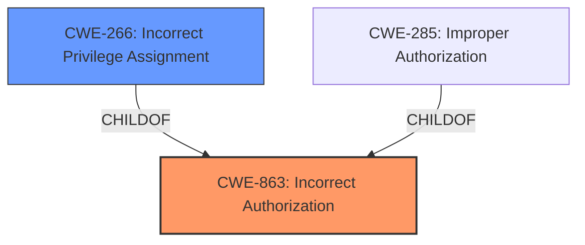

# Analysis for CVE-2024-2297

# Summary
| CWE ID | CWE Name | Confidence | CWE Abstraction Level | CWE Vulnerability Mapping Label | CWE-Vulnerability Mapping Notes |
|---|---|---|---|---|---|
| CWE-863 | Incorrect Authorization | 0.9 | Class | Allowed-with-Review | Primary CWE |
| CWE-266 | Incorrect Privilege Assignment | 0.7 | Base | Allowed | Secondary Candidate |

## Evidence and Confidence

*   **Confidence Score:** 0.8
*   **Evidence Strength:** MEDIUM

## Relationship Analysis
The primary relationship that influenced the decision was the parent-child relationship between CWE-863 (Incorrect Authorization) and potential base-level children related to privilege or permission management. Given the vulnerability description, the authorization was performed, but incorrectly allowing privilege escalation, making CWE-863 the most fitting. The retriever results also indicated several related CWEs such as CWE-266 (Incorrect Privilege Assignment), which could be a more specific child if the root cause was specifically related to privilege assignment.

## Vulnerability Chain
The vulnerability chain starts with **insufficient validation checks** on the `create_autosave` AJAX function. This leads to **Incorrect Authorization** (CWE-863), which then results in Privilege Escalation, allowing authenticated attackers to execute arbitrary PHP code with elevated privileges.

## Summary of Analysis
The initial analysis identified **insufficient validation checks** as the root cause leading to privilege escalation. The retriever results suggested CWE-863 (Incorrect Authorization) and CWE-266 (Incorrect Privilege Assignment) as potential candidates.

The decision to choose CWE-863 as the primary CWE is based on the fact that the authorization check was present but flawed, leading to the privilege escalation. If the authorization check was completely missing, then CWE-862 (Missing Authorization) would be more appropriate. Since there was an authorization check, but it was **insufficient**, CWE-863 is more appropriate.

The evidence from the vulnerability description includes:
"This is due to **insufficient validation checks** placed on the create_autosave AJAX function. This makes it possible for authenticated attackers, with contributor-level access and above, to execute arbitrary PHP code with elevated (administrator-level) privileges."

CWE-266 was considered as a secondary candidate because the vulnerability ultimately results in incorrect privilege assignment. However, the **incorrect authorization** is the more direct cause.

The selected CWEs are at the optimal level of specificity because CWE-863 is a Class-level CWE that accurately describes the **incorrect authorization**, while CWE-266, a Base-level CWE, highlights the resulting **incorrect privilege assignment**.

Relevant CWE Information:

# Enhanced Context (25 CWEs)
The following CWEs were identified as potentially relevant to this vulnerability:

## CWE-266: Incorrect Privilege Assignment
**Abstraction Level**: Base
**Similarity Score**: 0.79
**Source**: dense

**Description**:
A product incorrectly assigns a privilege to a particular actor, creating an unintended sphere of control for that actor.

**Mapping Guidance**:
- Usage: Allowed
- Rationale: This CWE entry is at the Base level of abstraction, which is a preferred level of abstraction for mapping to the root causes of vulnerabilities.

## CWE-863: Incorrect Authorization
**Abstraction Level**: Class
**Similarity Score**: 1987.89
**Source**: sparse

**Description**:
The product performs an authorization check when an actor attempts to access a resource or perform an action, but it does not correctly perform the check.

**Mapping Guidance**:
- Usage: Allowed-with-Review
- Rationale: This CWE entry is a Class and might have Base-level children that would be more appropriate