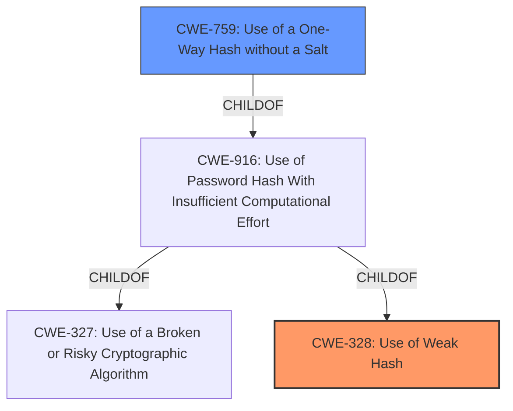

# Raw Analyzer Response for CVE-2024-23091

# Summary
| CWE ID | CWE Name | Confidence | CWE Abstraction Level | CWE Vulnerability Mapping Label | CWE-Vulnerability Mapping Notes |
|---|---|---|---|---|---|
| CWE-328 | Use of Weak Hash | 1.0 | Base | Primary | Allowed |
| CWE-759 | Use of a One-Way Hash without a Salt | 0.7 | Variant | Secondary | Allowed |

## Evidence and Confidence

*   **Confidence Score:** 0.85
*   **Evidence Strength:** HIGH

## Relationship Analysis
The primary CWE is CWE-328 (Use of Weak Hash), which is a base-level CWE. CWE-759 (Use of a One-Way Hash without a Salt) is a variant of CWE-916 (Use of Password Hash With Insufficient Computational Effort), which in turn is a child of CWE-327 (Use of a Broken or Risky Cryptographic Algorithm) and CWE-328. If the vulnerable code didn't use a salt, then CWE-759 could be a secondary weakness.

## Vulnerability Chain
The vulnerability chain starts with the **use of a weak hash** algorithm (MD5), which could optionally be compounded by the **lack of a salt**. This leads to the ability for an attacker to **obtain plaintext passwords**, resulting in unauthorized access.

## Summary of Analysis
The vulnerability description clearly states that the **rootcause** is **weak password hashing** using MD5. The CVE Reference Links Content Summary also confirms this. The retriever results list CWE-328 (Use of Weak Hash) as the top candidate, and its description aligns perfectly with the vulnerability. The use of MD5 as a hashing algorithm is considered a **weakness** because it's prone to collision attacks, preimage attacks, and brute-force attacks, making it easier for attackers to recover the original passwords.

If the code did not use a salt, then the secondary weakness would be CWE-759 (Use of a One-Way Hash without a Salt).

# Relevant CWE Information:

## CWE-328: Use of Weak Hash
**Abstraction Level**: Base

**Description**:
The product uses an algorithm that produces a digest (output value) that does not meet security expectations for a hash function that allows an adversary to reasonably determine the original input (preimage attack), find another input that can produce the same hash (2nd preimage attack), or find multiple inputs that evaluate to the same hash (birthday attack).

**Why this CWE was selected:**
The vulnerability description and CVE reference summary explicitly state that the use of MD5, a weak hashing algorithm, is the root cause of the vulnerability. This aligns directly with the description of CWE-328.
"**Root Cause of Vulnerability:** The vulnerability stems from the use of the MD5 hashing algorithm..."

## CWE-759: Use of a One-Way Hash without a Salt
**Abstraction Level**: Variant

**Description**:
The product uses a one-way cryptographic hash against an input that should not be reversible, such as a password, but the product does not also use a salt as part of the input.

**Why this CWE was considered:**
The CVE description mentions that prior versions of the product did not use a salt. While the main issue is the **weak hash**, the absence of a salt could be considered a secondary weakness.
"**Lack of Salt (Prior to v1.32):** Older versions of the software did not use salt when hashing passwords."

## CWE-916: Use of Password Hash With Insufficient Computational Effort
**Abstraction Level**: Base

**Description**:
The product generates a hash for a password, but it uses a scheme that does not provide a sufficient level of computational effort that would make password cracking attacks infeasible or expensive.

**Why this CWE was not selected:**
While this is related, the **rootcause** is the MD5 hashing algorithm and not necessarily the computational effort required. MD5 is a **weak hash** regardless of computational effort.

## CWE-327: Use of a Broken or Risky Cryptographic Algorithm
**Abstraction Level**: Class

**Description**:
The product uses a broken or risky cryptographic algorithm or protocol.

**Why this CWE was not selected:**
This is a higher-level class that contains CWE-328. Since CWE-328 is more specific and accurate, it's preferred.