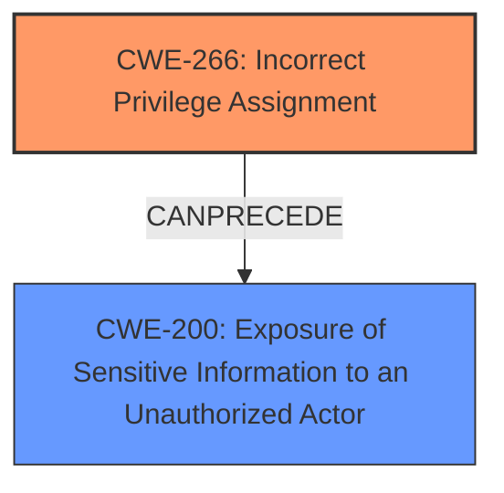

# Enhanced Analysis for CVE-2024-23321

# Summary
| CWE ID | CWE Name | Confidence | CWE Abstraction Level | CWE Vulnerability Mapping Label | CWE-Vulnerability Mapping Notes |
|---|---|---|---|---|---|
| CWE-266 | Incorrect Privilege Assignment | 0.8 | Base | Primary | Allowed |
| CWE-200 | Exposure of Sensitive Information to an Unauthorized Actor | 0.6 | Class | Secondary | Discouraged |

## Evidence and Confidence

*   **Confidence Score:** 0.7
*   **Evidence Strength:** MEDIUM

## Relationship Analysis
The primary relationship influencing the decision is that CWE-266 (Incorrect Privilege Assignment) can lead to CWE-200 (Exposure of Sensitive Information to an Unauthorized Actor). The hierarchical relationships guided the selection of CWE-266 as a root cause rather than a more generic access control issue. The guidance provided helped to choose privilege assignment as the root cause and data exposure as the impact.



## Vulnerability Chain
The vulnerability chain starts with an **incorrect privilege assignment** (**CWE-266**), which allows an attacker with regular user privileges (or even just being on the IP whitelist) to acquire administrator credentials. This leads to the **exposure of sensitive information** (**CWE-200**) because the attacker gains full control over RocketMQ.

## Summary of Analysis
The initial assessment focused on identifying the root cause of the vulnerability. The key phrase "exposure of sensitive Information to an unauthorized actor" initially suggested CWE-200, but the description also mentioned that the attacker had "regular user privileges or listed in the IP whitelist." This indicated a problem with how privileges were assigned. The retriever results suggested CWE-266 (Incorrect Privilege Assignment) and CWE-639 (Authorization Bypass Through User-Controlled Key) as potential candidates. However, the vulnerability description indicated that the attacker was able to obtain administrator credentials, suggesting that the issue was more related to privilege assignment than bypassing authorization with a user-controlled key.

The analysis of the vulnerability description, combined with the retriever results and the authentication vs authorization vs access control guidance, led to the selection of CWE-266 as the primary CWE. The phrase "attacker, possessing regular user privileges or listed in the IP whitelist, could potentially acquire the administrators account and password through specific interfaces" clearly indicates an issue with privilege assignment.

The "Privileges vs Permissions Guidance" further solidified the choice of CWE-266. The description suggests that the attacker's initial privileges (regular user or IP whitelist) were incorrectly mapped to administrator privileges.

CWE-200 was considered because the ultimate impact of the vulnerability is the exposure of sensitive information. However, it was deemed a secondary consequence of the privilege assignment issue.

The selected CWEs are at the optimal level of specificity. CWE-266 is a Base-level CWE that directly addresses the root cause, while CWE-200 describes the resulting impact.

Relevant CWE Information:

# Enhanced Context (25 CWEs)
The following CWEs were identified as potentially relevant to this vulnerability:

## CWE-266: Incorrect Privilege Assignment
**Abstraction Level**: Base
**Similarity Score**: 0.73
**Source**: dense

**Description**:
A product incorrectly assigns a privilege to a particular actor, creating an unintended sphere of control for that actor.

**Mapping Guidance**:
- Usage: Allowed
- Rationale: This CWE entry is at the Base level of abstraction, which is a preferred level of abstraction for mapping to the root causes of vulnerabilities.

## CWE-200: Exposure of Sensitive Information to an Unauthorized Actor
**Abstraction Level**: Class
**Similarity Score**: 0.195
**Source**: sparse

**Description**:
The product exposes sensitive information to an actor who is not explicitly authorized to have access to that information.

**Mapping Guidance**:
- Usage: Discouraged
- Rationale: This CWE entry is very high level. More specific subtypes are usually available.

# Complete CWE Specifications

CWE-284: Improper Access Control
CWE-639: Authorization Bypass Through User-Controlled Key
CWE-201: Insertion of Sensitive Information Into Sent Data
CWE-863: Incorrect Authorization
CWE-532: Insertion of Sensitive Information into Log File
CWE-200: Exposure of Sensitive Information to an Unauthorized Actor
CWE-285: Improper Authorization
CWE-287: Improper Authentication
CWE-306: Missing Authentication for Critical Function
CWE-226: Sensitive Information in Resource Not Removed Before Reuse

## CWE Details

**CWE-266: Incorrect Privilege Assignment**

*   **Technical Explanation:** The vulnerability arises from the product's **failure** to correctly assign privileges to actors. In this case, users with regular privileges, or even those on an IP whitelist, can acquire administrator privileges. This can be due to flaws in the logic that determines privilege levels, misconfiguration of roles, or a lack of proper validation during account provisioning.
*   **Security Implications:** This weakness can lead to unauthorized access to sensitive data and functionality. An attacker with elevated privileges can bypass security controls, modify critical system settings, and potentially compromise the entire system.
*   **Relationship Analysis:** This is a Base-level CWE. It can lead to other weaknesses, such as CWE-200 (Exposure of Sensitive Information to an Unauthorized Actor).
*   **Mapping Guidance Influence:** The "Privileges vs Permissions Guidance" strongly influenced the selection of this CWE. The guidance highlights that CWE-266 is appropriate when the system assigns incorrect privileges to a user, as is the case here.
*   **Why it is the Primary CWE:** This CWE is the **root cause** of the vulnerability, as the incorrect privilege assignment enables the attacker to gain administrator access and subsequently expose sensitive information.

**CWE-200: Exposure of Sensitive Information to an Unauthorized Actor**

*   **Technical Explanation:** The product exposes sensitive information to an actor who is not explicitly authorized to have access to that information. In this case, the attacker, having gained administrator privileges, can access sensitive data such as administrator account passwords.
*   **Security Implications:** This can lead to further attacks, such as identity theft, financial fraud, or system compromise.
*   **Relationship Analysis:** This is a Class-level CWE. It is often a consequence of other weaknesses, such as CWE-266.
*   **Mapping Guidance Influence:** CWE-200 is discouraged, but included as the impact.
*   **Why it is a Secondary CWE:** This CWE represents the **impact** of the vulnerability, rather than the root cause.

## CWEs Considered but Not Used

*   **CWE-284: Improper Access Control:** This CWE is too general. The specific issue is related to privilege assignment, making CWE-266 a more appropriate choice.
*   **CWE-639: Authorization Bypass Through User-Controlled Key:** This CWE is not appropriate because the attacker is not bypassing authorization with a user-controlled key. Instead, they are gaining administrator privileges, which inherently bypasses authorization checks.
*   **CWE-306: Missing Authentication for Critical Function:** While authentication is mentioned, the primary issue isn't the absence of authentication, but the incorrect assignment of privileges after authentication or through IP whitelisting.


## CWE Relationship Analysis

Current CWEs represent these abstraction levels: .


### Vulnerability Chain Analysis

**Chain starting from CWE-863:**
- 863 (Incorrect Authorization) - ROOT


**Chain starting from CWE-226:**
- 226 (Sensitive Information in Resource Not Removed Before Reuse) - ROOT


### CWE Relationship Diagram

```mermaid
graph TD
    classDef primary fill:#f96,stroke:#333,stroke-width:2px
    classDef secondary fill:#69f,stroke:#333
    classDef tertiary fill:#9e9,stroke:#333
```