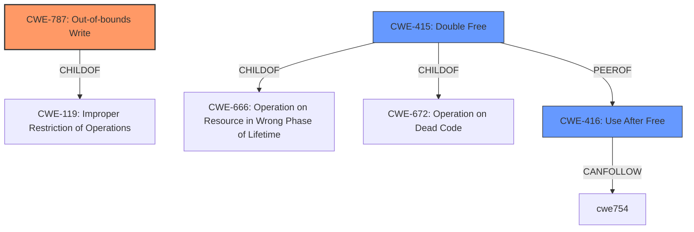

# Raw Analyzer Response for CVE-2024-23355

# Summary
| CWE ID | CWE Name | Confidence | CWE Abstraction Level | CWE Vulnerability Mapping Label | CWE-Vulnerability Mapping Notes |
|---|---|---|---|---|---|
| CWE-787 | Out-of-bounds Write | 0.9 | Base | Allowed | Primary CWE |
| CWE-416 | Use After Free | 0.6 | Variant | Allowed | Secondary Candidate |
| CWE-415 | Double Free | 0.5 | Variant | Allowed | Secondary Candidate |

## Evidence and Confidence

*   **Confidence Score:** 0.9
*   **Evidence Strength:** MEDIUM

## Relationship Analysis
The primary relationship influencing the decision is that CWE-787 (**Out-of-bounds Write**) is a base CWE which is generally preferred, and the vulnerability description mentions **memory corruption**, which can often be caused by writing outside the bounds of allocated memory. CWE-416 (**Use After Free**) and CWE-415 (**Double Free**) are also considered because memory corruption could manifest in these ways, though the description doesn't directly state it.

## Vulnerability Chain
The vulnerability chain starts with an unspecified error during the import of a shared key in the keymaster operation which then leads to **memory corruption**, specifically an out-of-bounds write.

## Summary of Analysis
The initial analysis focused on the term "**memory corruption**" in the vulnerability description. The retriever results highlighted CWE-787 (**Out-of-bounds Write**) as the top candidate, with a score of 1.000. The fact that CWE-787 is a Base level CWE and is explicitly about writing outside the boundaries of allocated memory strongly supports its selection. The vulnerability occurs during the import of a shared key in a keymaster operation.

CWE-416 (**Use After Free**) and CWE-415 (**Double Free**) were also considered as secondary candidates since they are forms of memory corruption.

The evidence is limited, but the high score for CWE-787 and the direct reference to **memory corruption** make it the most appropriate primary CWE.

Relevant CWE Information:
*   CWE-787 (**Out-of-bounds Write**) addresses the **root cause** of writing data past the end, or before the beginning, of the intended buffer. By overwriting memory, an attacker can modify program state, control program execution, or cause a denial-of-service.
*   CWE-416 (**Use After Free**) refers to the use of memory after it has been freed, which is another type of memory corruption.
*   CWE-415 (**Double Free**) refers to freeing the same memory twice, which is another type of memory corruption.