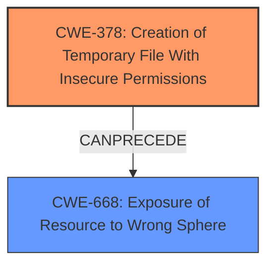

# Analysis Report for CVE-2024-23454

# Vulnerability Analysis Report: CVE-2024-23454

## Description

Apache Hadoops RunJar.run() does not set permissions for temporary directory by default. If sensitive data will be present in this file, all the other local users may be able to view the content. This is because, on unix-like systems, the system temporary directory is shared between all local users. As such, files written in this directory, without setting the correct posix permissions explicitly, may be viewable by all other local users.

## Vulnerability Description Key Phrases

- **Rootcause:** improper permissions
- **Impact:** view sensitive data
- **Attacker:** local users
- **Product:** Apache Hadoop
- **Component:** RunJar.run()

## Analysis (with Relationship Data)

# Summary
| CWE ID | CWE Name | Confidence | CWE Abstraction Level | CWE Vulnerability Mapping Label | CWE-Vulnerability Mapping Notes |
|---|---|---|---|---|---|
| CWE-378 | Creation of Temporary File With Insecure Permissions | 0.9 | Base | Allowed | Primary CWE |
| CWE-668 | Exposure of Resource to Wrong Sphere | 0.6 | Class | Discouraged | Secondary Candidate |

## Evidence and Confidence

*   **Confidence Score:** 0.8
*   **Evidence Strength:** HIGH

## Relationship Analysis
The primary relationship that influenced the decision was the direct match between the vulnerability description and the CWE-378 description, which directly addresses the creation of temporary files with **improper permissions**. CWE-668 was considered due to the exposure of resources, but CWE-378 is more specific.



## Vulnerability Chain
The vulnerability chain starts with the **improper creation of a temporary file with insecure permissions** (CWE-378), which leads to the potential **exposure of sensitive information** to other local users (CWE-668).

## Summary of Analysis
The analysis is primarily based on the provided evidence, especially the "Vulnerability Description Key Phrases" and "CVE Reference Links Content Summary". The key phrase "**improper permissions**" and the summary mentioning "insecure temporary file creation" directly support the selection of CWE-378. The relationship analysis also indicates that CWE-378 can lead to CWE-668, forming a vulnerability chain. The selected CWEs are at the optimal level of specificity because CWE-378 is a base-level CWE that accurately describes the **rootcause** of the vulnerability, while CWE-668 describes the impact.

Relevant CWE Information:

# Enhanced Context (25 CWEs)
The following CWEs were identified as potentially relevant to this vulnerability:

## CWE-378: Creation of Temporary File With Insecure Permissions
**Abstraction Level**: Base
**Similarity Score**: 0.78
**Source**: dense

**Description**:
Opening temporary files without appropriate measures or controls can leave the file, its contents and any function that it impacts vulnerable to attack.

**Mapping Guidance**:
- Usage: Allowed
- Rationale: This CWE entry is at the Base level of abstraction, which is a preferred level of abstraction for mapping to the root causes of vulnerabilities.

# Complete CWE Specifications

CWE-378: Creation of Temporary File With Insecure Permissions
Opening temporary files without appropriate measures or controls can leave the file, its contents and any function that it impacts vulnerable to attack.

CWE-668: Exposure of Resource to Wrong Sphere
The product exposes a resource to the wrong control sphere, providing unintended actors with inappropriate access to the resource.

CWE-378 is selected as the primary CWE because it directly addresses the **rootcause**: the **improper creation of temporary files with insecure permissions**. This aligns with the vulnerability description, which states that "Apache Hadoops RunJar.run() does not set permissions for temporary directory by default." CWE-378 is at the Base level of abstraction, which is preferred for mapping root causes.

CWE-668 is considered as a secondary CWE because it describes the impact of the vulnerability: the exposure of sensitive data to unauthorized users. However, it is a Class-level CWE and is discouraged for use when more specific CWEs are available. Since CWE-378 directly addresses the **rootcause**, it is the primary CWE.

The other CWEs were considered but not selected because they were either too general (e.g., CWE-863 Incorrect Authorization, CWE-732 Incorrect Permission Assignment for Critical Resource, CWE-269 Improper Privilege Management) or did not directly address the **rootcause** of the vulnerability (e.g., CWE-59 Improper Link Resolution Before File Access ('Link Following'), CWE-73 External Control of File Name or Path, CWE-22 Improper Limitation of a Pathname to a Restricted Directory ('Path Traversal')).


## CWE Relationship Analysis

Current CWEs represent these abstraction levels: .


### Vulnerability Chain Analysis

**Chain starting from CWE-863:**
- 863 (Incorrect Authorization) - ROOT


**Chain starting from CWE-378:**
- 378 (Creation of Temporary File With Insecure Permissions) - ROOT


### CWE Relationship Diagram

```mermaid
graph TD
    classDef primary fill:#f96,stroke:#333,stroke-width:2px
    classDef secondary fill:#69f,stroke:#333
    classDef tertiary fill:#9e9,stroke:#333
```


*Report generated on 2025-07-13 06:00:34*
