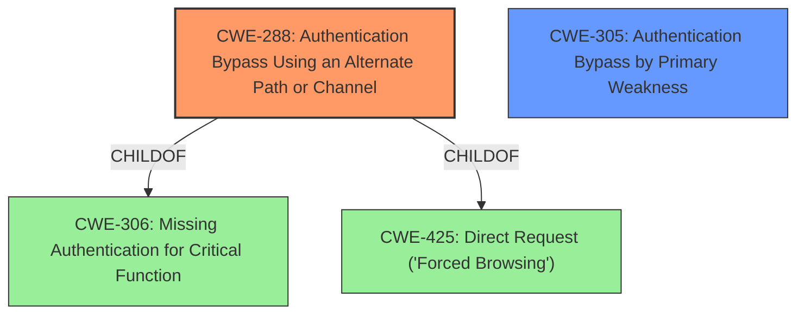

# Enhanced Analysis for CVE-2024-23465

# Summary
| CWE ID | CWE Name | Confidence | CWE Abstraction Level | CWE Vulnerability Mapping Label | CWE-Vulnerability Mapping Notes |
|---|---|---|---|---|---|
| CWE-288 | Authentication Bypass Using an Alternate Path or Channel | 0.9 | Base | Allowed | Primary CWE. The vulnerability allows an unauthenticated user to gain domain admin access through an alternate path. |
| CWE-305 | Authentication Bypass by Primary Weakness | 0.7 | Base | Allowed | Secondary CWE. The **authentication bypass** is due to an exposed dangerous method. |

## Evidence and Confidence

*   **Confidence Score:** 0.8
*   **Evidence Strength:** HIGH

## Relationship Analysis
The primary CWE is CWE-288, which represents an authentication bypass using an alternate path. CWE-305 is a secondary CWE because the bypass is caused by a primary weakness, in this case an exposed dangerous method. CWE-288 is a child of CWE-306 (Missing Authentication for Critical Function) and CWE-425 (Direct Request ('Forced Browsing')). The selection of CWE-288 over its parent CWEs is because it more specifically describes the vulnerability.



## Vulnerability Chain
The vulnerability chain starts with the **exposed dangerous method** (`ChangeHumster`) which leads to an **authentication bypass**, ultimately allowing an unauthenticated user to gain domain admin access.

## Summary of Analysis
The primary CWE is CWE-288 because the vulnerability allows an unauthenticated user to gain domain admin access through an alternate path. The "CVE Reference Links Content Summary" states that the "**Root Cause of Vulnerability:** The vulnerability stems from an exposed dangerous method named `ChangeHumster`. This method allows for an **authentication bypass**." This indicates an alternate path, as the normal authentication process is bypassed. CWE-305 is a secondary CWE because the **authentication bypass** is due to an exposed dangerous method.

Other CWEs considered but not used:

*   CWE-306: Missing Authentication for Critical Function - While authentication is bypassed, CWE-288 is more specific as it involves an alternate path.
*   CWE-425: Direct Request ('Forced Browsing') - Similar to CWE-306, CWE-288 is more specific.
*   CWE-863: Incorrect Authorization and CWE-285: Improper Authorization - These are not applicable since the vulnerability is an **authentication bypass**, not an authorization issue.


## CWE Relationship Analysis

Current CWEs represent these abstraction levels: .


### Vulnerability Chain Analysis

**Chain starting from CWE-288:**
- 288 (Authentication Bypass Using an Alternate Path or Channel) - ROOT


**Chain starting from CWE-863:**
- 863 (Incorrect Authorization) - ROOT


### CWE Relationship Diagram

```mermaid
graph TD
    classDef primary fill:#f96,stroke:#333,stroke-width:2px
    classDef secondary fill:#69f,stroke:#333
    classDef tertiary fill:#9e9,stroke:#333
```