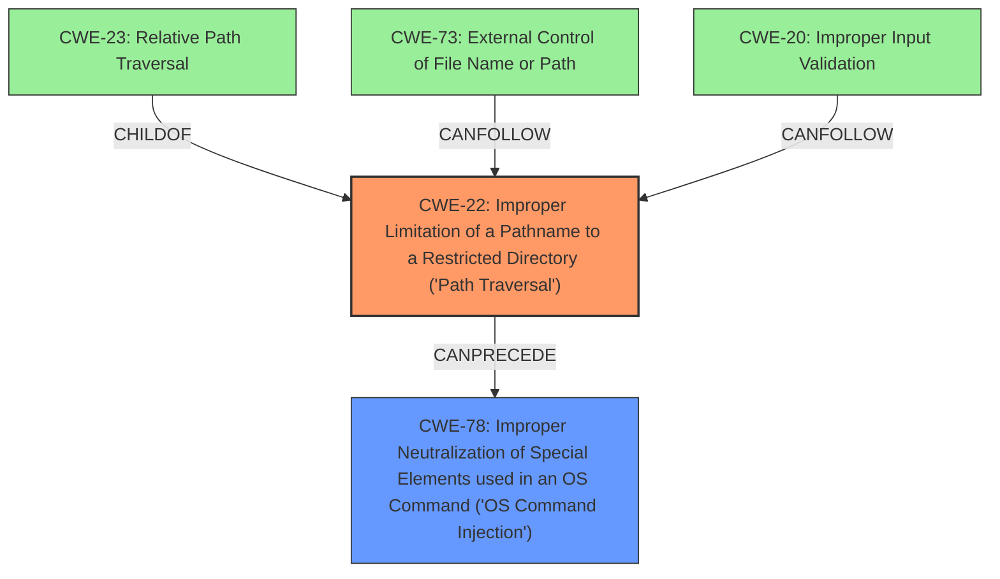

# Enhanced Analysis for CVE-2024-23471

# Summary
| CWE ID | CWE Name | Confidence | CWE Abstraction Level | CWE Vulnerability Mapping Label | CWE-Vulnerability Mapping Notes |
|---|---|---|---|---|---|
| CWE-22 | Improper Limitation of a Pathname to a Restricted Directory ('Path Traversal') | 1.0 | Base | Allowed | Primary CWE.  The vulnerability stems from a directory traversal issue within the CreateFile function of the SolarWinds Access Rights Manager. |
| CWE-78 | Improper Neutralization of Special Elements used in an OS Command ('OS Command Injection') | 0.7 | Base | Allowed | Secondary candidate. The successful exploitation allows an authenticated attacker to achieve remote code execution, a common impact of command injection. |

## Evidence and Confidence

*   **Confidence Score:** 0.9
*   **Evidence Strength:** HIGH

## Relationship Analysis
The primary CWE is CWE-22, which represents a path traversal vulnerability. CWE-22 is a base level CWE. It can be a parent of CWE-23 (Relative Path Traversal). It also has a CANFOLLOW relationship to CWE-73 (External Control of File Name or Path) and CWE-20 (Improper Input Validation). CWE-78, while also a base CWE, is considered secondary because it represents a potential consequence (remote code execution) of the path traversal, not the direct **root cause**.



## Vulnerability Chain
The vulnerability chain starts with the **improper handling of file paths** (CWE-22) within the `CreateFile` function. This leads to directory traversal, allowing an attacker to manipulate file locations outside the intended directory. The final impact is remote code execution, potentially achieved through command injection (CWE-78).

CWE-22 (Improper Limitation of a Pathname to a Restricted Directory) -> CWE-78 (Improper Neutralization of Special Elements used in an OS Command ('OS Command Injection'))

## Summary of Analysis
The initial analysis identified CWE-22 as the most likely primary CWE based on the vulnerability description and the CVE reference summary, which explicitly mentions a directory traversal issue. The retriever results also list CWE-22 as the top candidate.

The decision to classify CWE-22 as the primary weakness is strongly supported by the "CVE Reference Links Content Summary" which highlights the **root cause** as stemming from a directory traversal issue within the CreateFile function of the SolarWinds Access Rights Manager. The weakness is that the software **improperly handles file paths**, allowing for directory traversal. This aligns perfectly with the description of CWE-22.

CWE-78 is considered as a secondary CWE because the ultimate impact is remote code execution. The attacker could inject commands to achieve remote code execution.

The selected CWEs are at the optimal level of specificity because they directly address the **root cause** (CWE-22) and a potential consequence (CWE-78).


## CWE Relationship Analysis

Current CWEs represent these abstraction levels: .


### Vulnerability Chain Analysis

**Chain starting from CWE-22:**
- 22 (Improper Limitation of a Pathname to a Restricted Directory ('Path Traversal')) - ROOT


**Chain starting from CWE-73:**
- 73 (External Control of File Name or Path) - ROOT


### CWE Relationship Diagram

```mermaid
graph TD
    classDef primary fill:#f96,stroke:#333,stroke-width:2px
    classDef secondary fill:#69f,stroke:#333
    classDef tertiary fill:#9e9,stroke:#333
```