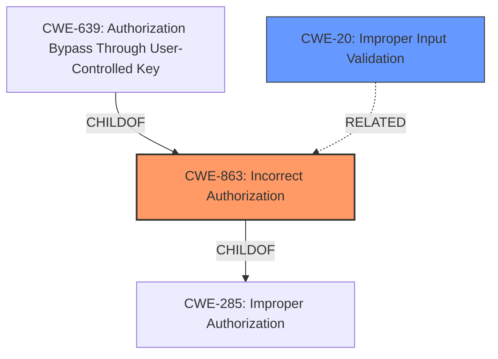

# Analysis Report for CVE-2024-23669

# Vulnerability Analysis Report: CVE-2024-23669

## Description

An **improper authorization** in Fortinet FortiWebManager version 7.2.0 and 7.0.0 through 7.0.4 and 6.3.0 and 6.2.3 through 6.2.4 and 6.0.2 allows attacker to execute unauthorized code or commands via HTTP requests or CLI.

## Vulnerability Description Key Phrases

- **Rootcause:** improper authorization
- **Impact:** execute unauthorized code or commands
- **Vector:** HTTP requests or CLI
- **Attacker:** attacker
- **Product:** Fortinet FortiWebManager
- **Version:** ['7.2.0', '7.0.0 through 7.0.4', '6.3.0', '6.2.3 through 6.2.4', '6.0.2']

## Analysis (with Relationship Data)

# Summary
| CWE ID  | CWE Name                                                                      | Confidence | CWE Abstraction Level | CWE Vulnerability Mapping Label | CWE-Vulnerability Mapping Notes |
| :-------- | :---------------------------------------------------------------------------- | :--------- | :-------------------- | :------------------------------ | :-------------------------------- |
| CWE-863   | Incorrect Authorization                                                       | 0.9        | Class                 | Allowed-with-Review             | Primary CWE                       |
| CWE-20    | Improper Input Validation                                                     | 0.7        | Class                 | Discouraged                     | Secondary Candidate               |

## Evidence and Confidence

*   **Confidence Score:** 0.8
*   **Evidence Strength:** MEDIUM

## Relationship Analysis
The primary CWE is CWE-863 (Incorrect Authorization), which is a Class-level CWE. Several other CWEs were considered, including CWE-285 (Improper Authorization) and CWE-639 (Authorization Bypass Through User-Controlled Key), but CWE-863 was selected because the vulnerability description explicitly mentions "improper authorization." CWE-20 (Improper Input Validation) was included as a secondary candidate because the CVE Reference Links Content Summary mentions it as part of the root cause.



## Vulnerability Chain
The vulnerability chain starts with **improper authorization** (CWE-863), potentially compounded by **improper input validation** (CWE-20), leading to the ability to execute unauthorized code or commands.

## Summary of Analysis
The initial assessment identified **improper authorization** as the primary weakness, aligning with the vulnerability description. The "CVE Reference Links Content Summary" supports this assessment. The Retriever Results also list CWE-863 as a potential candidate. The final decision is based on the explicit mention of "improper authorization" in the vulnerability description and its confirmation in the CVE summary. While CWE-285 is a parent of CWE-863, CWE-863 is more specific and therefore a better fit. CWE-20 is included as a secondary CWE because the CVE summary mentions it as a contributing factor.

Relevant CWE Information:

# Enhanced Context (25 CWEs)
The following CWEs were identified as potentially relevant to this vulnerability:

## CWE-863: Incorrect Authorization
**Abstraction Level**: Class
**Similarity Score**: 1724.54
**Source**: sparse

**Description**:
The product performs an authorization check when an actor attempts to access a resource or perform an action, but it does not correctly perform the check.

**Mapping Guidance**:
- Usage: Allowed-with-Review
- Rationale: This CWE entry is a Class and might have Base-level children that would be more appropriate

## CWE-20: Improper Input Validation
**Abstraction Level**: class
**Similarity Score**: 2.55
**Source**: graph

**Description**:
CWE-20: Improper Input Validation

**Mapping Guidance**:
- Usage: Discouraged
- Rationale: CWE-20 is commonly misused in low-information vulnerability reports when lower-level CWEs could be used instead, or when more details about the vulnerability are available [REF-1287]. It is not useful for trend analysis. It is also a level-1 Class (i.e., a child of a Pillar).

**Final Conclusion:**
CWE-863 is the most appropriate primary CWE due to the explicit mention of "**improper authorization**" in the vulnerability description. CWE-20 is added as a secondary weakness. This selection is at the optimal level of specificity, given the available information. Other CWEs were considered but deemed less relevant based on the evidence.


## CWE Relationship Analysis

Current CWEs represent these abstraction levels: .


### Vulnerability Chain Analysis

**Chain starting from CWE-639:**
- 639 (Authorization Bypass Through User-Controlled Key) - ROOT


**Chain starting from CWE-863:**
- 863 (Incorrect Authorization) - ROOT


### CWE Relationship Diagram

```mermaid
graph TD
    classDef primary fill:#f96,stroke:#333,stroke-width:2px
    classDef secondary fill:#69f,stroke:#333
    classDef tertiary fill:#9e9,stroke:#333
```


*Report generated on 2025-07-13 06:05:21*
