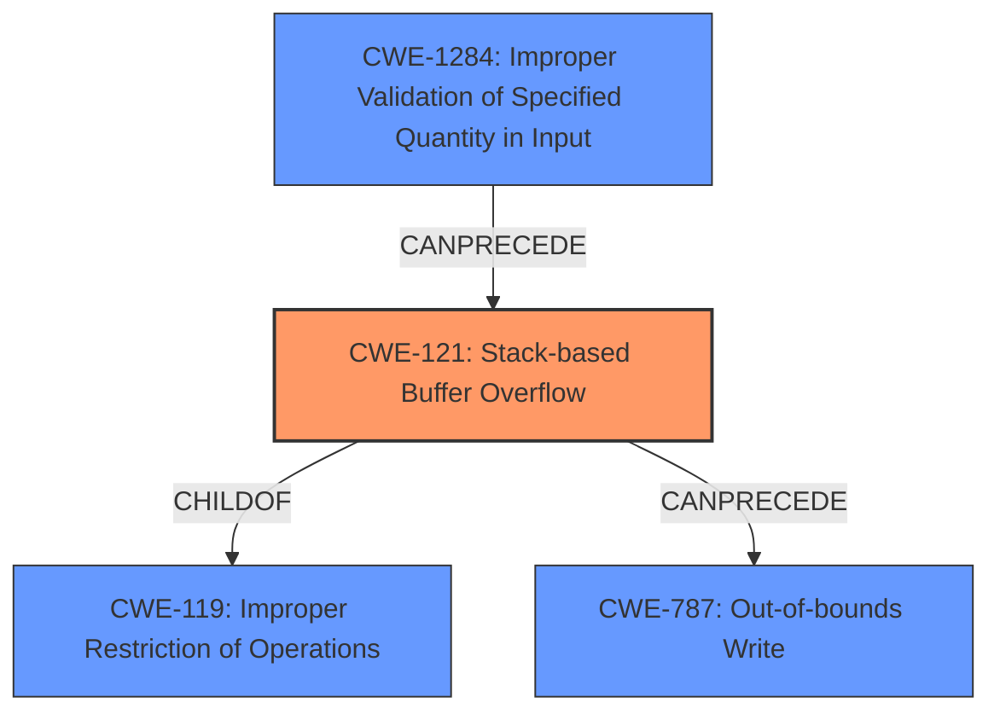

# Analysis Report for CVE-2024-23957

# Vulnerability Analysis Report: CVE-2024-23957

## Description

Autel MaxiCharger AC Elite Business C50 DLB_HostHeartBeat **Stack-based Buffer Overflow** Remote Code Execution Vulnerability. This vulnerability allows network-adjacent attackers to execute arbitrary code on affected installations of Autel MaxiCharger AC Elite Business C50 charging stations. Authentication is not required to exploit this vulnerability. The specific flaw exists within the DLB_HostHeartBeat handler of the DLB protocol implementation. When parsing an AES key, the process does not properly validate the length of user-supplied data prior to copying it to a fixed-length stack-based buffer. An attacker can leverage this vulnerability to execute code in the context of the device. Was ZDI-CAN-23241

## Vulnerability Description Key Phrases

- **Rootcause:** The process does not properly validate the length of user-supplied data prior to copying it to a fixed-length stack-based buffer
- **Weakness:** Stack-based Buffer Overflow
- **Impact:** ['Remote Code Execution', 'execute arbitrary code', 'execute code']
- **Attacker:** network-adjacent attackers
- **Product:** Autel MaxiCharger AC Elite Business C50
- **Component:** DLB_HostHeartBeat handler

## Analysis (with Relationship Data)

# Summary
| CWE ID | CWE Name | Confidence | CWE Abstraction Level | CWE Vulnerability Mapping Label | CWE-Vulnerability Mapping Notes |
|---|---|---|---|---|---|
| CWE-121 | Stack-based Buffer Overflow | 1.0 | Variant |  Primary CWE | Allowed |
| CWE-1284 | Improper Validation of Specified Quantity in Input | 0.7 | Base | Secondary Candidate | Allowed |
| CWE-787 | Out-of-bounds Write | 0.7 | Base | Secondary Candidate | Allowed |

## Evidence and Confidence

*   **Confidence Score:** 0.9
*   **Evidence Strength:** HIGH

## Relationship Analysis
The primary CWE is CWE-121 (Stack-based Buffer Overflow), which is a variant of the more general CWE-119 (Improper Restriction of Operations within the Bounds of a Memory Buffer). The vulnerability description explicitly mentions a **stack-based buffer overflow**, making CWE-121 the most specific and appropriate choice. CWE-1284 (Improper Validation of Specified Quantity in Input) is considered as a contributing factor because the root cause is the **missing validation of the length of user-supplied data**. This leads to the overflow. CWE-787 (Out-of-bounds Write) is considered an impact as a consequence of the overflow. The relationships influenced the decision to prioritize CWE-121 as the primary weakness, with CWE-1284 and CWE-787 as contributing factors.



## Vulnerability Chain
The vulnerability chain starts with the **improper validation of the length of user-supplied data** (CWE-1284), which leads to a **stack-based buffer overflow** (CWE-121), ultimately resulting in an **out-of-bounds write** (CWE-787) that allows for remote code execution.

## Summary of Analysis
The analysis is based on the provided vulnerability description and the CVE reference links content summary. The description clearly states the presence of a **stack-based buffer overflow** due to the **lack of proper validation of user-supplied data length**. This directly maps to CWE-121.

The retriever results also list CWE-121 and other related CWEs like CWE-119, CWE-120, CWE-787, and CWE-125, supporting the initial assessment. The relationship analysis confirms that CWE-121 is a specific variant of CWE-119, making it a more appropriate choice. The chain relationships highlight how the **improper input validation** leads to the buffer overflow and subsequent out-of-bounds write.

The selection of CWE-121 is at the optimal level of specificity because the vulnerability is explicitly described as a **stack-based buffer overflow**. Choosing a more general CWE like CWE-119 would not capture the specific nature of the vulnerability. The evidence strongly supports the selection of CWE-121 as the primary CWE. The fact that the **process does not properly validate the length of user-supplied data prior to copying it to a fixed-length stack-based buffer** is quoted from the vulnerability description, which is the root cause.

**CWEs Considered But Not Used:**

*   **CWE-119 (Improper Restriction of Operations within the Bounds of a Memory Buffer)**: While CWE-119 is a parent of CWE-121, the explicit mention of "stack-based" makes CWE-121 a more precise match.
*   **CWE-120 (Buffer Copy without Checking Size of Input ('Classic Buffer Overflow'))**: This CWE is similar, but the vulnerability description doesn't explicitly state that the issue involves a buffer copy operation.
*   **CWE-125 (Out-of-bounds Read)**: This CWE is not applicable as the vulnerability is about writing past the end of the buffer not reading.
*   **CWE-190 (Integer Overflow or Wraparound)**: While an integer overflow could potentially contribute to the calculation of buffer size, the description focuses on missing input validation, making CWE-1284 more relevant.
*   **CWE-74 (Improper Neutralization of Special Elements in Output Used by a Downstream Component ('Injection'))**: This CWE is about injection vulnerabilities, which is not directly relevant to the described buffer overflow.
*   **CWE-285 (Improper Authorization)**, **CWE-863 (Incorrect Authorization)**, **CWE-345 (Insufficient Verification of Data Authenticity)**: These are related to Authorization and Authentication, but it is not related to the description.
*   **CWE-78 (Improper Neutralization of Special Elements used in an OS Command ('OS Command Injection'))**: This is about OS Command Injection, but it is not related to the description.
*   **CWE-134 (Use of Externally-Controlled Format String)**: This is about format String bugs, but it is not related to the description.
*   **CWE-130 (Improper Handling of Length Parameter Inconsistency)**: This is related, but is not the primary reason for the vulnerability.
*   **CWE-252 (Unchecked Return Value)**: This is about return values but it is not related to the description.
*   **CWE-280 (Improper Handling of Insufficient Permissions or Privileges)**: This is about insufficient privileges but it is not related to the description.
*   **CWE-754 (Improper Check for Unusual or Exceptional Conditions)**: This is not the primary reason for the vulnerability.
*   **CWE-1339 (Insufficient Precision or Accuracy of a Real Number)**: This is about Real Numbers, but it is not related to the description.
*   **CWE-1257 (Improper Access Control Applied to Mirrored or Aliased Memory Regions)**: This is not the primary reason for the vulnerability.
*   **CWE-1260 (Improper Handling of Overlap Between Protected Memory Ranges)**: This is not the primary reason for the vulnerability.
*   **CWE-131 (Incorrect Calculation of Buffer Size)**: While incorrect calculation of the buffer could be a factor, the description focuses on **missing validation of input length**.
*   **CWE-128 (Wrap-around Error)**: While wrap-around errors could potentially contribute to the calculation of buffer size, the description focuses on missing input validation, making CWE-1284 more relevant.
*   **CWE-191 (Integer Underflow (Wrap or Wraparound))**: The description focuses on missing input validation, making CWE-1284 more relevant.
*   **CWE-193 (Off-by-one Error)**: The description focuses on missing input validation, making CWE-1284 more relevant.
*   **CWE-20 (Improper Input Validation)**: While this is true, CWE-1284 is more specific to quantity.


## CWE Relationship Analysis

Current CWEs represent these abstraction levels: .


### Vulnerability Chain Analysis

**Chain starting from CWE-130:**
- 130 (Improper Handling of Length Parameter Inconsistency) - ROOT


**Chain starting from CWE-345:**
- 345 (Insufficient Verification of Data Authenticity) - ROOT


### CWE Relationship Diagram

```mermaid
graph TD
    classDef primary fill:#f96,stroke:#333,stroke-width:2px
    classDef secondary fill:#69f,stroke:#333
    classDef tertiary fill:#9e9,stroke:#333
```


*Report generated on 2025-07-13 06:09:33*
