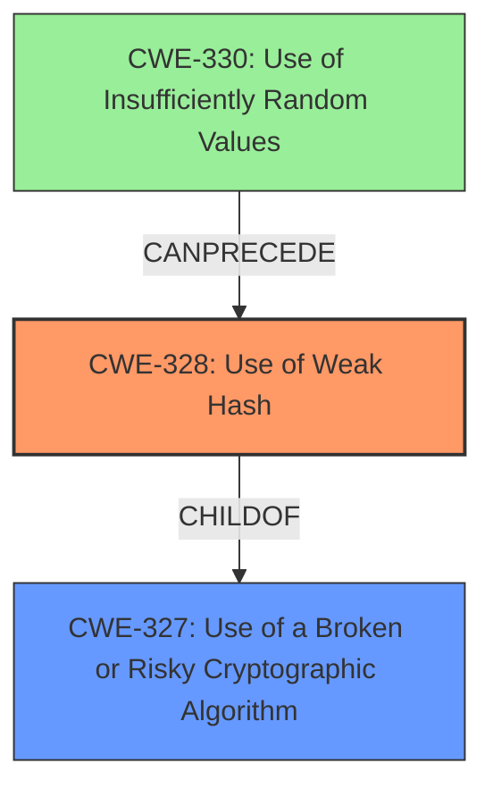

# Enhanced Analysis for CVE-2024-24553

# Summary
| CWE ID | CWE Name | Confidence | CWE Abstraction Level | CWE Vulnerability Mapping Label | CWE-Vulnerability Mapping Notes |
|---|---|---|---|---|---|
| CWE-328 | Use of Weak Hash | 1.0 | Base | Primary | Allowed |
| CWE-330 | Use of Insufficiently Random Values | 0.8 | Class | Secondary | Discouraged |

## Evidence and Confidence

*   **Confidence Score:** 0.9
*   **Evidence Strength:** HIGH

## Relationship Analysis
The primary relationship that influenced the decision was the parent-child relationship between CWE-327 (Use of a Broken or Risky Cryptographic Algorithm) and CWE-328 (Use of Weak Hash). While CWE-327 is a broader class, CWE-328 is a more specific base-level weakness that directly applies to the use of SHA-1. Additionally, CWE-330 (Use of Insufficiently Random Values) is related, since a weak PRNG is used to generate the salt. However, CWE-330 is a Class-level CWE, so it is considered as a secondary weakness.



## Vulnerability Chain
The vulnerability chain starts with the **use of the SHA-1 hashing algorithm** (CWE-328), and **the use of `rand()` function for salt generation** (CWE-330), leading to the impact of attackers being able to determine cleartext passwords through brute-force attacks.

## Summary of Analysis
The primary CWE is CWE-328 (Use of Weak Hash) because the vulnerability description clearly states that "**Bludit uses the SHA-1 hashing algorithm to compute password hashes**". The "CVE Reference Links Content Summary" section reinforces this by stating that the "**Weak Hashing Algorithm:** SHA-1 is fast and therefore vulnerable to brute force attacks." This aligns perfectly with the description of CWE-328, which refers to using an algorithm that produces a digest that does not meet security expectations.

CWE-330 (Use of Insufficiently Random Values) is considered a secondary weakness because the vulnerability also mentions that "the salt that is computed by Bludit is generated with a non-cryptographically secure function." This falls under the broader category of using insufficiently random values, but it's a contributing factor to the overall weakness of the password hashing scheme. Because CWE-330 is a Class, I chose to make it a secondary CWE.

I considered other CWEs from the Retriever Results, such as CWE-916 (Use of Password Hash With Insufficient Computational Effort), but ultimately decided that CWE-328 is a more accurate representation of the root cause. While CWE-916 is related, the core issue is the specific hashing algorithm used (SHA-1), rather than the computational effort in general. Similarly, CWE-760 (Use of a One-Way Hash with a Predictable Salt) was considered, but the primary issue is the use of SHA-1 itself, with the predictable salt being a contributing factor.


## CWE Relationship Analysis

Current CWEs represent these abstraction levels: .


### Vulnerability Chain Analysis

**Chain starting from CWE-327:**
- 327 (Use of a Broken or Risky Cryptographic Algorithm) - ROOT


**Chain starting from CWE-330:**
- 330 (Use of Insufficiently Random Values) - ROOT


### CWE Relationship Diagram

```mermaid
graph TD
    classDef primary fill:#f96,stroke:#333,stroke-width:2px
    classDef secondary fill:#69f,stroke:#333
    classDef tertiary fill:#9e9,stroke:#333
```