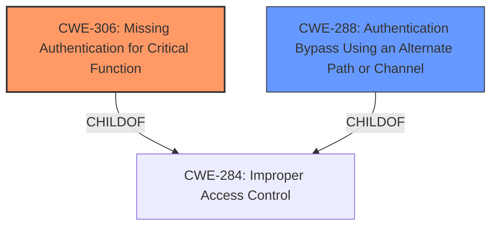

# Raw Analyzer Response for CVE-2024-24621

# Summary
| CWE ID | CWE Name | Confidence | CWE Abstraction Level | CWE Vulnerability Mapping Label | CWE-Vulnerability Mapping Notes |
|---|---|---|---|---|---|
| CWE-306 | Missing Authentication for Critical Function | 0.9 | Base | Primary | Allowed |
| CWE-288 | Authentication Bypass Using an Alternate Path or Channel | 0.7 | Base | Secondary Candidate | Allowed |

## Evidence and Confidence

*   **Confidence Score:** 0.8
*   **Evidence Strength:** HIGH

## Relationship Analysis
The primary CWE is CWE-306, which falls under the Class-level weakness of Improper Access Control (CWE-284). CWE-306 represents the specific case where authentication is entirely missing for a critical function, which aligns directly with the vulnerability description. CWE-288, while also relevant, describes bypassing authentication through an alternate path, which is a related but distinct scenario. The hierarchical relationship informs the selection of the more specific CWE-306 over its parent CWEs.

## Vulnerability Chain
The vulnerability chain starts with **missing authentication** for the password reset functionality (CWE-306). This leads to an **authentication bypass**, which allows a remote, anonymous attacker to gain full server access as the root user. The root cause is the **lack of authentication**, and the impact is complete system compromise.

## Summary of Analysis
The initial analysis identified several potential CWEs, including CWE-306, CWE-798, CWE-287, and CWE-288. However, based on the vulnerability description and the provided guidance, CWE-306 best represents the root cause: the password reset functionality lacks authentication, enabling an attacker to bypass security measures. The description explicitly states an **authentication bypass vulnerability** in the password reset functionality, allowing remote, anonymous attackers to gain full server access. This directly indicates a **missing authentication** issue, making CWE-306 the most appropriate choice.

The choice of CWE-306 is also supported by the "Authentication vs Authorization vs Access Control Guidance," which states that "CWE-306: *Missing Authentication for Critical Function* – used when no identity validation is enforced for sensitive functionality (e.g., password reset, user deletion)."

CWE-288, "Authentication Bypass Using an Alternate Path or Channel," was considered as a secondary option. While the vulnerability does result in an authentication bypass, the root cause is the **lack of authentication** rather than an alternate path.

The selected CWEs are at the optimal level of specificity because they accurately reflect the root cause of the vulnerability. CWE-306 is a Base-level CWE that specifically addresses the **missing authentication** issue, providing a precise representation of the vulnerability.

Relevant CWE Information:

# Enhanced Context (25 CWEs)
The following CWEs were identified as potentially relevant to this vulnerability:

## CWE-303: Incorrect Implementation of Authentication Algorithm
**Abstraction Level**: Base
**Similarity Score**: 0.76
**Source**: dense

**Description**:
The requirements for the product dictate the use of an established authentication algorithm, but the implementation of the algorithm is incorrect.

**Mapping Guidance**:
- Usage: Allowed
- Rationale: This CWE entry is at the Base level of abstraction, which is a preferred level of abstraction for mapping to the root causes of vulnerabilities.

*Rejected:* This CWE is not applicable because the vulnerability is not due to an incorrect implementation of an authentication algorithm, but rather the complete **absence of authentication**.

## CWE-305: Authentication Bypass by Primary Weakness
**Abstraction Level**: Base
**Similarity Score**: 0.76
**Source**: dense

**Description**:
The authentication algorithm is sound, but the implemented mechanism can be bypassed as the result of a separate weakness that is primary to the authentication error.

**Mapping Guidance**:
- Usage: Allowed
- Rationale: This CWE entry is at the Base level of abstraction, which is a preferred level of abstraction for mapping to the root causes of vulnerabilities.

*Rejected:* While an authentication bypass occurs, the primary weakness is the **lack of authentication** itself, not a separate weakness.

## CWE-288: Authentication Bypass Using an Alternate Path or Channel
**Abstraction Level**: Base
**Similarity Score**: 0.76
**Source**: dense

**Description**:
The product requires authentication, but the product has an alternate path or channel that does not require authentication.

**Mapping Guidance**:
- Usage: Allowed
- Rationale: This CWE entry is at the Base level of abstraction, which is a preferred level of abstraction for mapping to the root causes of vulnerabilities.

*Accepted as Secondary:* The password reset functionality represents an alternate path that lacks authentication.

## CWE-1391: Use of Weak Credentials
**Abstraction Level**: Class
**Similarity Score**: 0.76
**Source**: dense

**Description**:
The product uses weak credentials (such as a default key or hard-coded password) that can be calculated, derived, reused, or guessed by an attacker.

**Mapping Guidance**:
- Usage: Allowed-with-Review
- Rationale: This CWE entry is a Class and might have Base-level children that would be more appropriate

*Rejected:* This CWE is not applicable as the vulnerability is not related to the usage of weak credentials. It's about the **absence of authentication**.

## CWE-1390: Weak Authentication
**Abstraction Level**: Class
**Similarity Score**: 0.74
**Source**: dense

**Description**:
The product uses an authentication mechanism to restrict access to specific users or identities, but the mechanism does not sufficiently prove that the claimed identity is correct.

**Mapping Guidance**:
- Usage: Allowed-with-Review
- Rationale: This CWE entry is a Class and might have Base-level children that would be more appropriate

*Rejected:* This CWE is too general. The issue is not that the authentication is weak, but that it is **missing altogether** for the password reset functionality.

## CWE-472: External Control of Assumed-Immutable Web Parameter
**Abstraction Level**: Base
**Similarity Score**: 0.74
**Source**: dense

**Description**:
The web application does not sufficiently verify inputs that are assumed to be immutable but are actually externally controllable, such as hidden form fields.

**Mapping Guidance**:
- Usage: Allowed
- Rationale: This CWE entry is at the Base level of abstraction, which is a preferred level of abstraction for mapping to the root causes of vulnerabilities.

*Rejected:* This CWE is not relevant to the vulnerability description, as it focuses on the lack of verification for assumed-immutable parameters, which is not the case here.

## CWE-798: Use of Hard-coded Credentials
**Abstraction Level**: Base
**Similarity Score**: 0.74
**Source**: dense

**Description**:
The product contains hard-coded credentials, such as a password or cryptographic key.

**Mapping Guidance**:
- Usage: Allowed
- Rationale: This CWE entry is at the Base level of abstraction, which is a preferred level of abstraction for mapping to the root causes of vulnerabilities.

*Rejected:* This CWE is not applicable because the vulnerability is not due to hard-coded credentials.

## CWE-807: Reliance on Untrusted Inputs in a Security Decision
**Abstraction Level**: Base
**Similarity Score**: 0.74
**Source**: dense

**Description**:
The product uses a protection mechanism that relies on the existence or values of an input, but the input can be modified by an untrusted actor in a way that bypasses the protection mechanism.

**Mapping Guidance**:
- Usage: Allowed
- Rationale: This CWE entry is at the Base level of abstraction, which is a preferred level of abstraction for mapping to the root causes of vulnerabilities.

*Rejected:* This CWE is not applicable, as the vulnerability doesn't stem from relying on untrusted inputs in a security decision, but from the **absence of authentication**.

## CWE-290: Authentication Bypass by Spoofing
**Abstraction Level**: Base
**Similarity Score**: 0.73
**Source**: dense

**Description**:
This attack-focused weakness is caused by incorrectly implemented authentication schemes that are subject to spoofing attacks.

**Mapping Guidance**:
- Usage: Allowed
- Rationale: This CWE entry is at the Base level of abstraction, which is a preferred level of abstraction for mapping to the root causes of vulnerabilities.

*Rejected:* This CWE is not applicable, as the vulnerability doesn't involve spoofing.

## CWE-425: Direct Request ('Forced Browsing')
**Abstraction Level**: Base
**Similarity Score**: 0.73
**Source**: dense

**Description