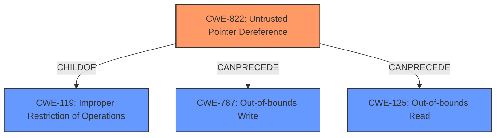

# Analysis Report for CVE-2024-25073

# Vulnerability Analysis Report: CVE-2024-25073

## Description

An issue was discovered in Samsung Semiconductor Mobile Processor and Modem Exynos 9820, Exynos 9825, Exynos 980, Exynos 990, Exynos 850, Exynos 1080, Exynos 2100, Exynos 2200, Exynos 1280, Exynos 1380, Exynos 1330, Exynos 9110, Exynos W920, Exynos W930, Exynos Modem 5123, Exynos Modem 5300. The baseband software does not properly check a pointer specified by the CC (Call Control module), which can lead to Denial of Service (**Untrusted Pointer Dereference**).

## Vulnerability Description Key Phrases

- **Rootcause:** Untrusted Pointer Dereference
- **Impact:** Denial of Service
- **Product:** Samsung Semiconductor Mobile Processor and Modem Exynos
- **Component:** baseband software

## Analysis (with Relationship Data)

# Summary
| CWE ID | CWE Name | Confidence | CWE Abstraction Level | CWE Vulnerability Mapping Label | CWE-Vulnerability Mapping Notes |
|---|---|---|---|---|---|
| CWE-822 | Untrusted Pointer Dereference | 1.0 | Base | Primary | Allowed |

## Evidence and Confidence

*   **Confidence Score:** 1.0
*   **Evidence Strength:** HIGH

## Relationship Analysis
The primary CWE selected is CWE-822, which is a Base level CWE, and accurately reflects the **untrusted pointer dereference** issue described in the vulnerability. While other CWEs like CWE-787, CWE-476, and CWE-824 were considered due to their relevance to pointer issues, CWE-822 best captures the specific scenario where a pointer from an **untrusted** source (CC module) is dereferenced without proper validation. CWE-822 is related to CWE-119 (Improper Restriction of Operations within the Bounds of a Memory Buffer), indicating that **untrusted pointer dereference** can lead to memory corruption issues. It can also PRECEDE CWE-787 (Out-of-bounds Write) and CWE-125 (Out-of-bounds Read).



## Vulnerability Chain
The vulnerability chain starts with the CC module providing a pointer without proper validation. This leads to an **untrusted pointer dereference** (CWE-822), which results in a denial of service.

## Summary of Analysis
The primary vulnerability is an **untrusted pointer dereference** in the baseband software, specifically due to the Call Control (CC) module providing an unchecked pointer. This leads directly to a denial-of-service condition. The evidence from the vulnerability description clearly states: "The baseband software does not properly check a pointer specified by the CC (Call Control module), which can lead to Denial of Service (**Untrusted Pointer Dereference**)."

The selection of CWE-822 is based on this direct evidence and the nature of the vulnerability. The retriever results also highlight CWE-822 as a relevant candidate. Other candidates were considered, but ultimately the direct match of "**Untrusted Pointer Dereference**" in the vulnerability description to CWE-822 made it the most appropriate choice. The base abstraction level is suitable as it directly identifies the root cause.


## CWE Relationship Analysis

Current CWEs represent these abstraction levels: .


### Vulnerability Chain Analysis

**Chain starting from CWE-476:**
- 476 (NULL Pointer Dereference) - ROOT


**Chain starting from CWE-125:**
- 125 (Out-of-bounds Read) - ROOT


### CWE Relationship Diagram

```mermaid
graph TD
    classDef primary fill:#f96,stroke:#333,stroke-width:2px
    classDef secondary fill:#69f,stroke:#333
    classDef tertiary fill:#9e9,stroke:#333
```


*Report generated on 2025-07-13 06:20:35*
