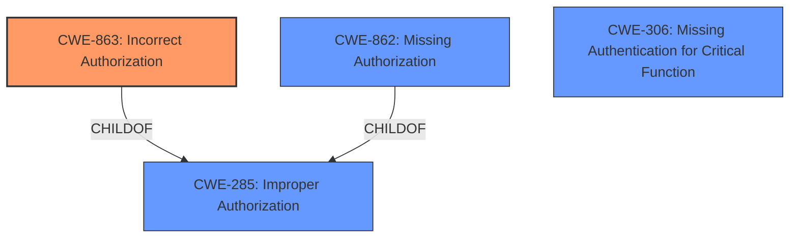

# Raw Analyzer Response for CVE-2024-25157

# Summary
| CWE ID | CWE Name | Confidence | CWE Abstraction Level | CWE Vulnerability Mapping Label | CWE-Vulnerability Mapping Notes |
|---|---|---|---|---|---|
| CWE-863 | Incorrect Authorization | 0.9 | Class | Primary CWE | Allowed-with-Review |
| CWE-306 | Missing Authentication for Critical Function | 0.6 | Base | Secondary Candidate | Allowed |

## Evidence and Confidence

*   **Confidence Score:** 0.8
*   **Evidence Strength:** HIGH

## Relationship Analysis
The primary relationship that influenced the decision was the distinction between authentication and authorization. The vulnerability description clearly points to an **authentication bypass**, but the bypass leads to being able to circumvent some permission checks, indicating an authorization problem. CWE-863 is related to CWE-285 (Improper Authorization) and CWE-862 (Missing Authorization). If the authentication bypass allowed complete access without any checks, CWE-862 might be more appropriate. However, since the bypass allows only *some* permission checks to be circumvented, CWE-863, indicating *incorrect* authorization, is a more precise fit. CWE-306 *could* be considered if there were absolutely no authentication checks, but the description states an **authentication bypass**, implying authentication is present but flawed.

## Vulnerability Chain
The vulnerability chain starts with an **authentication bypass**, which leads to the circumvention of some permission checks, and ultimately results in unauthorized information disclosure and modification.

Authentication Bypass -> Incorrect Authorization -> Unauthorized Information Disclosure/Modification

CWE-863 (Incorrect Authorization) is the primary weakness in this chain, as it directly leads to the impact. CWE-306 (Missing Authentication for Critical Function) *could* be a prerequisite, but the description specifies bypass, suggesting authentication is present but flawed.

## Summary of Analysis
The initial analysis focused on identifying the root cause of the vulnerability, which is described as an **authentication bypass** that allows circumvention of some permission checks. The retriever results suggested several CWEs related to authorization and authentication issues. However, after carefully considering the vulnerability description and the CWE specifications, CWE-863 (Incorrect Authorization) was selected as the primary CWE because it accurately describes the scenario where an authentication bypass leads to flawed permission checks. The fact that the admin user is able to circumvent *some* permission checks points to incorrect authorization, rather than completely missing authorization (CWE-862). The guidance on Authentication vs Authorization was particularly helpful in making this determination.

CWE-306 (Missing Authentication for Critical Function) was considered but ultimately deemed less appropriate because the vulnerability description explicitly states an **authentication bypass**, implying that authentication mechanisms are present but flawed, not entirely absent. However, the possibility remains that the authentication on the affected pages is missing or insufficient.

The selection of CWE-863 is at the optimal level of specificity, as it is a Class-level CWE that accurately captures the nature of the authorization flaw. While more specific Base or Variant CWEs might exist, the available evidence does not provide enough detail to justify a more granular classification.

Relevant CWE Information:

# Enhanced Context (25 CWEs)
The following CWEs were identified as potentially relevant to this vulnerability:

## CWE-863: Incorrect Authorization
**Abstraction Level**: Class
**Similarity Score**: 2559.18
**Source**: sparse

**Description**:
The product performs an authorization check when an actor attempts to access a resource or perform an action, but it does not correctly perform the check.

**Mapping Guidance**:
- Usage: Allowed-with-Review
- Rationale: This CWE entry is a Class and might have Base-level children that would be more appropriate

## CWE-306: Missing Authentication for Critical Function
**Abstraction Level**: Base
**Similarity Score**: 2358.39
**Source**: sparse

**Description**:
The product does not perform any authentication for functionality that requires a provable user identity or consumes a significant amount of resources.

**Mapping Guidance**:
- Usage: Allowed
- Rationale: This CWE entry is at the Base level of abstraction, which is a preferred level of abstraction for mapping to the root causes of vulnerabilities.