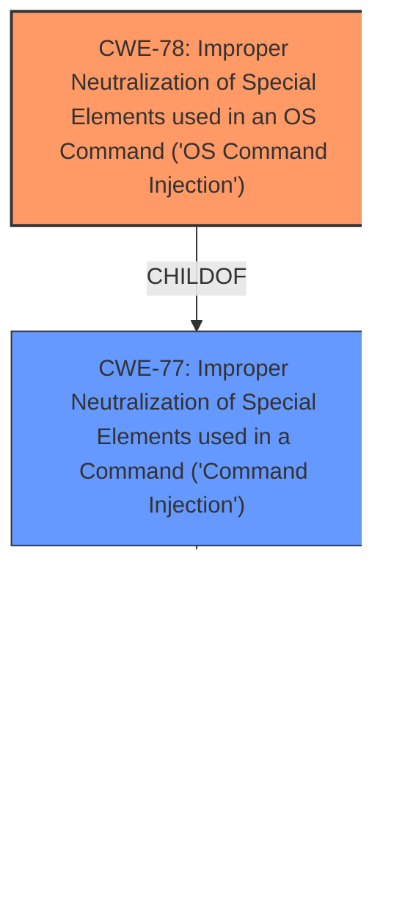

# Raw Analyzer Response for CVE-2024-25255

# Summary
| CWE ID | CWE Name | Confidence | CWE Abstraction Level | CWE Vulnerability Mapping Label | CWE-Vulnerability Mapping Notes |
|---|---|---|---|---|---|
| CWE-78 | Improper Neutralization of Special Elements used in an OS Command ('OS Command Injection') | 1.0 | Base | Primary | Allowed |
| CWE-77 | Improper Neutralization of Special Elements used in a Command ('Command Injection') | 0.7 | Class | Secondary | Allowed-with-Review |

## Evidence and Confidence

*   **Confidence Score:** 0.9
*   **Evidence Strength:** HIGH

## Relationship Analysis
The primary relationship impacting the decision is the ChildOf relationship between CWE-78 and CWE-77. CWE-78 is a specific type of command injection that occurs at the operating system level, while CWE-77 is a more general class. Because the vulnerability description explicitly states that the injection occurs in the context of an OS command, CWE-78 is the more appropriate and specific choice.

## Vulnerability Chain
The vulnerability chain starts with the **improper neutralization** of special elements within the `shell_cmd` option of a `.sublime-build` file. This leads to the ability to inject and execute arbitrary operating system commands, resulting in potential system compromise.

1.  **Root Cause:** **Improper Neutralization** of special elements in `shell_cmd` (CWE-78).
2.  **Vulnerability:** OS Command Injection (CWE-78).
3.  **Impact:** Arbitrary code execution, system compromise.

## Summary of Analysis
The vulnerability involves a **command injection** in Sublime Text 4's New Build System module. The `shell_cmd` option within a `.sublime-build` file allows the execution of arbitrary shell commands without proper sanitization.

The primary CWE is CWE-78, "Improper Neutralization of Special Elements used in an OS Command ('OS Command Injection')". This is because the **injection** occurs directly within an operating system command. The "CVE Reference Links Content Summary" section confirms this, stating, "The core vulnerability is the ability to inject and execute arbitrary operating system commands via the `shell_cmd` option."

CWE-77, "Improper Neutralization of Special Elements used in a Command ('Command Injection')", was considered as a broader, more general classification. However, CWE-78 is more specific and accurately reflects the nature of the vulnerability, as the injection directly involves OS commands.

The retriever results also support this selection, with CWE-78 having a high score and being a more specific instance of the more general CWE-77.

The evidence from the vulnerability description and the "CVE Reference Links Content Summary" section strongly supports the selection of CWE-78 as the primary CWE. The confidence level is high (0.9) due to the clear evidence and alignment with the CWE description.