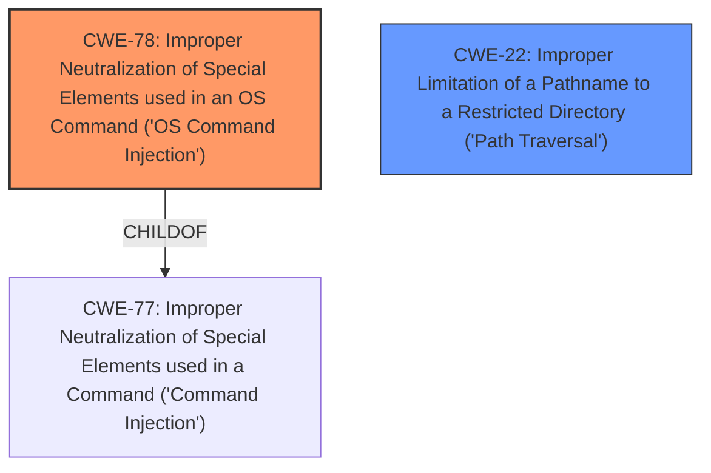

# Raw Analyzer Response for CVE-2024-2552

# Summary
| CWE ID | CWE Name | Confidence | CWE Abstraction Level | CWE Vulnerability Mapping Label | CWE-Vulnerability Mapping Notes |
|---|---|---|---|---|---|
| CWE-78 | Improper Neutralization of Special Elements used in an OS Command ('OS Command Injection') | 1.0 | Base | Primary | Allowed |
| CWE-22 | Improper Limitation of a Pathname to a Restricted Directory ('Path Traversal') | 0.5 | Base | Secondary | Allowed |

## Evidence and Confidence

*   **Confidence Score:** 0.9
*   **Evidence Strength:** MEDIUM

## Relationship Analysis
The primary relationship is that CWE-78 [Improper Neutralization of Special Elements used in an OS Command ('OS Command Injection')] is a specific type of command injection, which is a child of the broader CWE-77 [Improper Neutralization of Special Elements used in a Command ('Command Injection')]. CWE-22 [Improper Limitation of a Pathname to a Restricted Directory ('Path Traversal')] is identified in the CVE Reference Links Content Summary.

## Vulnerability Chain
1.  The vulnerability starts with **command injection** (CWE-78).
2.  An authenticated administrator exploits this **command injection** vulnerability to bypass system restrictions.
3.  The attacker can then delete files on the firewall, potentially leveraging path traversal (CWE-22).

## Summary of Analysis
The vulnerability description clearly points to a **command injection** vulnerability. The key phrase "command injection" and the description of bypassing system restrictions to delete files strongly suggest CWE-78 [Improper Neutralization of Special Elements used in an OS Command ('OS Command Injection')]. The "CVE Reference Links Content Summary" section also explicitly mentions **command injection** as a vulnerability. The ability to delete files on the firewall could also indicate a path traversal issue (CWE-22) because the attacker needs to be able to specify which files to delete.

The retriever results also support CWE-78 [Improper Neutralization of Special Elements used in an OS Command ('OS Command Injection')], although the top hit is CWE-77 [Improper Neutralization of Special Elements used in a Command ('Command Injection')]. Since the vulnerability specifically allows execution of OS commands, CWE-78 [Improper Neutralization of Special Elements used in an OS Command ('OS Command Injection')] is a more specific and appropriate choice than CWE-77 [Improper Neutralization of Special Elements used in a Command ('Command Injection')].

CWE-77 [Improper Neutralization of Special Elements used in a Command ('Command Injection')] was considered but not selected as the primary CWE because CWE-78 [Improper Neutralization of Special Elements used in an OS Command ('OS Command Injection')] is more specific and accurately describes the vulnerability where OS commands are being injected.
CWE-285 [Improper Authorization] and CWE-269 [Improper Privilege Management] were considered but not selected because the root cause is **command injection**, not authorization or privilege issues, even though these could be secondary impacts.
CWE-22 [Improper Limitation of a Pathname to a Restricted Directory ('Path Traversal')] was considered and selected as a secondary issue because the attacker is deleting files on the system.

The evidence from the vulnerability description and the retriever results, along with the hierarchical relationship between CWE-77 [Improper Neutralization of Special Elements used in a Command ('Command Injection')] and CWE-78 [Improper Neutralization of Special Elements used in an OS Command ('OS Command Injection')], support the selection of CWE-78 [Improper Neutralization of Special Elements used in an OS Command ('OS Command Injection')] as the primary CWE.