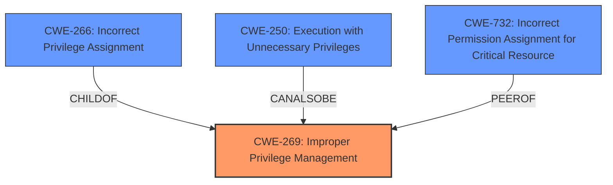

# Enhanced Analysis for CVE-2024-26314

# Summary
| CWE ID | CWE Name | Confidence | CWE Abstraction Level | CWE Vulnerability Mapping Label | CWE-Vulnerability Mapping Notes |
|---|---|---|---|---|---|
| CWE-269 | Improper Privilege Management | 0.9 | Class | Primary CWE | Discouraged |
| CWE-266 | Incorrect Privilege Assignment | 0.7 | Base | Secondary Candidate | Allowed |
| CWE-250 | Execution with Unnecessary Privileges | 0.6 | Base | Secondary Candidate | Allowed |
| CWE-732 | Incorrect Permission Assignment for Critical Resource | 0.5 | Class | Secondary Candidate | Allowed-with-Review |

## Evidence and Confidence

*   **Confidence Score:** 0.8
*   **Evidence Strength:** HIGH

## Relationship Analysis
The primary CWE is CWE-269, which is a Class-level CWE. The retriever results and guidance suggest considering more specific Base-level CWEs if possible. CWE-266 and CWE-250 are Base-level CWEs related to privilege management, making them potential candidates. CWE-732 is a Class that is not preferred but is included in the Retriever Results.



## Vulnerability Chain
The vulnerability chain starts with **Improper Privilege Management** (CWE-269), which leads to privilege escalation and arbitrary code execution.
  - Root Cause: **Improper Privilege Management** (CWE-269)
  - Impact: Privilege escalation, arbitrary code execution.

## Summary of Analysis
The initial assessment, based on the vulnerability description and CVE details, points to **Improper Privilege Management** (CWE-269) as the primary weakness. The description explicitly states "**Improper privilege management**" as the root cause.

The CVE Reference Links Content Summary states:
*   **Root Cause:** The root cause of CVE-2024-26314 is an "Improper Privilege Management" vulnerability within Jungo's WinDriver, which is used by multiple Mitsubishi Electric FA Engineering software products. This likely involves insufficient checks or controls on user privileges during operations performed by WinDriver.
*   **Weaknesses/Vulnerabilities:** The specific weakness is "Improper Privilege Management" (CWE-269), which allows for privilege escalation.

While CWE-269 is a Class-level CWE and is generally discouraged, the explicit mention in the CVE summary and the lack of specific details about *how* the privilege management is improper makes it a reasonable starting point.

The Retriever Results suggest CWE-266 (**Incorrect Privilege Assignment**) and CWE-250 (**Execution with Unnecessary Privileges**) as more specific alternatives. However, the current evidence does not provide enough detail to definitively say whether the privileges were assigned incorrectly (CWE-266) or if the code was executed with unnecessary privileges (CWE-250). Therefore, CWE-269 remains the primary CWE, with CWE-266 and CWE-250 as secondary candidates pending more information. CWE-732 is considered but does not match the Privilege vs Permissions Guidance.

Relevant CWE Information:

# Enhanced Context (25 CWEs)
The following CWEs were identified as potentially relevant to this vulnerability:

## CWE-266: Incorrect Privilege Assignment
**Abstraction Level**: Base
**Similarity Score**: 0.79
**Source**: dense

**Description**:
A product incorrectly assigns a privilege to a particular actor, creating an unintended sphere of control for that actor.

**Mapping Guidance**:
- Usage: Allowed
- Rationale: This CWE entry is at the Base level of abstraction, which is a preferred level of abstraction for mapping to the root causes of vulnerabilities.

## CWE-269: Improper Privilege Management
**Abstraction Level**: Class
**Similarity Score**: 1846.06
**Source**: sparse

**Description**:
The product does not properly assign, modify, track, or check privileges for an actor, creating an unintended sphere of control for that actor.

**Mapping Guidance**:
- Usage: Discouraged
- Rationale: CWE-269 is commonly misused. It can be conflated with "privilege escalation," which is a technical impact that is listed in many low-information vulnerability reports [REF-1287]. It is not useful for trend analysis.

## CWE-250: Execution with Unnecessary Privileges
**Abstraction Level**: Base
**Similarity Score**: 0.79
**Source**: sparse

**Description**:
The software component performs its actions with more privileges than necessary.

**Mapping Guidance**:
- Usage: Allowed
- Rationale: This CWE entry is at the Base level of abstraction, which is a preferred level of abstraction for mapping to the root causes of vulnerabilities.

## CWE-732: Incorrect Permission Assignment for Critical Resource
**Abstraction Level**: Class
**Similarity Score**: 1775.68
**Source**: sparse

**Description**:
The product specifies permissions for a security-critical resource in a way that allows that resource to be read or modified by unintended actors.

**Mapping Guidance**:
- Usage: Allowed-with-Review
- Rationale: While the name itself indicates an assignment of permissions for resources, this is often misused for vulnerabilities in which "permissions" are not checked, which is an "authorization" weakness (CWE-285 or descendants) within CWE's model [REF-1287].


## CWE Relationship Analysis

Current CWEs represent these abstraction levels: .


### Vulnerability Chain Analysis

**Chain starting from CWE-732:**
- 732 (Incorrect Permission Assignment for Critical Resource) - ROOT


**Chain starting from CWE-269:**
- 269 (Improper Privilege Management) - ROOT


### CWE Relationship Diagram

```mermaid
graph TD
    classDef primary fill:#f96,stroke:#333,stroke-width:2px
    classDef secondary fill:#69f,stroke:#333
    classDef tertiary fill:#9e9,stroke:#333
```