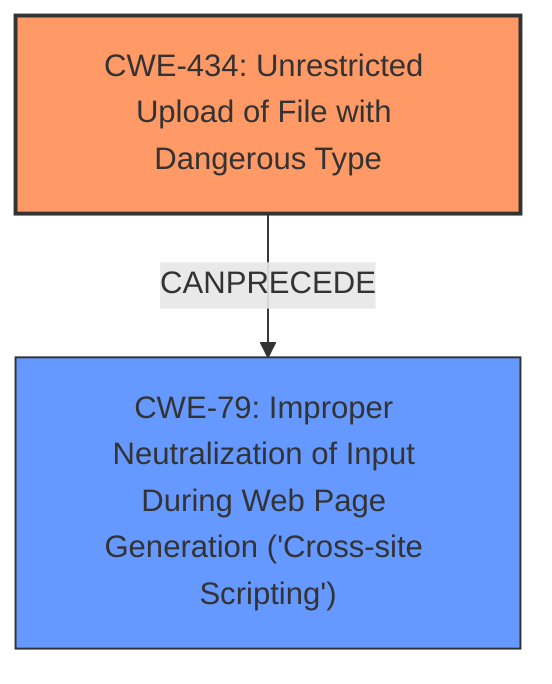

# Enhanced Analysis for CVE-2024-27731

# Summary
| CWE ID | CWE Name | Confidence | CWE Abstraction Level | CWE Vulnerability Mapping Label | CWE-Vulnerability Mapping Notes |
|---|---|---|---|---|---|
| CWE-434 | Unrestricted Upload of File with Dangerous Type | 1.0 | Base | Allowed | Primary CWE: This is the **root cause** of the vulnerability, as the **lack of file type filtering** allows for the upload of malicious files. |
| CWE-79 | Improper Neutralization of Input During Web Page Generation ('Cross-site Scripting') | 0.9 | Base | Allowed | Secondary CWE: The **lack of file type filtering** leads to the injection of malicious script into the web page, resulting in Cross-site Scripting. |

## Evidence and Confidence

*   **Confidence Score:** 0.95
*   **Evidence Strength:** HIGH

## Relationship Analysis
The primary weakness is CWE-434, as it represents the **lack of file type filtering**, which is the direct cause of the vulnerability. This leads to CWE-79, which represents the resulting XSS vulnerability. CWE-434 can precede CWE-79 because the dangerous file upload is a prerequisite for the XSS to occur. Both are base level CWEs, making them specific to the case.



## Vulnerability Chain
The vulnerability chain starts with the **lack of file type filtering** (CWE-434). This allows an attacker to upload a malicious file (e.g., an HTML file containing JavaScript). When a user accesses this file, the JavaScript is executed in their browser, resulting in Cross-site Scripting (CWE-79), which can lead to sensitive information disclosure.

## Summary of Analysis
The analysis strongly supports the selection of CWE-434 as the primary CWE because the **lack of file type filtering** is the direct **root cause**. The uploaded file containing Javascript leads to the XSS vulnerability (CWE-79). The evidence for this is explicitly stated in the vulnerability description and CVE reference: "**lack of file type filtering in the file attachment parameter**".

The relationship graph highlights that CWE-434 allows CWE-79 to occur. Both of these CWEs are at the base level of abstraction, providing sufficient specificity.

CWEs considered but not used:
*   CWE-352: Cross-Site Request Forgery (CSRF) - While CSRF is a common web vulnerability, it's not directly related to the described vulnerability, which focuses on file upload and XSS.
*   CWE-80: Improper Neutralization of Script-Related HTML Tags in a Web Page (Basic XSS) - CWE-79 is a more general case of XSS and more appropriate here.
*   CWE-790: Improper Filtering of Special Elements - This is a more general class, and CWE-434 specifically describes the file upload issue.
*   CWE-918: Server-Side Request Forgery (SSRF) - This is not related to the described vulnerability.
*   CWE-89: Improper Neutralization of Special Elements used in an SQL Command ('SQL Injection') - This is not related to the described vulnerability.
*   CWE-116: Improper Encoding or Escaping of Output - This is a more general class, and the vulnerability is specifically about file upload and XSS.
*   CWE-646: Reliance on File Name or Extension of Externally-Supplied File - While related to file uploads, the primary issue is the **lack of filtering** of the *content* of the file, not just the filename or extension.
*   CWE-494: Download of Code Without Integrity Check - This is not the primary issue, since the vulnerability involves the execution of uploaded code (XSS), not just the download of it.


## CWE Relationship Analysis

Current CWEs represent these abstraction levels: .


### Vulnerability Chain Analysis

**Chain starting from CWE-89:**
- 89 (Improper Neutralization of Special Elements used in an SQL Command ('SQL Injection')) - ROOT


**Chain starting from CWE-116:**
- 116 (Improper Encoding or Escaping of Output) - ROOT


### CWE Relationship Diagram

```mermaid
graph TD
    classDef primary fill:#f96,stroke:#333,stroke-width:2px
    classDef secondary fill:#69f,stroke:#333
    classDef tertiary fill:#9e9,stroke:#333
```