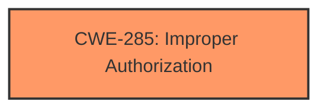

# Analysis Report for CVE-2024-27792

# Vulnerability Analysis Report: CVE-2024-27792

## Description

This issue was addressed by adding an additional prompt for user consent. This issue is fixed in macOS Sonoma 14.4. An app may be able to access user-sensitive data.

## Vulnerability Description Key Phrases

- **Impact:** access user-sensitive data
- **Attacker:** app
- **Product:** macOS
- **Version:** Sonoma 14.4

## Analysis (with Relationship Data)

# Summary
| CWE ID | CWE Name | Confidence | CWE Abstraction Level | CWE Vulnerability Mapping Label | CWE-Vulnerability Mapping Notes |
|---|---|---|---|---|---|
| CWE-285 | Improper Authorization | 0.8 | Class | Primary | Discouraged, but appropriate given available information. |

## Evidence and Confidence

*   **Confidence Score:** 0.8
*   **Evidence Strength:** MEDIUM

## Relationship Analysis
The primary CWE selected is CWE-285, Improper Authorization, a class-level CWE. While generally discouraged, the available information points towards an authorization issue within the TCC framework. No more specific CWE is readily apparent without further details.



## Vulnerability Chain
The vulnerability chain involves a **logic issue** within the TCC framework that leads to **insufficient checks or validation**, ultimately resulting in a bypass of user consent requirements. This allows an app to access user-sensitive data without explicit authorization. The chain is:
1.  **Logic Issue** (Root Cause, unspecified CWE)
2.  **Insufficient Checks/Validation** (contributes to CWE-285)
3.  **Improper Authorization** (CWE-285)
4.  **Access to Sensitive Data** (Impact)

## Summary of Analysis
The analysis centers around the description of a bypass of user consent requirements related to data access. The CVE Reference Links Content Summary explicitly mentions "**insufficient checks or validation** leading to bypass of user consent requirements." This strongly suggests an authorization issue.

CWE-285, Improper Authorization, is a high-level class, and the retriever results show it is discouraged. However, given the available information and the root cause being a logic issue within the TCC framework leading to insufficient checks, a more specific CWE is not readily discernible. The vulnerability description doesn't provide enough detail to pinpoint a lower-level weakness.

Therefore, CWE-285 is selected as the most appropriate CWE despite its high-level nature and discouragement. The decision is based on the root cause evidence and the explicit mention of bypassed user consent.

Other CWEs Considered:

*   CWE-732 (Incorrect Permission Assignment for Critical Resource): While related to permissions, the core issue seems to be the bypass of consent, not an incorrect assignment.
*   CWE-639 (Authorization Bypass Through User-Controlled Key): The description doesn't suggest user-controlled keys being involved.
*   CWE-863 (Incorrect Authorization): Similar to CWE-285, but still a class. Given the lack of lower-level details, CWE-285 is preferred as a slightly more general match.
*   CWE-20 (Improper Input Validation): Input validation doesn't appear to be the core issue, and this is a high-level CWE.
*   CWE-347 (Improper Verification of Cryptographic Signature): There is no mention of cryptographic signatures involved in the vulnerability.


## CWE Relationship Analysis

Current CWEs represent these abstraction levels: .


### Vulnerability Chain Analysis

**Chain starting from CWE-863:**
- 863 (Incorrect Authorization) - ROOT


**Chain starting from CWE-732:**
- 732 (Incorrect Permission Assignment for Critical Resource) - ROOT


### CWE Relationship Diagram

```mermaid
graph TD
    classDef primary fill:#f96,stroke:#333,stroke-width:2px
    classDef secondary fill:#69f,stroke:#333
    classDef tertiary fill:#9e9,stroke:#333
```


*Report generated on 2025-07-13 06:41:53*
