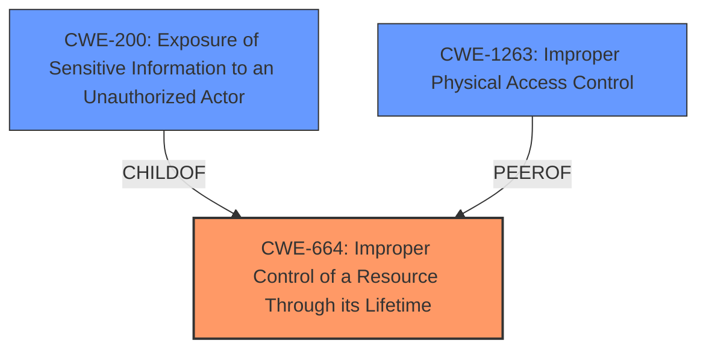

# Enhanced Analysis for CVE-2024-27814

# Summary

| CWE ID   | CWE Name                                                                 | Confidence | CWE Abstraction Level | CWE Vulnerability Mapping Label | CWE-Vulnerability Mapping Notes |
| :--------- | :----------------------------------------------------------------------- | :--------- | :---------------------- | :------------------------------ | :------------------------------ |
| CWE-664    | Improper Control of a Resource Through its Lifetime                     | 0.75       | Class                  | Primary                         | Allowed-with-Review           |
| CWE-1263   | Improper Physical Access Control                                         | 0.65       | Class                  | Secondary                       | Allowed-with-Review           |
| CWE-200    | Exposure of Sensitive Information to an Unauthorized Actor                | 0.50       | Base                    | Secondary                       | Allowed                         |

## Evidence and Confidence

*   **Confidence Score:** 0.7
*   **Evidence Strength:** MEDIUM

## Relationship Analysis

The primary weakness is classified as CWE-664, a class-level CWE related to resource management. Given the limited information about the specific resource or control **IMPROPER** in this case, it's difficult to pinpoint a more specific Base or Variant CWE. However, the potential for **EXPOSURE** of contact information due to **IMPROPER** state management aligns with CWE-200 which is a child of CWE-664. The physical access vector also makes CWE-1263 relevant, although less directly related to the **ROOT CAUSE** of the state management issue.



## Vulnerability Chain

The vulnerability chain starts with **IMPROPER** state management (CWE-664), which allows a person with physical access (CWE-1263) to view contact information from the lock screen, leading to potential **EXPOSURE** of sensitive information (CWE-200).

## Summary of Analysis

The analysis indicates that the vulnerability stems from **IMPROPER** state management, leading to unauthorized access to contact information. The primary CWE is chosen as CWE-664 because the **ROOT CAUSE** is an **IMPROPER** control of a resource through its lifetime. The **IMPACT** is the **EXPOSURE** of sensitive information which is classified as CWE-200. The physical access component is represented by CWE-1263. All decisions are based on the limited evidence available, primarily the description of the **WEAKNESS** as **IMPROPER** state management.

# Relevant CWE Information:

## CWE-664: Improper Control of a Resource Through its Lifetime
**Abstraction Level**: Class
**Description**: The software does not properly control the creation, deletion, or modification of a resource, which can lead to resource exhaustion or to unintended effects on other resources.

## CWE-1263: Improper Physical Access Control
**Abstraction Level**: Class
**Description**: The product is designed with access restricted to certain information, but it does not sufficiently protect against an unauthorized actor with physical access to these areas.

## CWE-200: Exposure of Sensitive Information to an Unauthorized Actor
**Abstraction Level**: Base
**Description**: The product exposes sensitive information to an actor that is not explicitly authorized to have access to that information.

### Detailed Analysis and Justification:

1.  **CWE-664 Improper Control of a Resource Through its Lifetime (Primary CWE)**
    *   **Explanation:** The **ROOT CAUSE** of the vulnerability is **IMPROPER** state management. This aligns with CWE-664, which describes a failure to properly control a resource's lifecycle. In this case, the "state" of the application or device is the resource.
    *   **Security Implications:** This can lead to unauthorized access to sensitive information.
    *   **Relationships:** CWE-664 is a Class-level CWE.
    *   **Mapping Guidance:** The description matches the **ROOT CAUSE** perfectly.
    *   **Confidence:** 0.75

2.  **CWE-1263 Improper Physical Access Control (Secondary CWE)**
    *   **Explanation:** A person with physical access to the device can view contact information. This aligns with CWE-1263, which focuses on vulnerabilities arising from insufficient protection against unauthorized physical access.
    *   **Security Implications:** An attacker with physical access can bypass intended security controls.
    *   **Relationships:** CWE-1263 is a Class-level CWE.
    *   **Mapping Guidance:** The vulnerability explicitly mentions physical access as the attack vector.
    *   **Confidence:** 0.65

3.  **CWE-200 Exposure of Sensitive Information to an Unauthorized Actor (Secondary CWE)**
    *   **Explanation:** The vulnerability results in contact information being visible to someone who should not have access to it. This directly corresponds to CWE-200, which deals with the **EXPOSURE** of sensitive information.
    *   **Security Implications:** This can lead to privacy violations and potential identity theft.
    *   **Relationships:** CWE-200 is a Base-level CWE and a ChildOf CWE-664.
    *   **Mapping Guidance:** The outcome of the vulnerability is the **EXPOSURE** of sensitive information.
    *   **Confidence:** 0.50

### CWEs Considered But Not Used:

*   **CWE-787 Out-of-bounds Write:** This CWE is related to memory errors and is not directly relevant to the **ROOT CAUSE** of the vulnerability, which is **IMPROPER** state management.
*   **CWE-285 Improper Authorization:** While authorization might be related, the description focuses on **IMPROPER** state management rather than a specific authorization failure.
*   **CWE-451 User Interface (UI) Misrepresentation of Critical Information:** This CWE is not applicable as the issue is not related to UI misrepresentation.
*   **CWE-667 Improper Locking:** This CWE is related to concurrency issues and locking mechanisms, which are not mentioned in the vulnerability description.
*   **CWE-256 Plaintext Storage of a Password:** This CWE is not applicable as the issue is not related to password storage.
*   **CWE-288 Authentication Bypass Using an Alternate Path or Channel:** This CWE is not applicable as the issue is not related to authentication bypass.
*   **CWE-1272 Sensitive Information Uncleared Before Debug/Power State Transition:** This CWE is more specific to debug/power state transitions, while the current vulnerability is about general state management.

The selected CWEs (CWE-664, CWE-1263, CWE-200) provide the best representation of the vulnerability based on the available information, covering both the **ROOT CAUSE** (**IMPROPER** state management), the attack vector (physical access), and the impact (**EXPOSURE** of sensitive information).


## CWE Relationship Analysis

Current CWEs represent these abstraction levels: .


### Vulnerability Chain Analysis

**Chain starting from CWE-288:**
- 288 (Authentication Bypass Using an Alternate Path or Channel) - ROOT


**Chain starting from CWE-1272:**
- 1272 (Sensitive Information Uncleared Before Debug/Power State Transition) - ROOT


### CWE Relationship Diagram

```mermaid
graph TD
    classDef primary fill:#f96,stroke:#333,stroke-width:2px
    classDef secondary fill:#69f,stroke:#333
    classDef tertiary fill:#9e9,stroke:#333
```