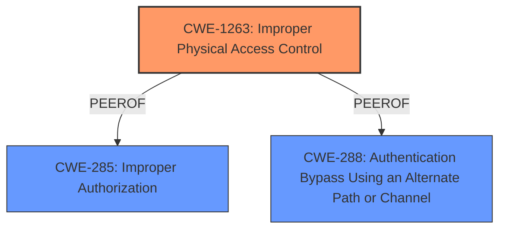

# Analysis Report for CVE-2024-27819

# Vulnerability Analysis Report: CVE-2024-27819

## Description

The issue was addressed by restricting options offered on a locked device. This issue is fixed in iOS 17.5 and iPadOS 17.5. An attacker with physical access may be able to access contacts from the lock screen.

## Vulnerability Description Key Phrases

- **Impact:** access contacts from the lock screen
- **Attacker:** attacker with physical access
- **Product:** ['iOS', 'iPadOS']
- **Version:** ['17.5', '17.5']

## Analysis (with Relationship Data)

# Summary
| CWE ID | CWE Name | Confidence | CWE Abstraction Level | CWE Vulnerability Mapping Label | CWE-Vulnerability Mapping Notes |
|---|---|---|---|---|---|
| CWE-1263 | Improper Physical Access Control | 0.9 | Class | Allowed-with-Review | Primary CWE - The vulnerability allows an attacker with physical access to bypass the lock screen and access contacts. |

## Evidence and Confidence

*   **Confidence Score:** 0.9
*   **Evidence Strength:** MEDIUM

## Relationship Analysis
The primary identified CWE is CWE-1263 (Improper Physical Access Control), which is a Class-level CWE. It's important because the vulnerability requires physical access to exploit the flaw. While other CWEs like CWE-285 (Improper Authorization) and CWE-288 (Authentication Bypass Using an Alternate Path or Channel) were considered, CWE-1263 directly addresses the physical access component. The relationships between these CWEs are not as relevant in this specific context because the root cause is directly tied to the lack of proper physical access controls which allowed unauthorized access.



## Vulnerability Chain
The vulnerability chain involves the following sequence:
1.  **Root Cause:** **Improper Physical Access Control** (CWE-1263) - The device fails to adequately restrict access based on physical presence and device lock status.
2.  **Weakness:** Logic issue in Siri's handling of options on a locked device.
3.  **Impact:** An attacker with physical access can access contacts from the lock screen.

## Summary of Analysis
The analysis is primarily based on the provided evidence, specifically the vulnerability description and the CVE reference summary. The key evidence is: "An attacker with physical access may be able to access contacts from the lock screen." and "The vulnerability is related to how Siri handles options when the device is locked." This strongly suggests that the core issue is the lack of proper controls to prevent unauthorized physical access leading to information disclosure.

CWE-1263 is the most appropriate because it directly addresses the scenario where physical access circumvents security measures. The other CWEs considered (CWE-285, CWE-288) are related to authorization and authentication bypass, but they do not specifically address the physical access component, making CWE-1263 the more precise and relevant classification.

The abstraction level of CWE-1263 (Class) is acceptable because it is a general category that encompasses the specific issue. While more specific variants could exist, the available information does not point to a particular implementation flaw but rather a general oversight in access control.

Relevant CWE Information:

# Enhanced Context (25 CWEs)
The following CWEs were identified as potentially relevant to this vulnerability:

## CWE-1263: Improper Physical Access Control
**Abstraction Level**: Class
**Similarity Score**: 0.67
**Source**: dense

**Description**:
The product is designed with access restricted to certain information, but it does not sufficiently protect against an unauthorized actor with physical access to these areas.

**Mapping Guidance**:
- Usage: Allowed-with-Review
- Rationale: This CWE entry is a Class and might have Base-level children that would be more appropriate


## CWE Relationship Analysis

Current CWEs represent these abstraction levels: .


### Vulnerability Chain Analysis

**Chain starting from CWE-288:**
- 288 (Authentication Bypass Using an Alternate Path or Channel) - ROOT


**Chain starting from CWE-1263:**
- 1263 (Improper Physical Access Control) - ROOT


### CWE Relationship Diagram

```mermaid
graph TD
    classDef primary fill:#f96,stroke:#333,stroke-width:2px
    classDef secondary fill:#69f,stroke:#333
    classDef tertiary fill:#9e9,stroke:#333
```


*Report generated on 2025-07-13 06:44:10*
