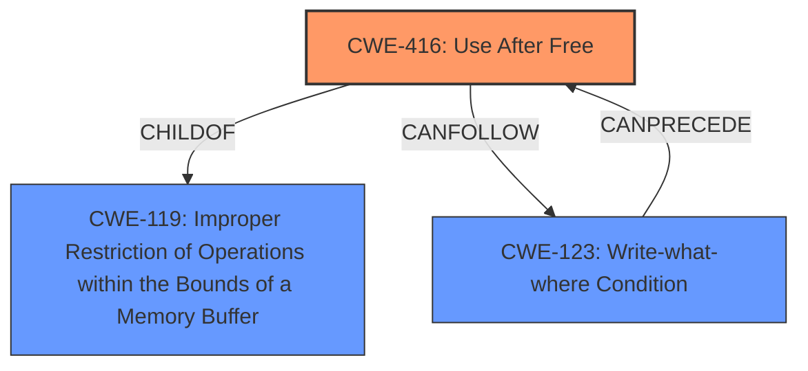

# Analysis for CVE-2024-27820

# Summary

| CWE ID | CWE Name | Confidence | CWE Abstraction Level | CWE Vulnerability Mapping Label | CWE-Vulnerability Mapping Notes |
|---|---|---|---|---|---|
| CWE-416 | Use After Free | 0.75 | Variant | Allowed | Primary CWE |
| CWE-119 | Improper Restriction of Operations within the Bounds of a Memory Buffer | 0.5 | Class | Discouraged | Secondary Candidate |

## Evidence and Confidence

*   **Confidence Score:** 0.7
*   **Evidence Strength:** MEDIUM

## Relationship Analysis

The primary relationship impacting the decision is the parent-child relationship between CWE-119 and CWE-416. CWE-416 is a variant of CWE-119, providing a more specific classification. The "CanPrecede" and "CanFollow" relationships are also important in understanding the potential chain of events that can lead to a "Use After Free" vulnerability.

## Vulnerability Chain

The vulnerability chain starts with a **memory handling issue**, potentially leading to a **use-after-free** condition (CWE-416). This, in turn, can lead to arbitrary code execution.

## Summary of Analysis

The initial analysis focused on identifying the root cause of the vulnerability, which is stated as "**memory handling issue**". The primary candidate CWEs from the Retriever Results were CWE-843 (Access of Resource Using Incompatible Type), CWE-787 (Out-of-bounds Write), and CWE-416 (Use After Free).

The selection of CWE-416 is based on the "**memory handling issue**" which is often related to memory allocation and deallocation. A use-after-free vulnerability occurs when memory is freed, but a pointer to that memory is still used. This aligns well with the provided vulnerability description.

CWE-119 (Improper Restriction of Operations within the Bounds of a Memory Buffer) was also considered because it is a broader category that includes memory safety issues. However, CWE-416 is more specific and accurately describes the vulnerability.

The evidence from the "CVE Reference Links Content Summary" states, "The vulnerability is due to a **memory handling issue** within the WebKit Web Inspector" and "Processing web content may lead to arbitrary code execution.". This supports the conclusion that a memory management issue is the root cause, and CWE-416 is a suitable representation.

The confidence level is 0.7, reflecting that the provided evidence is somewhat general. However, the correlation between memory handling issues and use-after-free vulnerabilities strengthens the selection of CWE-416.

CWE-843, CWE-787, CWE-665, CWE-415, CWE-20, CWE-126, CWE-401 and CWE-123 were considered but not used because they did not fit the vulnerability description as closely as CWE-416. While they represent potential memory-related weaknesses, the description specifically points to a general **memory handling issue** rather than a type confusion, out-of-bounds write, improper initialization, double free, input validation or write-what-where condition.

Relevant CWE Information:

# Enhanced Context (25 CWEs)
The following CWEs were identified as potentially relevant to this vulnerability:

## CWE-416: Use After Free
**Abstraction Level**: Variant
**Similarity Score**: 0.71
**Source**: dense

**Description**:
The product calls free() twice on the same memory address, potentially leading to modification of unexpected memory locations.

**Mapping Guidance**:
- Usage: Allowed
- Rationale: This CWE entry is at the Variant level of abstraction, which is a preferred level of abstraction for mapping to the root causes of vulnerabilities.