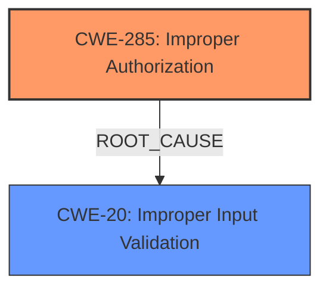

# Enhanced Analysis for CVE-2024-27855

# Summary

| CWE ID    | CWE Name                                                                 | Confidence | CWE Abstraction Level | CWE Vulnerability Mapping Label | CWE-Vulnerability Mapping Notes |
| --------- | ------------------------------------------------------------------------ | ---------- | --------------------- | ------------------------------- | ------------------------------- |
| CWE-285   | Improper Authorization                                                 | 0.75       | Class                 | Primary                         | Discouraged                     |
| CWE-20    | Improper Input Validation                                                 | 0.65      | Class                 | Secondary                       | Discouraged                     |

## Evidence and Confidence

*   **Confidence Score:** 0.7
*   **Evidence Strength:** MEDIUM

## Relationship Analysis

The primary relationship considered was that of root cause versus impact. The vulnerability involves a shortcut being able to use sensitive data without prompting the user. The root cause appears to be an **improper authorization** issue, which can often stem from **improper input validation**. While **improper authorization** is a class-level CWE, it captures the essence of the **missing** prompt, indicating a failure in the authorization process.



## Vulnerability Chain

The vulnerability chain starts with **insufficient checks**, leading to **improper authorization**, which results in the ability to use sensitive data without prompting the user. The root cause is the **lack of** proper authorization mechanisms, while the impact is the unauthorized access to sensitive data.

## Summary of Analysis

The analysis focused on identifying the root cause of the vulnerability. The "CVE Reference Links Content Summary" section provides valuable insights. It states that "The vulnerability is caused by **insufficient checks** when handling sensitive data within shortcuts," and lists "Insufficient input validation" as a weakness. However, the description "A shortcut may be able to use sensitive data with certain actions without prompting the user" strongly suggests that the primary issue is **improper authorization**, as the user should be prompted before sensitive data is accessed. **Improper input validation (CWE-20)** could be a contributing factor, but the lack of prompting points more directly to a failure in the authorization process (**CWE-285**).

While several CWEs were considered, including **CWE-787 (Out-of-bounds Write)**, **CWE-843 (Access of Resource Using Incompatible Type)**, and **CWE-347 (Improper Verification of Cryptographic Signature)**, these did not directly address the core issue of **missing** authorization. The final selection reflects the most direct cause of the vulnerability based on the available evidence.

# Enhanced Context (25 CWEs)
The following CWEs were identified as potentially relevant to this vulnerability:

## CWE-451: User Interface (UI) Misrepresentation of Critical Information
**Abstraction Level**: Class
**Similarity Score**: 0.69
The description mentions a **missing** prompt which could point to a UI issue but the root cause is more about **improper authorization**

## CWE-116: Improper Encoding or Escaping of Output
**Abstraction Level**: Class
**Similarity Score**: 0.67
There is no mention of encoding issues.

## CWE-212: Improper Removal of Sensitive Information Before Storage or Transfer
**Abstraction Level**: Base
**Similarity Score**: 0.67
This is not about the removal of sensitive information.

## CWE-843: Access of Resource Using Incompatible Type ('Type Confusion')
**Abstraction Level**: Base
**Similarity Score**: 0.67
This does not relate to type confusion.

## CWE-356: Product UI does not Warn User of Unsafe Actions
**Abstraction Level**: Base
**Similarity Score**: 0.67
The description mentions a **missing** prompt which could point to a UI issue but the root cause is more about **improper authorization**

## CWE-203: Observable Discrepancy
**Abstraction Level**: Base
**Similarity Score**: 0.66
This is not about observable discrepancies.

## CWE-277: Insecure Inherited Permissions
**Abstraction Level**: Variant
**Similarity Score**: 0.66
This is not about inherited permissions.

## CWE-59: Improper Link Resolution Before File Access ('Link Following')
**Abstraction Level**: Base
**Similarity Score**: 0.66
This is not about link resolution.

## CWE-347: Improper Verification of Cryptographic Signature
**Abstraction Level**: Base
**Similarity Score**: 0.66
This is not about cryptographic signatures.

## CWE-1391: Use of Weak Credentials
**Abstraction Level**: Class
**Similarity Score**: 0.66
This is not about credentials.

## CWE-843: Access of Resource Using Incompatible Type ('Type Confusion')
**Abstraction Level**: Base
**Similarity Score**: 563.36
This does not relate to type confusion.

## CWE-787: Out-of-bounds Write
**Abstraction Level**: Base
**Similarity Score**: 542.13
This is not about writing to memory out-of-bounds.

## CWE-119: Improper Restriction of Operations within the Bounds of a Memory Buffer
**Abstraction Level**: Class
**Similarity Score**: 535.82
This is not about memory bounds.

## CWE-415: Double Free
**Abstraction Level**: Variant
**Similarity Score**: 534.94
This is not about freeing the same memory twice.

## CWE-347: Improper Verification of Cryptographic Signature
**Abstraction Level**: Base
**Similarity Score**: 529.21
This is not about cryptographic signatures.

## CWE-123: Write-what-where Condition
**Abstraction Level**: base
**Similarity Score**: 4.47
This is not about writing to arbitrary memory locations.

## CWE-415: Double Free
**Abstraction Level**: variant
**Similarity Score**: 3.88
This is not about freeing the same memory twice.

## CWE-416: Use After Free
**Abstraction Level**: variant
**Similarity Score**: 3.20
This is not about using memory after it is freed.

## CWE-787: Out-of-bounds Write
**Abstraction Level**: base
**Similarity Score**: 3.14
This is not about writing to memory out-of-bounds.

## CWE-843: Access of Resource Using Incompatible Type ('Type Confusion')
**Abstraction Level**: Base
**Similarity Score**: 2.87
This does not relate to type confusion.

## CWE-825: Expired Pointer Dereference
**Abstraction Level**: base
**Similarity Score**: 2.87
This is not about dereferencing expired pointers.

## CWE-823: Use of Out-of-range Pointer Offset
**Abstraction Level**: base
**Similarity Score**: 2.87
This is not about out-of-range pointer offsets.

## CWE-822: Untrusted Pointer Dereference
**Abstraction Level**: base
**Similarity Score**: 2.87
This is not about untrusted pointer dereferences.

## CWE-134: Use of Externally-Controlled Format String
**Abstraction Level**: base
**Similarity Score**: 2.87
This is not about externally controlled format strings.

## CWE-120: Buffer Copy without Checking Size of Input ('Classic Buffer Overflow')
**Abstraction Level**: base
**Similarity Score**: 2.87
This is not about buffer overflows.


## CWE Relationship Analysis

Current CWEs represent these abstraction levels: .


### Vulnerability Chain Analysis

**Chain starting from CWE-416:**
- 416 (Use After Free) - ROOT


**Chain starting from CWE-787:**
- 787 (Out-of-bounds Write) - ROOT


### CWE Relationship Diagram

```mermaid
graph TD
    classDef primary fill:#f96,stroke:#333,stroke-width:2px
    classDef secondary fill:#69f,stroke:#333
    classDef tertiary fill:#9e9,stroke:#333
```