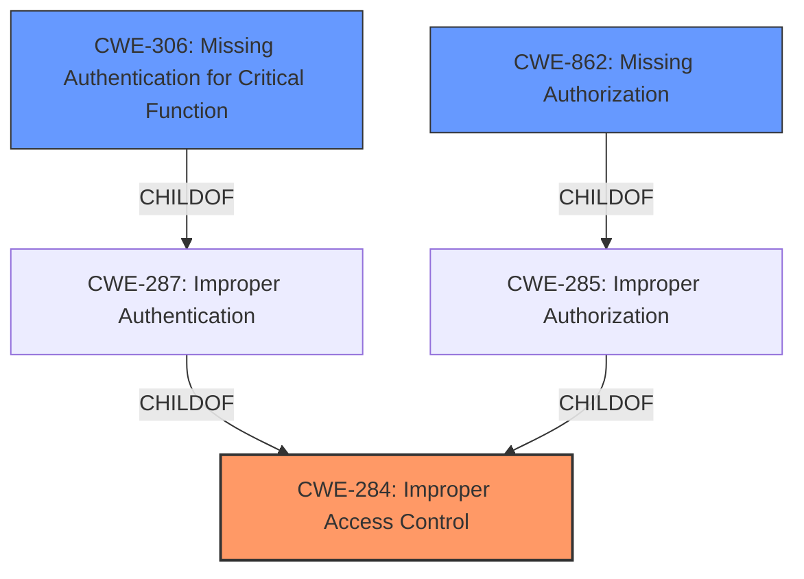

# Raw Analyzer Response for CVE-2024-28050

# Summary
| CWE ID | CWE Name | Confidence | CWE Abstraction Level | CWE Vulnerability Mapping Label | CWE-Vulnerability Mapping Notes |
|---|---|---|---|---|---|
| CWE-284 | Improper Access Control | 0.9 | Pillar | Primary CWE | Allowed |
| CWE-306 | Missing Authentication for Critical Function | 0.3 | Base | Secondary Candidate | Allowed |
| CWE-862 | Missing Authorization | 0.3 | Base | Secondary Candidate | Allowed |

## Evidence and Confidence

*   **Confidence Score:** 0.9
*   **Evidence Strength:** MEDIUM

## Relationship Analysis
The primary CWE is CWE-284, which is a high-level category. While less specific CWEs like CWE-306 and CWE-862 were considered as secondary candidates due to "Authentication vs Authorization vs Access Control Guidance", the limited information and rootcause evidence support the use of CWE-284 as a general access control issue.

## Vulnerability Chain
The vulnerability chain starts with **improper access control**, leading to a potential denial of service.

*   **Root Cause:** **Improper Access Control** (CWE-284)
*   **Impact:** Denial of Service

The specific nature of the **improper access control** is not detailed (Authentication or Authorization) in the evidence provided, so the chain is incomplete.

## Summary of Analysis
The initial assessment considered several CWEs related to access control, authentication, and authorization. The primary CWE, CWE-284, was selected because the vulnerability description explicitly mentions **improper access control**. The "Authentication vs Authorization vs Access Control Guidance" section indicates that the root cause may be in authentication or authorization. However, since the provided evidence lacks specific information to determine whether the root cause is due to missing authentication (CWE-306) or missing authorization (CWE-862), the more general CWE-284 is the most appropriate choice.

The evidence supporting this decision comes directly from the "Vulnerability Description Key Phrases" section: "**rootcause:** **Improper access control**". The "CVE Reference Links Content Summary" section also states: "**Root cause of vulnerability**: Improper access control in Intel® Arc™ & Iris® Xe Graphics software."

CWE-284 is at the Pillar level of abstraction, which is less specific than Base or Variant levels. However, given the limited information available, it provides the best representation of the vulnerability's root cause. The suggested alternative of using more specific child CWEs (e.g., CWE-306, CWE-862) is not possible due to the lack of detailed information.

Relevant CWE Information:

*   **CWE-284: Improper Access Control**
    *   **Technical Explanation:** The product does not adequately control access to resources or functionalities, allowing unauthorized access or manipulation.
    *   **Security Implications:** This can lead to various security breaches, including unauthorized data access, privilege escalation, and denial of service.
    *   **Relationship:** It is a high-level category, and more specific CWEs like CWE-306, CWE-862, and CWE-863 can be children of CWE-284.
    *   **Justification:** The vulnerability description explicitly states **improper access control** as the root cause.

*   **CWE-306: Missing Authentication for Critical Function**
    *   **Technical Explanation:** The product lacks authentication mechanisms for critical functions, allowing unauthorized users to perform sensitive actions.
    *   **Security Implications:** This can lead to complete system compromise, unauthorized data access, and other severe security breaches.
    *   **Relationship:** Child of CWE-287 (Improper Authentication).
    *   **Justification:** Considered but not selected as primary because the description doesn't explicitly state whether authentication is missing.

*   **CWE-862: Missing Authorization**
    *   **Technical Explanation:** The product does not perform authorization checks, allowing users to access resources or perform actions they are not authorized to perform.
    *   **Security Implications:** This can lead to unauthorized data access, privilege escalation, and other security breaches.
    *   **Relationship:** Child of CWE-285 (Improper Authorization).
    *   **Justification:** Considered but not selected as primary because the description doesn't explicitly state whether authorization checks are missing.