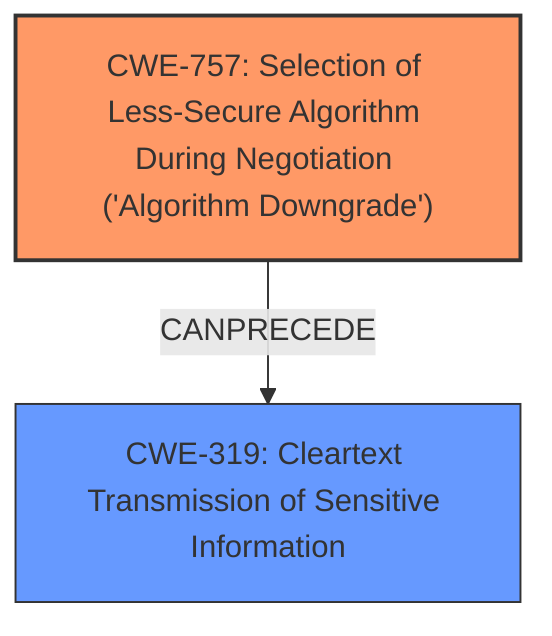

# Analysis for CVE-2024-28067

# Summary
| CWE ID | CWE Name | Confidence | CWE Abstraction Level | CWE Vulnerability Mapping Label | CWE-Vulnerability Mapping Notes |
|---|---|---|---|---|---|
| CWE-757 | Selection of Less-Secure Algorithm During Negotiation ('Algorithm Downgrade') | 0.9 | Base | Allowed | Primary CWE - The vulnerability allows a MITM attacker to **downgrade the security mode of packets**, which directly aligns with the description of CWE-757. |
| CWE-319 | Cleartext Transmission of Sensitive Information | 0.7 | Base | Allowed | Secondary CWE - The **downgrade** allows the attacker to read the messages due to the **transmission of messages in plaintext**. |

## Evidence and Confidence

*   **Confidence Score:** 0.8
*   **Evidence Strength:** HIGH

## Relationship Analysis
The primary CWE is CWE-757, which describes the **selection of a less secure algorithm during negotiation**. The secondary CWE is CWE-319, which represents the resulting **cleartext transmission of sensitive information**. The attacker downgrades to a less secure mode, resulting in sensitive data being transmitted in plaintext. The relationship between these two is that CWE-757 can lead to CWE-319.

## Vulnerability Chain
The vulnerability chain starts with the **selection of a less secure algorithm** (CWE-757). This leads to the **transmission of sensitive information in cleartext** (CWE-319).

## Summary of Analysis
The analysis is based on the provided evidence, which indicates that a MITM attacker can **downgrade the security mode of packets** (CWE-757), leading to the **transmission of messages in plaintext** (CWE-319).

The graph relationships show that CWE-757 can precede CWE-319, fitting the vulnerability description.

CWE-757 is at the Base level of abstraction, which is the preferred level according to MITRE mapping guidance. CWE-319 is also at the Base level of abstraction.

Relevant CWE Information:

# Enhanced Context (25 CWEs)
The following CWEs were identified as potentially relevant to this vulnerability:

## CWE-757: Selection of Less-Secure Algorithm During Negotiation ('Algorithm Downgrade')
**Abstraction Level**: Base
**Similarity Score**: 0.74
**Source**: dense

**Description**:
A protocol or its implementation supports interaction between multiple actors and allows those actors to negotiate which algorithm should be used as a protection mechanism such as encryption or authentication, but it does not select the strongest algorithm that is available to both parties.

**Mapping Guidance**:
- Usage: Allowed
- Rationale: This CWE entry is at the Base level of abstraction, which is a preferred level of abstraction for mapping to the root causes of vulnerabilities.

## CWE-319: Cleartext Transmission of Sensitive Information
**Abstraction Level**: Base
**Similarity Score**: 0.73
**Source**: dense

**Description**:
The product transmits sensitive or security-critical data in cleartext in a communication channel that can be sniffed by unauthorized actors.

**Mapping Guidance**:
- Usage: Allowed
- Rationale: This CWE entry is at the Base level of abstraction, which is a preferred level of abstraction for mapping to the root causes of vulnerabilities.

CWE-300 "Channel Accessible by Non-Endpoint" was considered because a MITM attacker needs to be in position to perform the attack. However, it was rejected because the core weakness is the **algorithm downgrade**, not the accessibility of the channel itself.