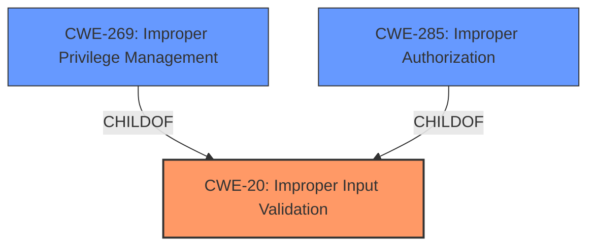

# Analysis for CVE-2024-28127

# Summary
| CWE ID | CWE Name | Confidence | CWE Abstraction Level | CWE Vulnerability Mapping Label | CWE-Vulnerability Mapping Notes |
|---|---|---|---|---|---|
| CWE-20 | Improper Input Validation | 0.9 | Class | Primary | Discouraged |
| CWE-269 | Improper Privilege Management | 0.6 | Class | Secondary | Discouraged |
| CWE-285 | Improper Authorization | 0.6 | Class | Secondary | Discouraged |

## Evidence and Confidence

*   **Confidence Score:** 0.9
*   **Evidence Strength:** HIGH

## Relationship Analysis
The primary relationship that influenced the decision was the parent-child relationship, specifically how CWE-20 [CWE-20: Improper Input Validation] is a high-level class. Additionally, the guidance for privileges and permissions was also reviewed. The fact that the **improper input validation** leads to privilege escalation suggests a chain. This caused the consideration of CWE-269 [CWE-269: Improper Privilege Management] and CWE-285 [CWE-285: Improper Authorization] as secondary CWEs. The abstraction levels influenced the decision to try to find a more specific CWE than the Class CWE-20 [CWE-20: Improper Input Validation] but one could not be determined with the available evidence.

## Vulnerability Chain
The vulnerability chain starts with **improper input validation** (CWE-20 [CWE-20: Improper Input Validation]), which then leads to an escalation of privilege. While the description doesn't explicitly state the authorization mechanism, the outcome strongly suggests that the **improper input validation** allows a privileged user to gain more privileges than intended. This suggests the chain: CWE-20 [CWE-20: Improper Input Validation] -> Improper Privilege Management or Improper Authorization.

## Summary of Analysis
The initial assessment identified CWE-20 [CWE-20: Improper Input Validation] as the primary weakness due to the explicit mention of "**Improper input validation**" in the vulnerability description and CVE summary. The retriever results also listed CWE-20 [CWE-20: Improper Input Validation], although with a discouraged usage. However, since the root cause identified in the description is **improper input validation**, CWE-20 [CWE-20: Improper Input Validation] is the most appropriate starting point.

The relationship graph shows that CWE-20 [CWE-20: Improper Input Validation] is a class-level CWE. While it is generally preferred to use a base or variant level CWE, the information provided doesn't have enough detail to determine the specific type of input validation error. Therefore, the decision was made to use the class-level CWE-20 [CWE-20: Improper Input Validation].

The advisory provides more detail than a typical CVE description, including CVSS scores and affected products. This additional detail supports the identification of CWE-20 [CWE-20: Improper Input Validation] as a root cause.

The secondary CWEs considered were CWE-269 [CWE-269: Improper Privilege Management] and CWE-285 [CWE-285: Improper Authorization]. These were added as secondary candidates because the **improper input validation** leads to privilege escalation. It is feasible that the **improper input validation** leads to assignment of privileges which is CWE-269 [CWE-269: Improper Privilege Management] or that the **improper input validation** bypasses or impacts authorization, making CWE-285 [CWE-285: Improper Authorization] relevant.

Relevant CWE Information:

# Enhanced Context (25 CWEs)
The following CWEs were identified as potentially relevant to this vulnerability:

## CWE-274: Improper Handling of Insufficient Privileges
**Abstraction Level**: Base
**Similarity Score**: 0.79
**Source**: dense

**Description**:
The product does not handle or incorrectly handles when it has insufficient privileges to perform an operation, leading to resultant weaknesses.

**Mapping Guidance**:
- Usage: Discouraged
- Rationale: This CWE entry could be deprecated in a future version of CWE.

## CWE-280: Improper Handling of Insufficient Permissions or Privileges 
**Abstraction Level**: Base
**Similarity Score**: 0.79
**Source**: dense

**Description**:
The product does not handle or incorrectly handles when it has insufficient privileges to access resources or functionality as specified by their permissions. This may cause it to follow unexpected code paths that may leave the product in an invalid state.

**Mapping Guidance**:
- Usage: Allowed
- Rationale: This CWE entry is at the Base level of abstraction, which is a preferred level of abstraction for mapping to the root causes of vulnerabilities.

## CWE-266: Incorrect Privilege Assignment
**Abstraction Level**: Base
**Similarity Score**: 0.78
**Source**: dense

**Description**:
A product incorrectly assigns a privilege to a particular actor, creating an unintended sphere of control for that actor.

**Mapping Guidance**:
- Usage: Allowed
- Rationale: This CWE entry is at the Base level of abstraction, which is a preferred level of abstraction for mapping to the root causes of vulnerabilities.

## CWE-267: Privilege Defined With Unsafe Actions
**Abstraction Level**: Base
**Similarity Score**: 0.78
**Source**: dense

**Description**:
A particular privilege, role, capability, or right can be used to perform unsafe actions that were not intended, even when it is assigned to the correct entity.

**Mapping Guidance**:
- Usage: Allowed
- Rationale: This CWE entry is at the Base level of abstraction, which is a preferred level of abstraction for mapping to the root causes of vulnerabilities.

## CWE-807: Reliance on Untrusted Inputs in a Security Decision
**Abstraction Level**: Base
**Similarity Score**: 0.78
**Source**: dense

**Description**:
The product uses a protection mechanism that relies on the existence or values of an input, but the input can be modified by an untrusted actor in a way that bypasses the protection mechanism.

**Mapping Guidance**:
- Usage: Allowed
- Rationale: This CWE entry is at the Base level of abstraction, which is a preferred level of abstraction for mapping to the root causes of vulnerabilities.

## CWE-703: Improper Check or Handling of Exceptional Conditions
**Abstraction Level**: Pillar
**Similarity Score**: 0.77
**Source**: dense

**Description**:
The product does not properly anticipate or handle exceptional conditions that rarely occur during normal operation of the product.

**Mapping Guidance**:
- Usage: Discouraged
- Rationale: This CWE entry is extremely high-level, a Pillar.

## CWE-691: Insufficient Control Flow Management
**Abstraction Level**: Pillar
**Similarity Score**: 0.77
**Source**: dense

**Description**:
The code does not sufficiently manage its control flow during execution, creating conditions in which the control flow can be modified in unexpected ways.

**Mapping Guidance**:
- Usage: Discouraged
- Rationale: This CWE entry is extremely high-level, a Pillar. However, classification research is limited for weaknesses of this type, so there can be gaps or organizational difficulties within CWE that force use of this weakness, even at such a high level of abstraction.

## CWE-41: Improper Resolution of Path Equivalence
**Abstraction Level**: Base
**Similarity Score**: 0.77
**Source**: dense

**Description**:
The product is vulnerable to file system contents disclosure through path equivalence. Path equivalence involves the use of special characters in file and directory names. The associated manipulations are intended to generate multiple names for the same object.

**Mapping Guidance**:
- Usage: Allowed
- Rationale: This CWE entry is at the Base level of abstraction, which is a preferred level of abstraction for mapping to the root causes of vulnerabilities.

## CWE-668: Exposure of Resource to Wrong Sphere
**Abstraction Level**: Class
**Similarity Score**: 0.77
**Source**: dense

**Description**:
The product exposes a resource to the wrong control sphere, providing unintended actors with inappropriate access to the resource.

**Mapping Guidance**:
- Usage: Discouraged
- Rationale: CWE-668 is high-level and is often misused as a catch-all when lower-level CWE IDs might be applicable. It is sometimes used for low-information vulnerability reports [REF-1287]. It is a level-1 Class (i.e., a child of a Pillar). It is not useful for trend analysis.

## CWE-472: External Control of Assumed-Immutable Web Parameter
**Abstraction Level**: Base