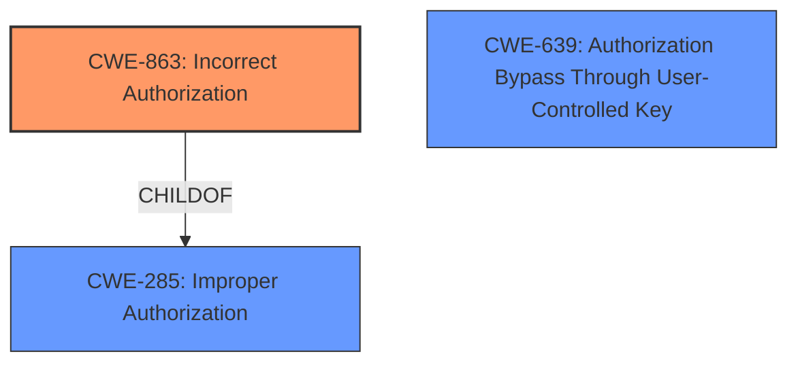

# Analysis Report for CVE-2024-2880

# Vulnerability Analysis Report: CVE-2024-2880

## Description

An issue was discovered in GitLab CE/EE affecting all versions starting from 16.5 prior to 16.11.6, starting from 17.0 prior to 17.0.4, and starting from 17.1 prior to 17.1.2 in which a user with `admin_group_member` custom role permission could ban group members.

## Vulnerability Description Key Phrases

- **Impact:** ban group members
- **Attacker:** user with admin_group_member custom role
- **Product:** GitLab CE/EE
- **Version:** 16.5 to 16.11.6, 17.0 to 17.0.4, 17.1 to 17.1.2

## Analysis (with Relationship Data)

# Summary
| CWE ID | CWE Name | Confidence | CWE Abstraction Level | CWE Vulnerability Mapping Label | CWE-Vulnerability Mapping Notes |
|---|---|---|---|---|---|
| CWE-863 | Incorrect Authorization | 0.9 | Class | Primary | Allowed-with-Review |
| CWE-639 | Authorization Bypass Through User-Controlled Key | 0.7 | Base | Secondary | Allowed |

## Evidence and Confidence

*   **Confidence Score:** 0.8
*   **Evidence Strength:** HIGH

## Relationship Analysis
The primary relationship that influenced the decision was the hierarchical relationship between CWE-285 (Improper Authorization) and CWE-863 (Incorrect Authorization), where CWE-863 is a child of CWE-285. The vulnerability description aligns more closely with the specifics of CWE-863, indicating an **incorrect** authorization check rather than a complete absence of one (CWE-285). CWE-639 is another potential match which focuses on bypassing authorization through user controlled keys which is also applicable here. Abstraction levels influenced selection by guiding the selection of the most specific CWE available.



## Vulnerability Chain
The vulnerability chain starts with an **incorrect authorization** mechanism (CWE-863), leading to a role permission bypass. A user with insufficient privileges can perform actions they should not be able to, culminating in the ability to ban group members, disrupting group operations. The UI enforced correct permissions, but the backend API **failed to properly check** the user's authorization, leading to the bypass.
  - **Root Cause:** CWE-863: Incorrect Authorization
  - **Weakness:** Role Permission Bypass
  - **Impact:** Unauthorized Banning of Group Members

## Summary of Analysis
The initial analysis focused on identifying the **root cause** of the vulnerability. The "CVE Reference Links Content Summary" clearly states that the vulnerability stems from a **missing permission check** on the backend request. While the UI correctly restricts the ability to ban users to group owners, a `Guest` user with a custom role having the "Admin group member" permission can bypass this restriction by directly sending a crafted backend request.

The choice of CWE-863 is supported by the fact that the authorization check exists but is **incorrectly implemented**. The guidance for privileges vs permissions also highlights CWE-863 when authorization logic is present but flawed.

CWE-639 is considered a secondary weakness because while there is an authorization bypass, it is not necessarily achieved "through user-controlled key" in the purest sense. The user is crafting a request, but the core issue is the **incorrect authorization** on the backend.

The selected CWEs are at the optimal level of specificity because they precisely reflect the **root cause** and contributing factors of the vulnerability, without being overly generic or abstract.

Relevant CWE Information:

# Enhanced Context (25 CWEs)
The following CWEs were identified as potentially relevant to this vulnerability:

## CWE-285: Improper Authorization
**Abstraction Level**: Class
**Similarity Score**: 2016.81
**Source**: sparse

**Description**:
The product does not perform or incorrectly performs an authorization check when an actor attempts to access a resource or perform an action.

**Mapping Guidance**:
- Usage: Discouraged
- Rationale: CWE-285 is high-level and lower-level CWEs can frequently be used instead. It is a level-1 Class (i.e., a child of a Pillar).

## Complete CWE Specifications

CWE-863: Incorrect Authorization
The product performs an authorization check when an actor attempts to access a resource or perform an action, but it does not correctly perform the check.

CWE-639: Authorization Bypass Through User-Controlled Key
The system's authorization functionality does not prevent one user from gaining access to another user's data or record by modifying the key value identifying the data.


## CWE Relationship Analysis

Current CWEs represent these abstraction levels: .


### Vulnerability Chain Analysis

**Chain starting from CWE-863:**
- 863 (Incorrect Authorization) - ROOT


**Chain starting from CWE-285:**
- 285 (Improper Authorization) - ROOT


### CWE Relationship Diagram

```mermaid
graph TD
    classDef primary fill:#f96,stroke:#333,stroke-width:2px
    classDef secondary fill:#69f,stroke:#333
    classDef tertiary fill:#9e9,stroke:#333
```


*Report generated on 2025-07-13 06:54:03*
