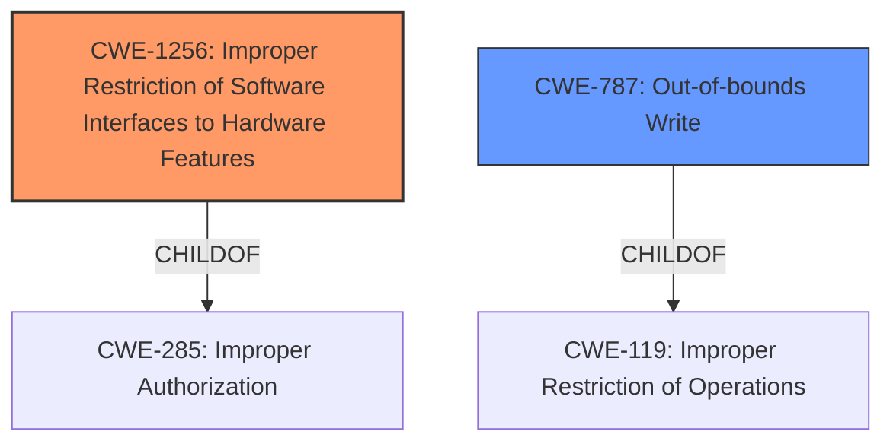

# Enhanced Analysis for CVE-2024-2881

# Summary
| CWE ID | CWE Name | Confidence | CWE Abstraction Level | CWE Vulnerability Mapping Label | CWE-Vulnerability Mapping Notes |
|---|---|---|---|---|---|
| CWE-1256 | Improper Restriction of Software Interfaces to Hardware Features | 0.7 | Base | Allowed | Primary CWE |
| CWE-787 | Out-of-bounds Write | 0.5 | Base | Allowed | Secondary Candidate |

## Evidence and Confidence

*   **Confidence Score:** 0.7
*   **Evidence Strength:** MEDIUM

## Relationship Analysis
The primary CWE is CWE-1256, which is a base-level weakness related to improper restriction of software interfaces to hardware features. This is a child of CWE-285 (Improper Authorization). CWE-787 (Out-of-bounds Write) is considered a secondary candidate because **fault injection** can lead to memory corruption. It is a base-level weakness, and a child of CWE-119 (Improper Restriction of Operations within the Bounds of a Memory Buffer).



## Vulnerability Chain
The vulnerability chain starts with the **fault injection**, specifically Rowhammer, targeting the ed25519_key structure. The primary weakness is **improper restriction of software interfaces to hardware features** (CWE-1256), allowing the attacker to manipulate hardware behavior. The potential impact is an **out-of-bounds write** (CWE-787), leading to information disclosure and privilege escalation.
Root Cause: **Fault Injection** leading to **Improper Restriction of Software Interfaces to Hardware Features** (CWE-1256)
Impact: Potential **Out-of-bounds Write** (CWE-787), information disclosure, and privilege escalation

## Summary of Analysis
The vulnerability description indicates that a **fault injection** attack, specifically Rowhammer, is used to target the ed25519_key structure in WolfSSL. Based on the description, the primary weakness is the **improper restriction of software interfaces to hardware features** (CWE-1256). This allows an attacker to manipulate the hardware via software interfaces. A secondary potential issue arising from this is **out-of-bounds write** (CWE-787) due to memory corruption.

The evidence is primarily based on the vulnerability description, which explicitly mentions **fault injection** as the root cause and its impact on information disclosure and privilege escalation. The retriever results support the selection of CWE-1256.

CWE-1256 aligns well with the description because it addresses vulnerabilities that arise from inadequate restrictions on how software interacts with hardware. The description indicates that the attacker exploits a **fault injection** technique to manipulate hardware, which then leads to security breaches.

CWE-787 is considered a secondary candidate because the **fault injection** could lead to memory corruption.

The CWEs are at the optimal level of specificity because they accurately represent the nature of the vulnerability. CWE-1256 captures the root cause related to hardware interaction, while CWE-787 represents a potential impact.

Relevant CWE Information:

# Enhanced Context (25 CWEs)
The following CWEs were identified as potentially relevant to this vulnerability:

## CWE-1256: Improper Restriction of Software Interfaces to Hardware Features
**Abstraction Level**: base
**Similarity Score**: 2.47
**Source**: graph

**Description**:
CWE-1256: Improper Restriction of Software Interfaces to Hardware Features

**Mapping Guidance**:
- Usage: Allowed
- Rationale: This CWE entry is at the Base level of abstraction, which is a preferred level of abstraction for mapping to the root causes of vulnerabilities.

**Relationships**:
- CHILDOF -> CWE-285
- PARENTOF -> CWE-1256

## CWE-787: Out-of-bounds Write
**Abstraction Level**: base
**Similarity Score**: 3.89
**Source**: graph

**Description**:
CWE-787: Out-of-bounds Write

**Mapping Guidance**:
- Usage: Allowed
- Rationale: This CWE entry is at the Base level of abstraction, which is a preferred level of abstraction for mapping to the root causes of vulnerabilities.

**Relationships**:
- CANFOLLOW -> CWE-825
- CANFOLLOW -> CWE-824
- CANFOLLOW -> CWE-823
- CANFOLLOW -> CWE-822
- PARENTOF -> CWE-124


## CWE Relationship Analysis

Current CWEs represent these abstraction levels: .


### Vulnerability Chain Analysis

**Chain starting from CWE-823:**
- 823 (Use of Out-of-range Pointer Offset) - ROOT


**Chain starting from CWE-787:**
- 787 (Out-of-bounds Write) - ROOT


### CWE Relationship Diagram

```mermaid
graph TD
    classDef primary fill:#f96,stroke:#333,stroke-width:2px
    classDef secondary fill:#69f,stroke:#333
    classDef tertiary fill:#9e9,stroke:#333
```