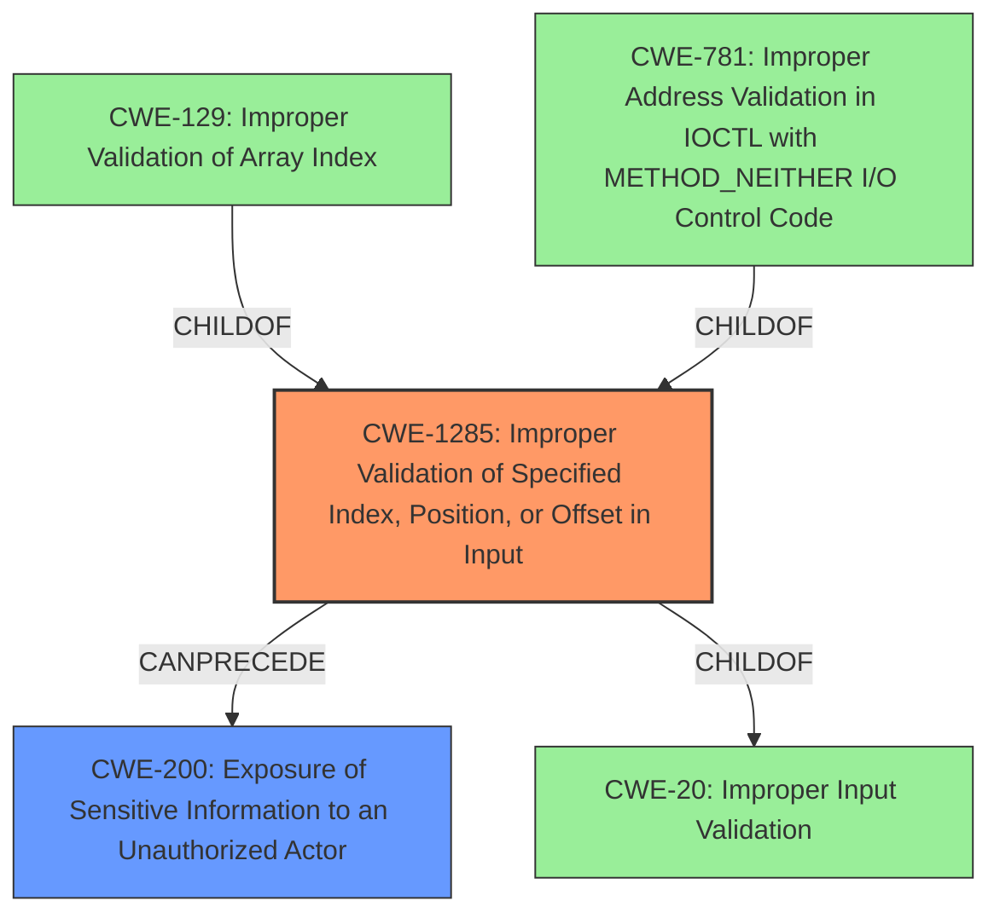

# Analysis for CVE-2024-28818

# Summary
| CWE ID | CWE Name | Confidence | CWE Abstraction Level | CWE Vulnerability Mapping Label | CWE-Vulnerability Mapping Notes |
|---|---|---|---|---|---|
| **CWE-1285** | **Improper Validation of Specified Index, Position, or Offset in Input** | 0.7 | Base | Primary CWE | Allowed |
| CWE-200 | Exposure of Sensitive Information to an Unauthorized Actor | 0.3 | Class | Secondary Candidate | Discouraged |

## Evidence and Confidence

*   **Confidence Score:** 0.7
*   **Evidence Strength:** MEDIUM

## Relationship Analysis
The primary CWE selected is CWE-1285 (Improper Validation of Specified Index, Position, or Offset in Input), which is a base-level CWE. The vulnerability description indicates that the baseband software **does not properly check states** specified by the RRC module. This suggests a **lack of validation** of the RRC module states.

CWE-1285 has child CWEs like CWE-129 (Improper Validation of Array Index) and CWE-781 (Improper Address Validation in IOCTL with METHOD_NEITHER I/O Control Code). While these are more specific, the description does not provide sufficient detail to pinpoint the exact type of index, position, or offset that lacks validation. Therefore, CWE-1285 is the most appropriate base-level CWE.

CWE-200 (Exposure of Sensitive Information to an Unauthorized Actor) is included as a secondary candidate because the impact of the vulnerability is the "disclosure of sensitive information." However, as CWE-200 is a class-level CWE representing the impact, and the problem stems from a **validation issue**, CWE-1285 is the better choice as the primary CWE.

## Vulnerability Chain
The vulnerability chain starts with the **improper validation** of the RRC module states (CWE-1285). This **lack of validation** leads to an exploitable condition that results in the **disclosure of sensitive information** (CWE-200).

## Summary of Analysis
The analysis is primarily based on the vulnerability description, which states that the baseband software **does not properly check states** specified by the RRC module. This directly points to a validation issue. The retriever results also highlight CWE-1285 as a relevant candidate, further supporting this assessment.

While the impact is the disclosure of sensitive information, focusing on the root cause, which is the **lack of validation**, is more accurate. The graph relationships show that CWE-1285 can precede CWE-200, which aligns with the vulnerability chain.

CWE-1285 is selected because it's a base-level CWE that specifically addresses the validation issue, while CWE-200 only describes the impact of the vulnerability.