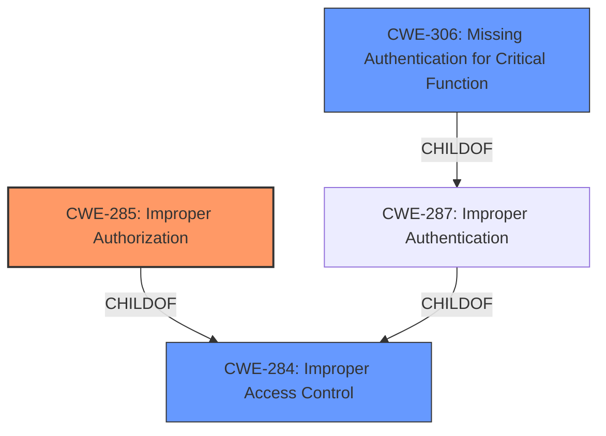

# Analysis for CVE-2024-28965

# Summary
| CWE ID  | CWE Name                                                     | Confidence | CWE Abstraction Level | CWE Vulnerability Mapping Label | CWE-Vulnerability Mapping Notes |
| ------- | ------------------------------------------------------------ | ---------- | --------------------- | ------------------------------- | ------------------------------- |
| CWE-285 | Improper Authorization                                       | 0.9        | Class                 | Primary                         | Discouraged                    |
| CWE-306 | Missing Authentication for Critical Function                 | 0.7        | Base                  | Secondary                       | Allowed                         |
| CWE-284 | Improper Access Control                                      | 0.6        | Pillar                  | Secondary                       | Discouraged                    |

## Evidence and Confidence

*   **Confidence Score:** 0.9
*   **Evidence Strength:** HIGH

## Relationship Analysis
The primary CWE is CWE-285 Improper Authorization, a Class-level weakness. This is related to the broader CWE-284 Improper Access Control (Pillar). CWE-306 Missing Authentication for Critical Function (Base) is also considered as a contributing factor, especially if the authorization **improperness** stems from the complete absence of authentication, making it a potential root cause.

## Vulnerability Chain
The vulnerability chain starts with a **Improper Access Control** on an internal enable REST API which leads to the execution of internal APIs applicable only for Admin Users. This then allows an unauthorized user to access restricted resources and change the state of the application's backend database.

## Summary of Analysis
The initial assessment strongly points to **CWE-285 Improper Authorization**, stemming from the **improper access control**. The vulnerability description states that "A remote low privileged attacker could potentially exploit this vulnerability, leading to the execution of certain Internal APIs applicable only for Admin Users". This aligns well with the concept of authorization, as it involves determining what an authenticated actor (in this case, a low-privileged attacker) is allowed to do.

The prompt emphasizes considering the root cause. The evidence indicates the weakness is an internal enable REST API is exposed for an internal enable REST API, which should only be accessible to admin users, indicating **Improper Access Control**, and the ability for a low-privileged user to then perform actions that only Admin users should be allowed to, so **CWE-285 Improper Authorization** is the best match.

The guidance specifically states to choose CWE-285 over CWE-284 if the issue involves improper or missing role checks. This vulnerability involves a low-privileged attacker being able to execute internal APIs applicable only for Admin Users, this is role-based so **CWE-285** is the better choice.

The prompt has a case for **CWE-306 Missing Authentication for Critical Function** if the **Improper Authorization** stems from the absence of authentication.
The evidence does not fully support this. The evidence states "remote low privileged attacker", so the attacker is authenticated but has low privileges. Therefore, **CWE-306** is not the primary weakness because it is about lack of authentication. It is a possible secondary weakness.

The selected CWEs are at the optimal level of specificity. **CWE-285** is a Class-level CWE, but it accurately captures the nature of the authorization flaw. While **CWE-306** is at the Base level, its applicability is secondary and dependent on whether the authorization weakness is directly linked to a missing authentication step. **CWE-284** is a high-level Pillar CWE.

Relevant CWE Information:

# Enhanced Context (25 CWEs)
The following CWEs were identified as potentially relevant to this vulnerability:

## CWE-497: Exposure of Sensitive System Information to an Unauthorized Control Sphere
**Abstraction Level**: Base
**Similarity Score**: 0.78

## CWE-668: Exposure of Resource to Wrong Sphere
**Abstraction Level**: Class
**Similarity Score**: 0.77

## CWE-280: Improper Handling of Insufficient Permissions or Privileges
**Abstraction Level**: Base
**Similarity Score**: 0.77

## CWE-274: Improper Handling of Insufficient Privileges
**Abstraction Level**: Base
**Similarity Score**: 0.77

## CWE-41: Improper Resolution of Path Equivalence
**Abstraction Level**: Base
**Similarity Score**: 0.76

## CWE-267: Privilege Defined With Unsafe Actions
**Abstraction Level**: Base
**Similarity Score**: 0.76

## CWE-345: Insufficient Verification of Data Authenticity
**Abstraction Level**: Class
**Similarity Score**: 0.76

## CWE-807: Reliance on Untrusted Inputs in a Security Decision
**Abstraction Level**: Base
**Similarity Score**: 0.75

## CWE-1391: Use of Weak Credentials
**Abstraction Level**: Class
**Similarity Score**: 0.75

## CWE-303: Incorrect Implementation of Authentication Algorithm
**Abstraction Level**: Base
**Similarity Score**: 0.75

## CWE-285: Improper Authorization
**Abstraction Level**: Class
**Similarity Score**: 1727.93

## CWE-863: Incorrect Authorization
**Abstraction Level**: Class
**Similarity Score**: 1694.71

## CWE-306: Missing Authentication for Critical Function
**Abstraction Level**: Base
**Similarity Score**: 1666.12

## CWE-287: Improper Authentication
**Abstraction Level**: Class
**Similarity Score**: 1636.63

## CWE-639: Authorization Bypass Through User-Controlled Key
**Abstraction Level**: Base
**Similarity Score**: 1634.13

## CWE-613: Insufficient Session Expiration
**Abstraction Level**: base
**Similarity Score**: 4.33

## CWE-73: External Control of File Name or Path
**Abstraction Level**: base
**Similarity Score**: 2.73

## CWE-259: Use of Hard-coded Password
**Abstraction Level**: variant
**Similarity Score**: 2.68

## CWE-942: Permissive Cross-domain Policy with Untrusted Domains
**Abstraction Level**: variant
**Similarity Score**: 2.68

## CWE-499: Serializable Class Containing Sensitive Data
**Abstraction Level**: variant
**Similarity Score**: 2.68

## CWE-498: Cloneable Class Containing Sensitive Information
**Abstraction Level**: variant
**Similarity Score**: 2.68

## CWE-287: Improper Authentication
**Abstraction Level**: class
**Similarity Score**: 2.55

## CWE-280: Improper Handling of Insufficient Permissions or Privileges
**Abstraction Level**: Base
**Similarity Score**: 2.49

## CWE-274: Improper Handling of Insufficient Privileges
**Abstraction Level**: Base
**Similarity Score**: 2.49

## CWE-306: Missing Authentication for Critical Function
**Abstraction Level**: base
**Similarity Score**: 2.47