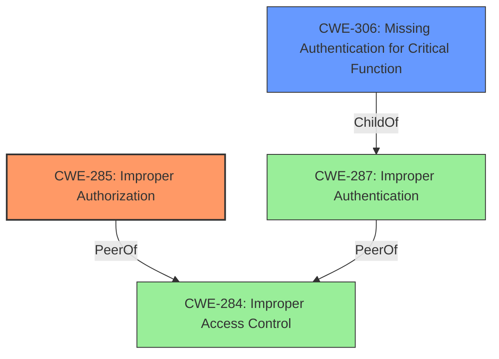

# Raw Analyzer Response for CVE-2024-28966

# Summary
| CWE ID  | CWE Name                                                     | Confidence | CWE Abstraction Level | CWE Vulnerability Mapping Label | CWE-Vulnerability Mapping Notes |
| :-------- | :----------------------------------------------------------- | :--------- | :---------------------- | :------------------------------ | :------------------------------ |
| CWE-285 | Improper Authorization | 0.9        | Class                   | Allowed-with-Review               | Primary CWE                   |
| CWE-306 | Missing Authentication for Critical Function | 0.7        | Base                   | Allowed               | Secondary Candidate                   |

## Evidence and Confidence

*   **Confidence Score:** 0.8
*   **Evidence Strength:** HIGH

## Relationship Analysis
The primary relationship that influenced the CWE selection was the parent-child relationship between CWE-287 Improper Authentication and CWE-306 Missing Authentication for Critical Function, and the authorization specific CWEs like CWE-285 Improper Authorization. The vulnerability description clearly points to an **improper access control** issue related to an internal update REST API. Since the attacker is described as a "remote low privileged attacker", it indicates that some level of authentication might be present, but the authorization checks are either missing or flawed for certain APIs. Therefore, CWE-285 is more fitting than CWE-306, but CWE-306 might still be present on the REST API.

## Vulnerability Chain
The vulnerability chain starts with **Improper Access Control**, leading to the execution of APIs intended for Admin Users by a low privileged attacker. This results in unauthorized access to restricted resources and a change of state. Therefore, the chain is: **Improper Access Control** (CWE-284/CWE-285) -> Unauthorized Access & Change of State. It is possible that **Missing Authentication** (CWE-306) is also present on the REST API.

## Summary of Analysis
Initially, the vulnerability was assessed as a potential **Improper Access Control** issue. However, after carefully considering the description and the provided guidance, it became clear that the root cause lies in **Improper Authorization** (CWE-285), due to the REST API being exposed to low privileged users. This is supported by the statement that a "remote low privileged attacker could potentially exploit this vulnerability, leading to the execution of certain APIs applicable only for Admin Users." This indicates the presence of some form of authentication but **improper authorization**. Also, the fact that this internal update REST API was exposed for an internal update REST API could mean that no Authentication was implemented for this API, so **Missing Authentication for Critical Function (CWE-306)** could be present as well.

The selection of CWE-285 as the primary CWE is based on the following evidence:

*   The **Vulnerability Description Key Phrases** includes "**Improper Access Control**".
*   The **CVE Reference Links Content Summary** states: "Root cause of vulnerability: **Improper Access Control** in the Dell Secure Connect Gateway (SCG) exposed for an internal update REST API."
*   The guidance provided emphasizes the difference between Authentication and Authorization, and this vulnerability seems to be an issue of **Authorization** after authentication.

The abstraction level of Class for CWE-285 is chosen because a more specific Base CWE was not evident in the provided information. Similarly, CWE-306 is chosen at the Base level because it directly represents the **missing authentication** aspect.

Relevant CWE Information:

# Enhanced Context (25 CWEs)

## CWE-497: Exposure of Sensitive System Information to an Unauthorized Control Sphere
**Abstraction Level**: Base
**Similarity Score**: 0.77

This CWE was considered but not selected as the primary CWE because the description focuses more on **improper access control** leading to execution of admin-level APIs, rather than the exposure of sensitive system information.

## CWE-668: Exposure of Resource to Wrong Sphere
**Abstraction Level**: Class
**Similarity Score**: 0.77

This CWE was considered but not selected as the primary CWE because while it's related, the **improper authorization** aspect is more prominent. CWE-668 is also discouraged for being too high-level.

## CWE-280: Improper Handling of Insufficient Permissions or Privileges 
**Abstraction Level**: Base
**Similarity Score**: 0.77

This CWE was considered but not selected as the primary CWE because the problem is not about the product lacking sufficient privileges, but about a low privileged user gaining access to admin-level functionality.

## CWE-274: Improper Handling of Insufficient Privileges
**Abstraction Level**: Base
**Similarity Score**: 0.76

This CWE was considered but not selected for the same reason as CWE-280. It's also discouraged.

## CWE-41: Improper Resolution of Path Equivalence
**Abstraction Level**: Base
**Similarity Score**: 0.76

This CWE was not selected because the vulnerability is not related to path equivalence issues.

## CWE-267: Privilege Defined With Unsafe Actions
**Abstraction Level**: Base
**Similarity Score**: 0.76

This CWE was considered but not selected as the primary CWE because it is not about a particular privilege being used to perform unsafe actions, but rather a low-privileged user gaining access to admin-level actions.

## CWE-807: Reliance on Untrusted Inputs in a Security Decision
**Abstraction Level**: Base
**Similarity Score**: 0.75

This CWE was not selected because the vulnerability is not directly related to reliance on untrusted inputs in a security decision.

## CWE-1391: Use of Weak Credentials
**Abstraction Level**: Class
**Similarity Score**: 0.75

This CWE was not selected because the vulnerability description does not specify the use of weak credentials as the root cause.

## CWE-345: Insufficient Verification of Data Authenticity
**Abstraction Level**: Class
**Similarity Score**: 0.75

This CWE was not selected because the vulnerability is not related to insufficient verification of data authenticity.

## CWE-303: Incorrect Implementation of Authentication Algorithm
**Abstraction Level**: Base
**Similarity Score**: 0.75

This CWE was not selected because the vulnerability is not due to an incorrect implementation of an authentication algorithm.

## CWE-285: Improper Authorization
**Abstraction Level**: Class
**Similarity Score**: 1555.44

This is the selected primary CWE.

## CWE-863: Incorrect Authorization
**Abstraction Level**: Class
**Similarity Score**: 1518.67

This CWE was considered but not selected over CWE-285 because while it could be an **incorrect authorization**, the provided description primarily focuses on **improper authorization** in general.

## CWE-306: Missing Authentication for Critical Function
**Abstraction Level**: Base
**Similarity Score**: 1481.24

This CWE was considered as a possible secondary CWE if the internal update REST API was missing any Authentication.

## CWE-639: Authorization Bypass Through User-Controlled Key
**Abstraction Level**: Base
**Similarity Score**: 1476.87

This CWE was not selected because the vulnerability is not related to authorization bypass through user-controlled keys.

## CWE-287: Improper Authentication
**Abstraction Level**: Class
**Similarity Score**: 1456.81

This CWE was not selected because the presence of a "low privileged attacker" indicates that some form of authentication is present.

## CWE-613: Insufficient Session Expiration
**Abstraction Level**: base
**Similarity Score**: 4.33

This CWE was not selected because the vulnerability description does not mention any session expiration issues.

## CWE-73: External Control of File Name or Path
**Abstraction Level**: base
**Similarity Score**: 2.73

This CWE was not selected because the vulnerability is not related to external control of file names or paths.

## CWE-259: Use of Hard-coded Password
**Abstraction Level**: variant
**Similarity Score**: 2.68

This CWE was not selected because the vulnerability description does not mention the use of hard-coded passwords.

## CWE-942: Permissive Cross-domain Policy with Untrusted Domains
**Abstraction Level**: variant
**Similarity Score**: 2.68

This CWE was not selected because the vulnerability is not related to permissive cross-domain policies.

## CWE-499: