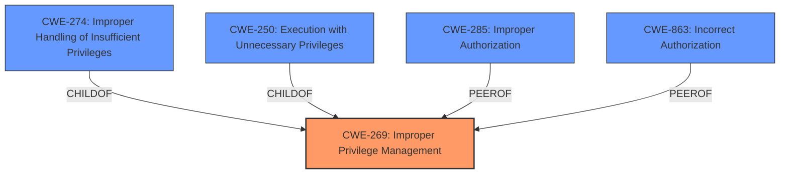

# Analysis for CVE-2024-29060

# Summary
| CWE ID | CWE Name | Confidence | CWE Abstraction Level | CWE Vulnerability Mapping Label | CWE-Vulnerability Mapping Notes |
|---|---|---|---|---|---|
| CWE-269 | Improper Privilege Management | 0.7 | Class | Primary | Discouraged |

## Evidence and Confidence

*   **Confidence Score:** 0.7
*   **Evidence Strength:** LOW

## Relationship Analysis
The primary candidate CWE-269 (Improper Privilege Management) is a Class-level CWE. There are several related CWEs, including its children (CWE-274, CWE-250) and peers, that describe privilege and permission issues. However, due to the limited information provided in the vulnerability description, it's challenging to pinpoint a more specific root cause. The analysis relies heavily on the "Top CWEs" from similar CVE descriptions.

## Vulnerability Chain
The vulnerability chain, based on the limited information, starts with **Improper Privilege Management** (CWE-269), leading to the impact of Elevation of Privilege.

## Summary of Analysis
The initial analysis and resulting conclusion are heavily based on the "Top CWEs" identified for similar CVE descriptions, as the provided vulnerability description lacks specific details about the root cause of the elevation of privilege. The primary indicator is the impact: "Elevation of Privilege". Given the limited evidence, a more specific CWE cannot be confidently assigned.

The selection of CWE-269 is influenced by its prevalence among similar CVE descriptions. However, it is crucial to acknowledge the limitations of this approach, especially given that the CWE is discouraged and lower-level CWEs can frequently be used instead.

Relevant CWE Information:
*   **CWE-269: Improper Privilege Management**: The product does not properly assign, modify, track, or check privileges for an actor, creating an unintended sphere of control for that actor. This aligns with the impact "Elevation of Privilege". The guidance discourages its use because it is too general.
*   **CWE-NVD-noinfo**: This was the primary CWE match, but is not a valid CWE.

CWEs Considered but Not Used:

*   **CWE-266: Incorrect Privilege Assignment**: Considered, but there's no specific evidence of incorrect assignment during account creation or modification.
*   **CWE-250: Execution with Unnecessary Privileges**: Considered, but there's no specific evidence that the code is running with elevated privileges.
*   **CWE-285: Improper Authorization**: Considered, but there's no specific evidence that there is an authorization check that is not working.
*   **CWE-863: Incorrect Authorization**: Considered, but there's no specific evidence that there is an authorization check that is not working correctly.
*   **CWE-732**: This CWE was in the Top CWEs, but there is no evidence to support it.